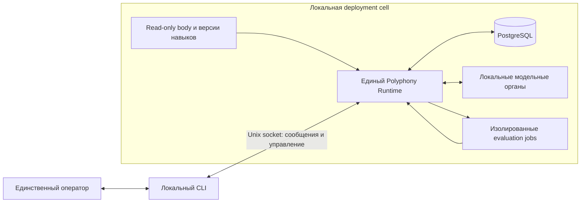
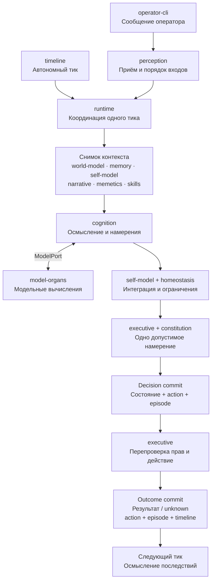
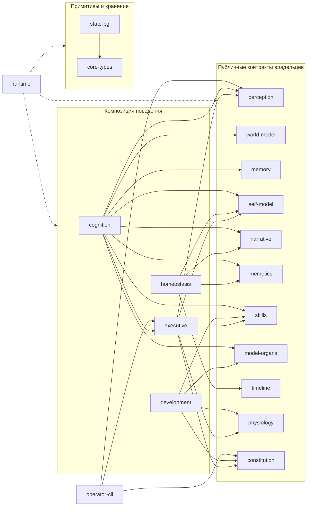

# Модульная архитектура Полифонии

Дата: 2026-09-24. Статус: accepted — архитектурный baseline принят оператором для спецификаций и реализации; runtime ещё не реализован.

Основание: [каноническая концепция](polyphony_concept.md), исходный снимок `07bf45c6d34b832d7760b919cce671a92e590509` с принятым 2026-09-23 уточнением §6.2.1 об одном операторе и будущих каналах связи; [методология](development-methodology/README.md) и решения оператора: независимые пакеты, единый runtime, TypeScript/Node.js + pnpm + PostgreSQL + AI SDK, локальный CLI. Уточнение оператора 2026-09-24: модельные вычисления разных модулей проходят через `model-organs`; среди органов возможны LLM, аудиомодели и специализированные классификаторы. Это уточняет общую границу, не требует включить все типы моделей в первую версию. При противоречии концепция и решения оператора имеют приоритет.

**Capability следующего этапа:** разработчик получает ограниченную способность, её публичный контракт, владельца данных и проверку; реализация соседнего модуля ему не нужна. **Substrate этого этапа:** архитектура и ADR. **Anti-claims:** документ не доказывает работу агента, безопасность sandbox, совместимость конкретной модели или сохранность данных при реальном сбое.

## 1. Архитектурные основания

| Основание | Источник концепции | Следствие и проверка |
| --- | --- | --- |
| Одно Я, timeline, память и исполнитель | §§2, 4.5, 8.7, 12, 14.1 | Единственный последовательный цикл решений; второй runtime не получает право действия; смена органа сохраняет историю |
| Мышление зависит от опыта и внутренней динамики | §§4.3, 4.10, 6.5, 9–10 | Контекст содержит память, PSM и мемы; различие этих входов должно менять наблюдаемый выбор, а не только запись в журнале |
| Самостоятельные цели и единственный оператор | §§4.10, 6.2.1, 10.9; уточнение оператора 2026-09-23 | Один оператор общается и управляет системой; его сообщение получает приоритет внимания, а явная команда управления имеет отдельный тип операции. Новые каналы не создают операторов |
| Локальная жизнь, заменяемые модели и framework | §§4.6, 7, 16.2.1 | Core не зависит от облака; SDK ограничен адаптером, доменные типы не содержат SDK-объектов |
| Правдивость памяти и оценок | §§6.4.6, 6.6, 9.3–9.7, 12.6, 13.4 | Факты отделены от интерпретаций; активация мема не является доказательством; происхождение сохраняется |
| Регулируемое развитие без утраты опыта | §§4.7, 13–14, 16.7–16.9 | Проверка кандидата, governor, стабильные версии, freeze и откат способа работы с сохранением биографии |
| Независимая разработка | Решение оператора; [правила модулей](development-methodology/modules.md) | Явные контракты, ациклические зависимости, собственные проверки; совместимая замена не меняет внутренности потребителей |

Первая живая версия включает **все** обязательные способности §17.1 и проверяется по §17.3. World model, навыки, физиология и Development Ledger сохраняются в минимальной форме. Богатая сеть отношений, сложная социальная модель, многочисленные сенсоры, облачные консультанты и somatic code evolution относятся к позднему контуру (§17.2). Их отсутствие не разрешает подменить живую версию чатом или workflow.

## 2. Форма системы и deployment cell

Выбран модульный монолит: один процесс принятия решений, PostgreSQL и локальные модельные сервисы. CLI — отдельный клиент. Изолированные процессы оценивания работают только с разрешёнными снимками и временными файлами. Отдельное развёртывание каждого доменного пакета не требуется.

Оператор — один и тот же человек в общении с Полифонией и в управлении её запуском, остановкой, настройками и подтверждениями. Для первой cell используется один CLI и одна доверенная привязка оператора; обычное сообщение и явная команда управления различаются по типу операции. Core, БД и model servers не публикуют порты в общедоступную сеть. Минимальный сценарий не требует интернета или ключа облачного API.

### 2.1 Проверенный технологический baseline

Проверка источников выполнена 2026-09-23. Это совместимость заявленных требований и выбранных версий, **не** выполненная сборка или тест конкретного model server.

| Компонент | Решение для первой реализации | Проверенное основание |
| --- | --- | --- |
| Node.js | 24 LTS; исходная фиксация `24.21.0` | [Официальный график](https://github.com/nodejs/Release#release-schedule), [релиз](https://nodejs.org/en/blog/release/v24.21.0) |
| TypeScript | `7.0.2`, strict, ESM; сборка `.ts` в JS и declarations | [Стабильный выпуск 7.0](https://devblogs.microsoft.com/typescript/announcing-typescript-7-0/), [manifest 7.0.2](https://registry.npmjs.org/typescript/7.0.2) |
| pnpm | Линия 10; при bootstrap обновить pin с имеющегося `10.28.2` до проверенного `10.34.5` | [Совместимость с Node 24](https://github.com/pnpm/pnpm.io/blob/main/versioned_docs/version-10.x/installation.md), [manifest](https://registry.npmjs.org/pnpm/10.34.5) |
| PostgreSQL | 18, исходная фиксация `18.6`; драйвер `pg@8.23.0` | [Поддержка PostgreSQL](https://www.postgresql.org/support/versioning/), [manifest pg](https://registry.npmjs.org/pg/8.23.0) |
| AI SDK | `ai@7.0.112` + `@ai-sdk/openai-compatible@3.0.54` внутри `model-organs` | [SDK manifest](https://registry.npmjs.org/ai/7.0.112), [provider manifest](https://registry.npmjs.org/@ai-sdk%2fopenai-compatible/3.0.54): Node ≥22, совпадающий provider ABI 4.0.18 |

Для SDK выбрать одну точную совместимую Zod 4-версию из его peer-range `^4.1.8` при bootstrap и зафиксировать lockfile. AI SDK 7 не означает принятия его agent/workflow platform: использовать только модельные вызовы, structured output и ограниченную отменяемую генерацию. Provider создаётся явно с локальным allowlisted endpoint; строковый shorthand с неявным AI Gateway запрещён. [Описание совместимого provider](https://ai-sdk.dev/providers/openai-compatible-providers).

AI SDK — внутренний адаптер для совместимых операций, а не универсальный контракт всех моделей. Для специализированного API допустим отдельный адаптер внутри `model-organs` с подходящим SDK или протоколом. Доменные пакеты вызывают публичный модельный порт без provider SDK. Выбор адаптера не меняет ограничения локальности, разрешённых endpoints и передачи данных.

Пакеты собираются отдельно; импорт идёт через `exports` и declarations, без запуска TypeScript из внутренних путей соседнего пакета. Manifest и зависимости в текущей документационной задаче не меняются. Перед первой установкой повторно проверить security updates и воспроизводимую совместимость всей выбранной связки.

## 3. Модули, состояние и публичные операции

Все пакеты размещаются в `packages/<module-id>` и имеют имя `@polyphony/<module-id>`. Идентификаторы ниже стабильны для последующих спецификаций. Модуль представляет способность; `core-types`, `state-pg` и сборка runtime — технические опоры, а не самостоятельные признаки живого организма.

**Как модули работают вместе.** `runtime` собирает реализации и координирует один последовательный тик. Схема ниже показывает путь обработки: блок — этап, стрелка — передача данных или вызов. Имена внутри этапа обозначают участвующие пакеты; граф разрешённых импортов приведён отдельно в §3.1.

На всех этапах сборку и порядок вызовов обеспечивает `runtime`; `cognition` получает модельный порт, а владельцы данных — собственные входы. Оба commit выполняются через `state-pg` и `./postgres` adapters владельцев. Разрешён и выбор бездействия: он тоже оставляет решение и эпизод, но не вызывает внешний инструмент. Для `operator.send` исполнитель сохраняет сообщение в outbox, а `operator-cli` получает его через транспорт доставки (§4.3). Точные границы транзакций и recovery — в §5.

На схеме показан модельный вызов `cognition`, но `model-organs` — общая граница модельных вычислений для любого модуля, которому они требуются. Потребитель формирует задачу и допустимый вход, получает типизированный результат и отвечает за его доменную интерпретацию. `runtime` передаёт ему узкий `ModelPort` с разрешёнными операциями и выделенным бюджетом; прямое обращение к модели в обход порта запрещено. Подключение потребителя описано в §3.1, формы операций — в §4.2.1.

`physiology` готовит результаты фоновых работ; `development` оценивает кандидатов навыков/органов и выдаёт grant в пределах policy. Этот материал рассматривается в очередном тике. Применение изменения возможно, когда `executive` выберет его единственным действием тика; grant сам ничего не активирует (§7). Эти два пакета не добавляют параллельный цикл личностных решений.

В таблице приведены **публичные операции**, не внутренняя последовательность функций. Входные и выходные DTO принадлежат указанному владельцу; обязательные общие формы заданы в §4. Изменения состояния возвращаются как типизированные proposals/changes и сохраняются владельцем при координации runtime (§5). Peer-модуль не пишет их напрямую.

| Модуль | Ответственность и принадлежащее состояние | Публичная граница первой версии | Не входит в ответственность |
| --- | --- | --- | --- |
| `core-types` | `AgentId`, `TickId`, `ActionId`, `Revision`, `EvidenceRef`, время, `Result<T,E>` | Типы и проверка общих примитивов; без I/O | Общий `AgentState`, произвольный event bus, доменные DTO |
| `state-pg` | Соединения, транзакции, журнал версий схем | `readSnapshot`, `transact`, `checkSchema`, получение эксклюзивной DB-сессии runtime | Доменные решения, чтение всех таблиц через универсальный repository API |
| `constitution` | Внешняя read-only policy: привязка единственного оператора, полномочия, лимиты, окна, стабильные manifest и approvals | `checkBoot(manifest, schema)`, `authorize(action, principal, policyRevision)`, `validateApproval(scope)` | Ценности агента; самоизменение policy; исполнение обычного сообщения как команды управления |
| `timeline` | Одна последовательность тиков, elapsed time, режим, ссылки на решения | `reserveTick(trigger)`, `decide(tick, actionRef)`, `settle(tick, outcomeRef)`, `resume()` | Мышление, самостоятельное исполнение действий |
| `perception` | Inbox, происхождение стимулов, распознавание оператора по доверенной привязке, статусы внимания | `accept(input, transportPrincipal) → Receipt`, `select(snapshot, budget) → PerceptBatch`, `markAttended(batch, tick)` | Решение отвечать; назначение операторов или полномочий |
| `world-model` | Наблюдения, сущности, факты и гипотезы о мире, confidence/provenance | `context(query, snapshot) → WorldView`, `revise(observations, evidence) → WorldChange` | Биография, сырые tool logs, богатый knowledge graph первой версии |
| `memory` | Единая эпизодическая история, индекс и ссылки на последствия | `recall(query, snapshot) → EpisodeView[]`, `recordDecision(episode)`, `appendOutcome(episodeId, outcome)` | Независимая память органов/мемов; бесконечный внутренний монолог |
| `self-model` | PSM: identity, affect, goals, beliefs, subjective state и история изменений | `view(snapshot) → SelfView`, `integrate(context, thought) → SelfChange`, `validateContinuity(change)` | Неподвижные навязанные ценности; wholesale замена identity |
| `narrative` | Отдельные Narrative Spine и Field Journal с версиями и evidence refs | `view(snapshot) → NarrativeView`, `proposeIntegration(episodes, self, tensions) → NarrativeChange` | Выдуманные факты; изменение биографии background job; Development Ledger |
| `memetics` | Мемы, связи, происхождение, активность, оценки и lifecycle | `activate(context, state) → MemeticView`, `revise(newEvidence, proposals) → MemeticChange` | Tool calls, частная биография, автоматическое подтверждение повторением |
| `skills` | Версии процедур, applicability, проверенные материалы, статусы candidate/active/retired | `select(context) → SkillView[]`, `stage(bundle) → CandidateRef`, `activate(candidate, grant)`, `revert(version, grant)` | Самостоятельный запуск произвольного кода; хранение личности в prompt |
| `model-organs` | Registry ролей и поддерживаемых операций, версии органов, endpoints, результаты health/evaluation, active bindings | `select(role, capability, limits) → OrganRef`, `infer<K>(request: ModelRequest<K>, signal) → ModelResult<K>`, `stage`, `activate`, `revert` | Владение memory/PSM; автоматический cloud fallback; собственный исполнитель |
| `cognition` | Рабочее пространство одного тика; долговременная память отсутствует | `think(context, modelPort, signal) → ThoughtProposal` | Прямой SQL, инструменты с последствиями, финальное решение за executor |
| `executive` | Единственный action log, авторизованный intent, status результата, operator outbox | `choose(candidates, self, limits) → Decision`, `prepare`, `dispatch`, `recordOutcome`, `reconcile` | Несколько независимых действий за тик; неподтверждённый успех; обход policy |
| `homeostasis` | Счётчики устойчивости, удержание режимов, cooldown, состояние freeze | `assess(summary) → Regulation`, `record(regulation)` | Автоматическое наказание любого долгого интереса; собственные намерения |
| `development` | Governor, proposals, evaluation decisions, единый Development Ledger | `propose(change)`, `assess(proposal, evidence) → Verdict`, `grant`, `recordApplied`, `recordRollback` | Promotion по самоотчёту модели; изменение constitution; живое редактирование тела |
| `physiology` | Очередь разрешённых jobs, окна, ресурсный учёт, технические receipts | `schedule(job)`, `claim(window, budget)`, `recordResult(job, artifacts)`, `cancel` | Самостоятельные цели и внешние действия; применение semantic changes |
| `runtime` | Composition root, lifecycle, epoch запуска, актуальный complete checkpoint | `boot`, `tick`, `pause`, `resume`, `shutdown`; связывает публичные порты | Новая доменная память или универсальный сервис, заменяющий владельцев |
| `operator-cli` | Локальный клиент ввода/чтения, delivery cursor; не каноническая память | `send`, `watch`, `history`; отдельные operator-команды `status/pause/resume/approve` | Автоответ; прямое подключение к БД; превращение текста сообщения в команду управления |

Семантическая память принадлежит `world-model`, процедурная — `skills`, developmental — `development`; общность памяти означает единый доступ через публичные views и одну линию episodes, а не один общий mutable object. Narrative Spine и Field Journal объединены в один пакет из-за общего цикла narrative integration, но сохраняют разные контракты и правила обновления.

### 3.1 Разрешённые зависимости

У каждого доменного пакета есть side-effect-free export `./contracts` с DTO/validators. Пакет может проверяться с опубликованными контрактами зависимостей до появления их реализации. Реализации передаются через constructor/factory injection в composition root; запуск при импорте, service locator и глобальный mutable singleton запрещены.

| Уровень | Пакеты | Разрешённые импорты помимо `core-types` |
| --- | --- | --- |
| 0 | `core-types` | Нет |
| 1 | `state-pg`, `constitution`, `timeline`, `perception`, `world-model`, `memory`, `self-model`, `narrative`, `memetics`, `skills`, `model-organs`, `physiology` | Доменные входы этих пакетов определяются собственными контрактами через primitive/evidence refs; `model-organs` использует AI SDK только в своём adapter export |
| 2 | `homeostasis` | Контракты `self-model`, `narrative`, `memetics`, `timeline` |
| 2 | `development` | Контракты `skills`, `model-organs`, `physiology`, `constitution` |
| 2 | `executive` | Контракты `self-model`, `constitution`, `perception`, `skills`, `physiology` |
| 3 | `cognition` | Контракты `perception`, `world-model`, `memory`, `self-model`, `narrative`, `memetics`, `skills`, `model-organs`, `executive` |
| 3 | `operator-cli` | Клиентские контракты `perception`, `executive`, `constitution`; без runtime implementation |
| 4 | `runtime` | Публичные exports всех модулей, их adapters; не импортирует `operator-cli` |

Собственный `./postgres` adapter каждого stateful пакета дополнительно зависит от `state-pg`, но не наоборот. Он принимает opaque transaction handle и сохраняет только данные своего владельца. Private SQL остаётся внутри adapter; только root связывает adapters в общий commit. Типовая DB-роль core имеет права, необходимые всем владельцам: изоляция пакетов — проверяемая дисциплина доверенного кода, **не** sandbox против злонамеренного npm-пакета. Недоверенный код в core не загружается.

**Зависимости всех 19 пакетов.** Сплошная стрелка `A → B` означает, что `A` может импортировать публичные контракты `B`; у `state-pg → core-types` это общие примитивы. Пунктир от `runtime` к группе означает сборку всех её пакетов через публичные exports. Рамки только группируют узлы для чтения.

Две повторяющиеся зависимости вынесены из рисунка, чтобы сохранить его читаемость: каждый пакет, кроме самого `core-types`, может импортировать его примитивы; собственные `./postgres` adapters stateful владельцев импортируют `state-pg`. Пунктир от `runtime` охватывает все пакеты внутри трёх рамок; `operator-cli` остаётся отдельным клиентом и в runtime не импортируется. Вместе с этими правилами схема соответствует allowlist таблицы, включая технические зависимости.

Например, `cognition → memory` означает импорт типа `EpisodeView` из `memory/contracts`. Эпизоды извлекает `runtime` через публичный порт памяти и передаёт в `CognitiveContext`; `cognition` работает с готовым снимком. Поток данных от поставщика к потребителю не создаёт обратного импорта. Нельзя обходить граф через `../../other/src`, прямой SQL другого владельца, общий JSON-мешок или callbacks, выдающие лишние полномочия.

Текущий граф фиксирует модельные зависимости `cognition` и `development`; он не требует модельных вызовов от каждого владельца. Для другого потребителя до реализации согласуются узкий `ModelPort`, capability и контрактные сценарии; в таблицу и граф добавляется явное ребро `consumer → model-organs/contracts` с пересчётом уровней. `model-organs` не импортирует контракты потребителя: тот отображает свои данные в модельный запрос. Вычислительный порт не открывает stage/activate/revert.

Вход владельца уровня 1 — его собственная узкая input projection. Например, `self-model.integrate` принимает `SelfIntegrationInput` с thought summary/evidence refs, а не импортирует `ThoughtProposal` из `cognition`; `narrative` принимает `NarrativeInput` с episode/self refs и нужными summaries. Root явно отображает выход производителя во вход получателя; совместимость этого отображения проверяется consumer contract. Так feedback не создаёт цикл зависимостей. Это не разрешает дублировать чужую модель состояния целиком.

### 3.2 Жизненный цикл и отдельная проверка

Root сначала проверяет manifest/policy/schema, затем открывает adapters, загружает версии владельцев и только после этого допускает tick. Pure modules не делают I/O при создании. Stateful owner принимает snapshot/revision, готовит change и сохраняет его только в установленной commit phase. Shutdown отменяет незавершённые вычисления, фиксирует известный outcome, закрывает adapters и удерживает эксклюзивность до остановки dispatcher. Отмена не выдаётся за rollback уже совершённого эффекта.

| Владельцы | Существенный отказ публичного контракта | Минимальная изолированная проверка |
| --- | --- | --- |
| `core-types` | Невалидный ID, ref или discriminant → `invalid_input` | Различение доменных IDs, валидные/невалидные fixtures, отсутствие I/O |
| `state-pg` | `unavailable`, `incompatible`, rollback транзакции | Реальный PostgreSQL: все owner writes либо сохраняются, либо откатываются |
| `constitution` | Missing/corrupt policy, неверный/устаревший approval → `denied` | Тот же action с разными actor/scope/hash не получает чужое разрешение |
| `timeline` | Повторный sequence/переход, вторая reservation → `conflict` | Reserve/decide/settle, interrupted attempt и монотонность после reload |
| `perception` | Невалидный principal/frame, перегрузка → явный reject/pending | Operator ordering, дедупликация deliveryId, delivery ≠ attended |
| `world-model`, `memory` | Broken provenance, stale revision → reject/conflict | Fact/hypothesis не смешиваются; решение и неизвестный outcome читаются после reload |
| `self-model`, `narrative` | Потеря continuity/evidence или stale revision → reject/conflict | Изменение ценностей сохраняет прежнюю биографию; неподтверждённый факт не попадает в spine |
| `memetics` | Невалидные изменения связей/provenance → reject | Повторение не подтверждает гипотезу; dormancy/return и merge/split сохраняют происхождение |
| `skills` | Incompatible version, missing binding, denied grant | Select/stage/activate/revert по точной версии |
| `model-organs` | Incompatible version, missing binding, denied grant; `unsupported_capability`, invalid input/output, timeout/cancelled | Версия/binding, соответствие capability входу/выходу, общий бюджет; contract-double, затем real-provider проверка каждой включённой операции |
| `cognition` | Невалидный контекст, output или отмена → typed error без commit | Проверенный ModelPort-double; ни SQL, ни callback внешнего действия недоступны |
| `executive` | Denied/stale intent, uncertainty → `denied/conflict/unknown` | Один decision slot, актуальная policy перед dispatch, ошибка каждой persisted фазы |
| `homeostasis` | Невалидный policy budget, stale summary → reject | Управляемые часы: dwell/cooldown/freeze и проверка длительного полезного интереса |
| `development`, `physiology` | Insufficient evidence, freeze, старый job/grant → reject/blocked | Новый hash не наследует approval; worker-result не активирует кандидата |
| `operator-cli`, `runtime` | Недоступный transport, несовместимая версия, lost exclusivity | CLI против protocol-double; boot/shutdown wiring против owner doubles, затем real-cell сценарии |

`reject` в таблице означает доменную ошибку в `Result`, не исключение с секретным payload; точный domain code фиксирует спецификация владельца. Для публичных портов применяется нотация `operation(input: OwnerInput): Promise<Result<OwnerOutput, OwnerError>>` при I/O и `Result<OwnerOutput, OwnerError>` для pure transitions. Передача `AbortSignal` обязательна для отменяемого вызова; proposal/change не означает, что state уже сохранён.

## 4. Контракты обмена

### 4.1 Общие правила

- Все пересекающие границу значения — immutable DTO. IDs непрозрачны; `TickId` принадлежит одному `AgentId`, sequence монотонен, пропуски после незавершённого запуска допустимы. Время wall-clock и монотонно измеренная длительность различаются.
- Persisted и транспортные сообщения имеют `schemaVersion`; изменения state имеют `expectedRevision`. Устаревшая revision возвращает `conflict`, не last-write-wins. Несовместимая схема при boot блокирует запуск с сохранением данных.
- `EvidenceRef` содержит вид источника, стабильный идентификатор и revision/hash; производные сохраняют родительские refs. Ссылка не является доказательством истинности. Численная confidence допускает `unknown`; отсутствие оценки не кодируется нулём.
- Формат `Result<T,E>` — дискриминированный union `ok/value` либо `ok/error`. Общие коды: `invalid_input`, `conflict`, `unavailable`, `budget_exceeded`, `cancelled`, `denied`, `incompatible`; domain-коды принадлежат модулю. Ошибка не содержит секретов. Для внешнего действия `unknown` — состояние результата, не разрешение retry.
- Cancellation и deadline обязательны для model/I/O/job операций. Пределы входят в проверенную policy; module не увеличивает их по просьбе модели. Строгая runtime validation обязательна на CLI, модельной, worker и persisted границах.

### 4.2 Минимальные публичные DTO

Ниже — архитектурный состав, который спецификация превращает в точные TypeScript declarations и validation rules. Нельзя удалить перечисленные поля или объединить различимые состояния; допустимо уточнить доменные payload без изменения границ.

| DTO / владелец | Обязательный состав и смысл |
| --- | --- |
| `TickFrame` / `timeline` | agentId, tickId, sequence, previousCompleteTick, epoch, wallTime, elapsed, mode, policyRevision, snapshotRevision; mode — `REACTIVE/DELIBERATIVE/CONTEMPLATIVE/CONSOLIDATION/DEVELOPMENTAL/DORMANT` |
| `Percept` / `perception` | perceptId, sourceKind, authenticatedPrincipalRef или отсутствие подтверждения, receivedAt, content, evidenceRefs, deliveryId; operator priority устанавливается транспортом, а не текстом content |
| `PerceptBatch` / `perception` | ordered percepts, inbox high-water mark, отложенные percept refs и причина; подтверждение доставки отдельно от подтверждения включения в reasoning context |
| `WorldView` / `world-model` | entities, observations, assertions с видом fact/hypothesis/interpretation, confidence и evidenceRefs; минимальные отношения вместо обязательного graph engine |
| `EpisodeView` / `memory` | episodeId, tickId, situation, participants, decision/actionRef, outcome refs/status, significance, tensions, provenance; не raw chain-of-thought |
| `SelfView` / `self-model` | identity и continuity anchors, affect, goals со связями с ценностями и смыслами, beliefs, subjective state, revision; неизменность agentId не означает неизменность ценностей |
| `NarrativeView` / `narrative` | spine: anchors/facts/chapter/tensions/direction; journal: незавершённые hypotheses/interpretations; отдельные revisions и evidenceRefs |
| `MemeticView` / `memetics` | активные meme refs, содержимое/контекст ролей, связи/коалиции, отдельные activation/stability/confirmation/value/plasticity, происхождение; dormant-мем не считается утраченным |
| `SkillView` / `skills` | skillId/version/hash, applicability, процедура, evidence, допустимые инструменты и risk envelope; инструкция не выдаёт разрешение |
| `OrganRef` / `model-organs` | роль, точная model/version/config reference и поддерживаемые capabilities; выбор не наделяет модель правом действия |
| `ModelRequest<K>`, `ModelResult<K>` / `model-organs` | requestId, capability `K`, OrganRef, input/output schema ids, типизированный input, input evidence refs, deadline и budget; результат сохраняет requestId/capability/фактический OrganRef, типизированный output и usage. Формы и единицы зависят от capability; credentials и произвольный endpoint не передаются потребителем |
| `CognitiveContext` / `cognition` | TickFrame, PerceptBatch, WorldView, EpisodeView[], SelfView, NarrativeView, MemeticView, выбранные SkillView[], ограничения и доступные organ roles; все части принадлежат одному consistent snapshot |
| `ThoughtProposal` / `cognition` | краткая мысль/интерпретация, tensions, hypotheses, варианты intent, evidenceRefs, использованные organ/skill refs и bounded usage; не сохранять сырой монолог как личность |
| `Intent`, `Decision` / `executive` | intentId, tickId, вид, типизированные аргументы, reason summary, evidenceRefs; Decision выбирает ровно один intent либо explicit abstention, связывает selfRevision и policyRevision |
| `ActionRecord`, `ActionOutcome` / `executive` | actionId/tickId, intent, authorization scope, idempotencyKey при поддержке инструмента; status и receipt/evidence refs; `prepared/dispatching/succeeded/failed/unknown/cancelled`; delivery не равно прочтению человеком |
| `ChangeProposal`, `Grant` / `development` | proposalId, target kind/id, old/new version+hash, основания, applicability, evaluation refs, continuity/rollback checks; grantId, agentId, target scope, sourceRevision, canonical approval/evidence refs, policyRevision, expiresAt, consumedByActionId либо отсутствие потребления |
| `JobRequest`, `JobResult` / `physiology` | jobId, закрытый kind, input snapshot/hash, разрешённый evaluator, budget/window, output artifact refs и технический outcome; результат не применяет semantic change |

В первой версии `Intent.kind` — `abstain`, `observe`, `operator.send`, `workspace.read`, `reflect`, `development.request`, `development.apply`, `development.rollback`. `observe/reflect/development.request` выполняют описанный внутренний переход; `development.apply/rollback` связывают точный candidate/grant с контролируемым переключением model/skill binding; `operator.send/workspace.read` имеют строго ограниченные adapters. Произвольный shell, произвольный URL, файловая запись и code promotion не входят в этот action set. Навык может задавать многошаговый план, но каждый исполняемый шаг получает отдельное решение тика; parallel tool calls не обходят лимит.

#### 4.2.1 Модельные операции и разные типы данных

**Роль** определяет назначение органа в организме, **capability** — операцию с заданными типами входа/выхода. Один орган может поддерживать несколько операций; одна операция — разные реализации. Потребитель не зависит от provider или внутреннего устройства модели.

`ModelPort<K>` открывает согласованный набор операций `K`. Это закрытое для каждой версии контракта отображение capability → request/result с TypeScript discriminated unions и runtime validators. Несовместимый input или неподдерживаемая capability отклоняются до вызова provider; результат другой формы считается `invalid_output`. Новый вариант согласуется с потребителями по §4.4, включая exhaustive checks.

| Семейство операций | Вход → результат | Место в плане |
| --- | --- | --- |
| `text.generate` | Ограниченный контекст и схема → текст либо структурированный результат | Локальный baseline для мышления; профиль определяется E1 |
| `classify`, `score` | Данные, допустимые категории либо шкала/проверяемое утверждение → категория, оценка либо вероятность с явной семантикой | Специализированный орган по подтверждённой задаче; LLM не обязателен |
| `embed`, `rerank` | Данные либо запрос и кандидаты → векторы либо упорядоченные candidate refs с оценками | Включаются при измеренной пользе для retrieval (§6) |
| `audio.transcribe`, `audio.synthesize` | Аудио → текст; текст и параметры голоса → аудио | Возможные последующие органы; аудиоканал не обязателен первой версии |

Общими остаются версия, происхождение, requestId, отмена, deadline, разрешённый бюджет и учёт ресурсов. Capability определяет применимые единицы лимитов и usage: токены, размер данных, длительность аудио, время вычисления. Бюджеты потребителей выделяются из общего лимита тика/job, не умножаются на число модулей; численные пороги требуют измерений.

Для медиа передаются ограниченные типизированные данные с форматом либо разрешённые immutable artifact refs с hash/provenance. Данные подготавливает доверенный адаптер; ref не даёт модели произвольного доступа к файлам или URL. Формат, ограничения размеров и lifecycle артефакта фиксируются до включения операции. Синтез звука создаёт результат вычисления; воспроизведение/отправка требует разрешённого действия `executive` и отсутствует в стартовом action set.

Пример специализированного органа — **Jev от TypeSafe AI**: `Choice`, `Score` и `Noul` возвращают выбор, оценку по шкале и вероятность утверждения; `confidence` у Choice/Score описывает концентрацию распределения и не гарантирует правильность. См. [официальные типы вопросов и результатов](https://docs.typesafe.ai/primitives), проверено 2026-09-24. Jev иллюстрирует форму `classify/score`; поставщик не выбран, локальная доступность и совместимость не заявлены, API не вызывался. Скорость, качество и стоимость кандидата проверяются на задаче до выбора.

Результат любой модели остаётся входом для владельца способности. Классификация, транскрипция и численная оценка сами по себе не подтверждают факт, не меняют PSM и не выдают разрешение governor/executive. Стартовая спецификация фиксирует локальный baseline; остальные операции получают точные схемы и отдельные real-provider проверки при включении, без обязательства реализовать все семейства сейчас.

### 4.3 CLI и управляющая граница

Для локальной Linux cell выбрать один Unix socket, JSON-сообщения с ограниченной длиной и `schemaVersion`, requestId и discriminant. `perception` владеет `OperatorRequest = SendMessage | ReadHistory | Subscribe`; `executive` — `OperatorEvent = Receipt | Message | DeliveryStatus | ChannelError`. `constitution` владеет `ControlRequest = Status | Pause | Resume | ApproveChange`, где approve указывает proposalId и точный hash. Один CLI передаёт запросы общения и управления через общий локальный transport; явный тип запроса определяет вызываемый публичный порт. Это операции одного оператора.

Внешняя конфигурация `constitution` содержит ровно одну привязку оператора к доверенному OS principal для локального CLI. Socket находится в закрытом каталоге, а transport сопоставляет peer credentials с этой привязкой до передачи запроса владельцу. Запросы и конфигурация не предусматривают назначения дополнительных операторов; попытка задать нескольких операторов или неоднозначная идентификация оператора блокирует boot. Первая версия защищается от других OS accounts; компрометация доверенного account/хоста выходит за этот trust boundary. Model/worker processes не получают operator socket mount.

Подключение CLI не запускает отдельного агента. Core продолжает разрешённые автономные тики при отключённом CLI; инициативное сообщение остаётся в durable outbox. После reconnect клиент читает по actionId/cursor, выводит идентификатор и подтверждает доставку клиенту. Возможна повторная доставка после сбоя между выводом и ack; это не второе решение агента и не доказательство прочтения человеком. Команды управления никогда не интерпретируются из `SendMessage`.

Лимит размера frame применяется до JSON parsing, OS principal проверяется до дорогой обработки. Недоверенное содержимое выводится как текст с экранированием управляющих последовательностей терминала; model/workspace output не становится командой или управляющим escape-кодом CLI.

Чат, browser use для чатов/форумов/соцсетей и собственные аккаунты Полифонии — варианты последующего подключения каналов (§6.2.1 концепции), не обязательные адаптеры первой версии. Они добавляют входы `perception` и разрешённые действия `executive`; отдельный модуль на каждый канал заранее не вводится. Канал или аккаунт Полифонии не является оператором. Сообщения других собеседников — обычные внешние стимулы; несколько каналов самого оператора могут ссылаться только на ту же единственную идентичность по доверенной привязке. Имя профиля, текст страницы и заявление «я оператор» не устанавливают эту привязку и не дают доступа к `ControlRequest`. Команды управления первой версии доступны только через локальный CLI.

### 4.4 Совместимость и независимая проверка

`./contracts` и примеры main/error/recovery принадлежат владельцу модуля. Additive optional поля допустимы только с определённым default и сохранением смысла; новый обязательный field, изменение ошибки или семантики требует новой contract version и согласованного обновления потребителей. Общий контракт сначала меняется отдельной последовательной задачей; затем разрешается параллельная работа. Никакого runtime hot swapping произвольных JS-пакетов.

Каждый пакет предоставляет `format`, `format:check`, `lint`, `typecheck`, `build`, `test`, собственные configs и contract fixtures; для adapter — ещё `test:integration`. Root вызывает их рекурсивно через pnpm. Тесты потребителя работают с двойником **публичного порта**, проверенным теми же контрактными сценариями; они не импортируют внутренности поставщика. Проверка graph/exports входит в lint. Команды и fixtures будут созданы при реализации, сейчас они являются обязательством handoff.

## 5. Единство состояния и полный тик

### 5.1 Владение хранением

PostgreSQL — одна каноническая БД организма. Каждый stateful владелец имеет свой schema namespace и миграции; один migration sequence на deployment release задаёт согласованный набор версий. Доменная таблица не является публичным API. Между владельцами передаются refs; их существование проверяется публичными read-портами при commit. История episodes, actions и ledger сохраняется как неизменяемые факты с новыми corrections/interpretations; mutable views имеют revision. Это не full event sourcing: восстановление не требует повторного проигрывания модели.

State-pg передаёт один transaction-scoped client собственным adapters владельцев. Вызовы `pool.query` вне этого client не могут составлять один общий commit; это прямо следует из [контракта node-postgres](https://node-postgres.com/features/transactions). Технический queue/outbox используют ту же БД; отдельный broker не нужен.

Ни один долгий model call, CLI wait или evaluation не держит открытую DB-транзакцию. Короткая read-only repeatable-read транзакция через owner adapters загружает PSM, narrative, мир, релевантные episodes/memes/skills и текущие входы. После закрытия транзакции reasoning получает immutable snapshot. Поступившие позже stimuli остаются в inbox для следующего тика.

### 5.2 Последовательность и commit points

1. **Reserve.** Runtime с действующим правом единственного исполнителя резервирует TickFrame; timeline отмечает `reserved`. Технические события и новая доставка могут записываться между тиками, но не меняют PSM/spine/цели.
2. **Perceive и retrieve.** Выбрать operator inputs перед обычными, затем собрать ограниченный consistent context. При превышении бюджета вход явно остаётся pending; ни потеря, ни молчаливое усечение сообщения не считаются вниманием. Policy ограничивает batch так, чтобы сообщения не отменяли autonomous/lifecycle работу. Конкретные размеры проверяются экспериментом §9.
3. **Think и integrate.** С учётом режима, affect, целей и активных мемов выбрать доступные organ roles; cognition формирует thought и candidates. Self-model интегрирует их в текущий субъективный момент. Homeostasis ограничивает темп изменений; executive выбирает одно допустимое намерение или бездействие. Ни популярность мема, ни operator priority не являются решением executor.
4. **Decision commit.** Одной транзакцией сохранить проверенные owner changes, attended refs, PSM, revisions narrative/memetics/world при наличии оснований, decision, уникальный action slot и начало episode; timeline становится `decided`. Policy/control revision перепроверяется в этой транзакции. Ошибка откатывает весь набор; внешнего действия ещё нет. Narrative описывает известный опыт, не будущий успех действия.
5. **Dispatch.** Для внешнего adapter записать `dispatching` до вызова, перепроверить актуальное permission/grant, затем выполнить один ограниченный вызов. Блокировка policy после решения приводит к `cancelled` с причиной `denied/policy_changed`, не новому выбору в том же тике. `operator.send` сначала создаёт уникальное outbox-сообщение, а его транспортная доставка имеет отдельные receipts.
6. **Outcome commit.** Receipt либо явный `unknown` атомарно связывается с action, episode и timeline `settled`. Физический эффект и SQL не образуют распределённую транзакцию. Следующий subjective tick рассматривает последствия, пересматривает мир/мемы/убеждения и применяет homeostatic/narrative proposals. Между тиками можно подготовить материал, но нельзя завершить смысловое решение.

Зарезервированный, но не решённый тик после crash остаётся технически interrupted, а не вымышленным прожитым эпизодом. Завершённые решения никогда не «вычисляются заново» моделью. После recovery очередной эпизод фиксирует известный перерыв и его влияние, сохраняя sequence и прошлую биографию.

### 5.3 Ошибки, единственный исполнитель и восстановление

| Состояние | Обязательный результат |
| --- | --- |
| Два запуска одной cell | Один владелец OS lifecycle lock и DB session advisory lock на agentId; второй получает `already_running`, не запускает cognition/actions |
| Потеря DB connection/эксклюзивности | Прекратить новые dispatch и тики; заменить процесс только после подтверждённой остановки старой process group. DB-lock сам по себе не является fencing внешнего эффекта |
| Crash после `prepared`, до `dispatching` | Пометить старое действие `cancelled: recovery_before_dispatch`; новое решение может появиться только в новом тике |
| Crash/timeout после `dispatching`, до receipt | `unknown`; сверка по idempotencyKey/receipt только если конкретный adapter умеет её безопасно выполнить. Нет evidence — нет заявления успеха и нет слепого повтора |
| Невалидный model output, timeout, отсутствует обязательный local organ | Не коммитить выдуманные thought/PSM; записать технический отказ, остановить зависимые тики в recoverable pause. Дополнительный орган может быть исключён по уже принятой routing policy; облако не подставляется |
| Ошибка записи outcome | Заблокировать новый dispatch, восстановить action по persisted фазе; неопределённость не стирать |
| Отменённый/старый worker result | Сохранить технический receipt; не применять к новым revisions, отправить на новый tick/review при актуальности |
| Несовместимые body/schema или corrupt state | Boot не разрешён; данные сохраняются для восстановления, новая identity автоматически не создаётся |

Эксклюзивная OS-блокировка удерживается на весь срок жизни runtime/effect dispatcher; supervisor обязан завершить их process group перед replacement. Локальный single-host режим не предусматривает takeover на другом хосте. Advisory locks PostgreSQL защищают от дублированного доступа к той же identity, но освобождаются вместе с сессией: [официальная семантика](https://www.postgresql.org/docs/18/explicit-locking.html#ADVISORY-LOCKS). Оба условия и окно in-flight эффекта проверяются в resilience-сценарии, а не объявляются решёнными наличием lock.

Boot проверяет stable body manifest: code revision, версии контрактов/схем, model/skill bindings и constitution revision. Стабильное тело read-only; backup БД и последовательность restore проверяются до первого допуска реальных данных. Обычный rollback body/organ/skill сохраняет более новую биографию и требует совместимой схемы. Восстановление БД из backup — отдельная disaster recovery с явно указанным интервалом потери/неопределённости и сверкой effects; оно не является обычным developmental rollback.

## 6. Мышление, память и устойчивость

На первом boot создаются immutable agentId и происхождение, начальные побуждения интереса/взаимодействия/осмысления, пустая биография и ограниченные средства деятельности. Оператор не задаёт обязательного ответа о смысле жизни. Цели, ценности и направления могут меняться с опытом; старый опыт остаётся своим. Continuity check защищает преемственность и ограничения, а не постоянство мнений.

Retrieval сначала использует PostgreSQL, явные связи с эпизодами, текущими целями и narrative chapter. Embeddings/reranking — роли `model-organs`, включаемые только при измеренной пользе; отдельный vector DB не нужен первой версии. Skills хранят способы действия независимо от модели; model swap обязан проверить применение накопленных процедур, а не только сохранность файлов.

Мемы имеют контекстные, сочетаемые роли; создание мема не требуется для каждой мысли. Selection активных единиц ограничен бюджетом; lifecycle допускает merge/split/dormancy/return/retirement без обязательной линейной машины состояний. Производные одного источника не считаются независимыми подтверждениями. Повторение меняет activation, но не confirmation. Долгое доминирование вызывает проверку оснований/контрпримеров и доступности альтернатив, а не обязательное подавление полезной линии.

Narrative proposal разделяет facts/interpretations/direction; fact без опоры на episode/ledger не становится фактом автоматически. Journal хранит незавершённость. Рабочий thought summary допускается как интерпретация; необработанный thought-log не становится persistent ядром личности.

Homeostasis применяет bounded changes, порог входа, minimum dwell, exit condition и cooldown для режимов. Он выдаёт Regulation, runtime применяет её в согласованном тике. `DORMANT` допускает мониторинг и пробуждение, но не внешние действия; остальные ограничения режимов сохраняют таблицу §11.3 концепции. При нестабильности freeze блокирует promotions/structural changes, не стирая предложения и опыт. Численные пороги не назначаются без профиля и измерений (§9).

## 7. Развитие, физиология и границы доверия

### 7.1 Развитие первой живой версии

Путь изменения: **episode → hypothesis → candidate → evaluation на новых случаях → governor verdict → точный grant → применение владельцем → наблюдение → сохранение или rollback**. В ledger фиксируются причины, исходные/целевые версии, refs evidence, verdict и результат; summary ledger — проекция этих фактов, не замена их provenance.

Три действующих контура: изменение меметической динамики на новых основаниях; консолидация знаний и улучшение навыков; оценка и замена готовых model organs. Governor проверяет: повторяемость проблемы, возможность более безопасного изменения, continuity и достижимый rollback. Полезность — качество результата/затраты при сохранении качества, не количество навыков или model entries.

Evaluation выполняется до активации на отделённых от формирования кандидата случаях, включая регрессии и ошибки. Для active candidate проверяются hash/version, текущие policy и freeze, applicability, срок grant. Применение и ledger result связываются атомарно там, где это DB-переход; развёртывание model process требует отдельного staged/health-check этапа, и прежний орган остаётся доступен до успешного переключения. Ошибка возвращает старый binding и сохраняет провал. Для смены базового model organ и активации исполнимого skill требуется отдельное подтверждение оператора; оно не получается из operator message. Low-risk изменения знания/мемов проходят обычный тик в пределах policy.

`Grant` сам не исполняет изменение. `development.apply` или `development.rollback` должен стать единственным выбранным действием соответствующего тика; executive передаёт проверенный grant владельцу binding. В этот тик нет второго operator/workspace effect. Staging/evaluation подготавливают неактивного кандидата; operator approval только разрешает точный scope и не создаёт параллельного semantic executor.

Approval/evaluation читаются по canonical refs из собственных хранилищ владельцев; caller не задаёт authoritative timestamp, verdict или evidence body. При admission сверяются agentId, исходная active version/revision, candidate hash, scope, актуальная policy и срок по доверенным часам. Grant атомарно связывается с единственным actionId при decision commit; два конкурирующих потребителя не получают одно разрешение. Применение binding использует compare-and-swap исходной revision. Повтор того же requestId с иным security-relevant payload даёт `conflict`; historical чтение approval/grant возвращает статус, не новое право исполнения. Повтор после rollback или смены исходной версии требует нового assessment/grant. Recovery потреблённого grant только завершает/сверяет прежний action, не создаёт новый effect.

В первой версии навыки — versioned инструкции и декларативные последовательности разрешённых действий. Code-bearing skill bundles можно хранить как candidates, но исполнять только после operator gate в отдельном sandbox без core credentials. Создание/редактирование собственного runtime-кода относится к позднему somatic контуру: branch/worktree → checks/evaluation → external review → stable snapshot → controlled restart/rollback. Основание для этого контура уже есть в governance/ledger/manifest; реализация self-modifying pipeline сейчас не требуется.

### 7.2 Физиология

Закрытый набор job kinds первой версии: `prepare-retrieval`, `prepare-consolidation`, `evaluate-skill`, `evaluate-organ`, `health-check`. Scheduler соблюдает окна/бюджеты и отмену; candidate results привязаны к input hash/revision. Decay, indexing и подсчёт ресурсов могут обновлять технические projection/activation данные, но не semantic confirmation, PSM, narrative или цели.

Worker получает минимальный read-only snapshot и отдельный scratch directory, не credentials БД, socket оператора, home оператора или Docker socket. Результат job считается недоверенным предложением; collector проверяет job identity, input/output hash, schema и полноту измерений. Assessment опирается на проверяемые результаты фиксированного evaluator, а не только на свободный текст кандидата. Применение возвращается в следующий subjective tick и соответствующий governor-контур.

### 7.3 Security boundary

- Доверены review-approved body, composition root, constitution, adapters и host control. Модельные ответы, входной текст, workspace contents и candidate code недоверены; ни один из них не превращается в instruction для host/runtime.
- Core работает без произвольного shell и управления container daemon. Model servers имеют read-only модели и свою рабочую область, без памяти/секретов организма. По умолчанию outbound network отсутствует; разрешённые адреса model services задаёт оператор, а не модель. Редиректы не позволяют покинуть allowlist.
- `workspace.read` ограничен явным read-only root; проверяется итоговая цель с учётом symlink/path traversal. Secret/config roots исключены. Ответ ограничен по объёму; paths, содержимое и результаты не превращаются в исполняемый код.
- Доступ к полномочиям и secret material отделён от доменных snapshots; ошибки/метрики содержат IDs, фазы и коды, а не токены или полный приватный контекст. Данные биографии доступны только локальному доверенному principal; secret-bearing ввод редактируется перед persistence/context по правилам perception, а не сохраняется автоматически целиком.
- Authorize выполняется в executive до dispatch и связывается с действием, аргументами, policy revision и grant; свободного callback `execute` модели не выдаётся. Необратимые действия требуют специального внешнего подтверждения и вообще отсутствуют в стартовом action set.
- Однопроцессная модульность не изолирует скомпрометированный доверенный пакет. Поэтому generated code/candidate dependencies не импортируются в core; sandbox проверяется на реальной границе процессов/файлов/сети.

## 8. Передача в спецификации и порядок интеграции

`ready` ниже означает достаточно архитектурных решений для **подготовки спецификации**, не готовность продукта или разрешение пропустить runtime evidence. Вход каждого handoff: строка владельца из §3, его DTO/правила §4, соответствующая часть цикла §§5–7 и сценарии §10. `spec-engineer` уточняет payload и поведения по [шаблону](development-methodology/templates/module-specification.md); не выбирает заново владельца данных или topology. `delivery-planner` затем строит компактный план модуля, не копируя требования в Issues.

| Поток и модули | Статус для `spec-engineer` / причина | Зависимость и точка интеграции |
| --- | --- | --- |
| Общие примитивы, storage и constitution | `ready`; compatibility prototype остаётся обязательством первой реализации | Сначала `core-types`, owner-store/transaction contract, policy/manifest/approval boundary |
| `timeline`, `perception`, `world-model`, `memory`, `self-model`, `narrative`, `memetics` | `ready`; сценарии могут использовать заданные тестовые бюджеты без назначения production-порогов | Параллельно после фиксации контрактов; затем consistent snapshot и общий decision/outcome commit |
| `skills`, `model-organs` | `ready` для registry/ports/versioning и контракта baseline; конкретный local inference профиль `blocked` до E1 | Сначала ModelPort и typed capability mapping, затем потребители; real provider до приёмки локальной жизни |
| `executive`, `operator-cli` | `ready`; реальное workspace/Unix boundary evidence требуется при реализации | Единый протокол общения и управления до параллельной реализации; сквозной CLI path и action outcome |
| `homeostasis`, `physiology`, `development` | `ready` для поведения/gates; численная настройка `blocked` до E2 | После ports и versioned candidates; evaluation result → tick → governor → owner/ledger |
| `cognition`, `runtime` | `ready` для спецификации сборки; E1/E2 блокируют заявление «живая версия» | Все owner contracts, storage/recovery, model port и action boundary; реальные local tick и restart |
| Дополнительные модельные операции, включая аудио и специализированные классификаторы | `draft`; конкретные задачи, модели, форматы медиа и пределы ещё не выбраны | Потребность потребителя → typed request/result и dependency → bounded evaluation → adapter. Новые медиа/внешние API требуют проверки затронутых data/egress границ; отсутствие дополнительного органа не блокирует baseline |
| Поздний somatic/cloud/rich-world контур и дополнительные каналы связи | `draft`; отложены по §§6.2.1, 17.2 концепции | Для каналов — входы `perception` и действия `executive`; один оператор сохраняется. Только затронутые owner contracts и architecture/security review при расширении |

Интеграция начинается рано: (1) boot/DB/один tick с реальными owner stores, (2) CLI → local cognition → разрешённое действие → episode → recall после restart, (3) непрерывные автономные тики с PSM/memetics/narrative/homeostasis, (4) проверенное обучение/skill либо model change и rollback. Промежуточный scaffold или цикл с заглушкой модели остаётся substrate, даже если остальные проверки зелёные.

Две независимые реализации одного модуля используют одинаковые public fixtures. В проверке замены меняется только binding в root; изменение private API потребителей означает дефект границы. Внутри одного integration PR версии contract и всех затронутых consumers должны быть согласованы; «потом сведём несовместимые интерфейсы» не является параллельной разработкой.

## 9. Ограниченные эксперименты и открытые вопросы

Эксперименты здесь — переданные обязательства, **не выполненные измерения**. Их результаты возвращаются `architecture-engineer`; до этого условные решения не становятся accepted performance claims.

| ID | Неизвестное, владелец решения | Ограниченная проверка и условие закрытия |
| --- | --- | --- |
| E1 | Целевое железо, baseline model/server, profile — оператор предоставляет CPU/RAM/VRAM; исполнитель `node-engineer` совместно с владельцем `model-organs` | Один локальный кандидат, offline structured generation по настоящему context/schema, отмена/timeout/invalid output, cold/warm resource и latency measurements, применение известных skills. Зафиксировать версии/профиль; отсутствие cloud calls и сохранение baseline quality обязательно. Без допустимого профиля local-life приёмка заблокирована |
| E2 | Ресурсные бюджеты, tick cadence, active meme/context limits и mode thresholds — `architecture-engineer` по evidence E1 и эксплуатационным ограничениям оператора | Серия bounded autonomous/operator/conflict/consolidation тиков: очереди не теряются, background jobs соблюдают окна, нет oscillation/starvation, локальная жизнь оставляет ресурс для действия. После измерения зафиксировать параметры и допустимые границы, не произвольные SLA |
| E3 | Подтверждение transaction/recovery протокола — исполнитель `node-engineer`, возврат архитектору | Реальный PostgreSQL, два запуска, kill в трёх commit windows, потеря DB session и in-flight effect. Ни второго исполнителя, ни повторного неидемпотентного эффекта; все неоднозначные исходы видны. Неуспех блокирует admission реальных действий |

Точная quality suite для новой модели/навыка принадлежит соответствующей спецификации и обязана использовать случаи, не участвовавшие в формировании кандидата. Выбор чисел и конкретной модели не перекладывается молча на разработчика другого пакета.

## 10. Приёмочные сценарии и evidence

| ID | Дано / Когда / Тогда | Граница проверки |
| --- | --- | --- |
| M1 | Дано модуль и только contracts соседей; когда он реализуется/проверяется отдельно и затем заменяет другую совместимую реализацию; тогда проходят его проверки и consumer contracts, private код соседей не меняется | Package/contract tests, dependency/exports check; затем реальная сборка root |
| M2 | Дано ModelPort с объявленными capabilities и общим бюджетом; когда потребитель вызывает разрешённую операцию, передаёт неверный тип или запрашивает неподдерживаемую; тогда валидный результат связан с requestId и версией органа, невалидный вызов не доходит до provider, ответ другого вида отклоняется, суммарный бюджет соблюдается | Контрактные fixtures включённых операций и отрицательных исходов; при подключении второго семейства — разные формы результата без приведения к тексту. Интеграция с реальным provider отдельно для каждой включённой capability; принятое владельцем изменение после commit/reload сохраняет provenance и не получает дополнительных полномочий |
| L1 | Дано локальная cell без internet/CLI input; когда проходят последовательные тики; тогда агент использует локальный орган, собственные цели/состояние, выбирает допустимое действие/бездействие и сохраняет связанную историю | Реальные model service + PostgreSQL; episode readback после restart |
| L2 | Дано обычный стимул и operator message; когда собирается следующий допустимый контекст; тогда содержание operator message включено приоритетно, но ответ/отсрочка/иная реакция выбирается общим циклом | CLI request → validated inbox → actual model request → decision → episode. Один Receipt тест не закрывает |
| L3 | Дано отключённый CLI; когда агент выбирает инициативное сообщение; тогда outbox хранит его, reconnect возвращает actionId/message, ack означает доставку клиенту, не прочтение | Реальные Unix sockets, durable outbox, crash между выводом и ack |
| C1 | Дано одинаковый стимул и контролируемое изменение релевантного опыта/PSM/memetic context; когда выполняется reasoning; тогда изменяются измеримые attention/choice outcomes, effect обусловлен входом | Детерминированный contract test плюс заранее определённая comparative suite с реальной локальной моделью; один diagnostic log недостаточен |
| C2 | Дано гипотеза, повторения и производные одного источника; когда она активируется/объединяется; тогда activation может вырасти, confirmation не растёт без новых оснований; provenance и dormant/return сохраняются | Memetics/world/narrative contract и DB readback |
| C3 | Дано прошлые убеждения и новый опыт; когда агент пересматривает цели/ценности; тогда agentId, прошлый опыт и ограничения сохранены; narrative различает fact/interpretation/direction | Self/narrative integration и multi-tick local scenario |
| R1 | Дано активная cell; когда стартует дубль или теряется lock/DB connection; тогда новый dispatch запрещён, replacement ждёт остановки старого runtime, in-flight effect отражён как evidence/unknown | E3; реальные процессы, DB и effect boundary |
| R2 | Дано crash до decision commit, после него или после effect до receipt; когда runtime восстанавливается; тогда нет частичного PSM commit, вымышленного успеха или слепого повтора, известные решения не генерируются заново | E3; persisted state, adapter receipt и повторное чтение episodes/actions |
| R3 | Дано stable body и более новая биография; когда body/organ откатывается; тогда совместимое состояние читается, история изменения/отказа сохранена, внешний мир не объявляется отменённым | Manifest/schema compatibility, real restart; backup restore проверяется отдельно с явными evidence limits |
| D1 | Дано опыт и кандидат навыка/органа; когда он оценивается на новых случаях и проходит governor/approval; тогда active binding/ledger меняются согласованно, качество и перенос навыков проверены; неудача сохраняет/возвращает старую версию | Real evaluation, повторное применение навыка, continuity/rollback readback |
| S1 | Дано текст, model output или job result с командой обойти правила; когда он обрабатывается; тогда нет дополнительного права, прямого tool call, записи PSM из worker или обращения к запрещённому файлу/сети | Реальные процессные mounts/UID/network policy, symlink escape и secret-redaction проверки |
| S2 | Дано старый/потреблённый grant либо refs другой версии/evaluation; когда кандидат повторно просит apply, меняет payload при том же requestId или два действия конкурируют за grant; тогда admission отклонён, новый binding/effect не возникает; failed admission persistence также не разрешает dispatch | Grant/action/binding transaction, canonical evidence readback и negative integration cases; historical replay только возвращает статус |
| S3 | Дано одна доверенная привязка оператора; когда другой OS principal посылает запрос или входной текст требует считать автора оператором; тогда запрос управления отклоняется, текст не меняет привязку/приоритет. Конфигурация с несколькими операторами блокирует boot; новые каналы при последующем подключении не создают второго оператора | Constitution/perception contracts и реальные socket peer credentials; повторное чтение сохраняет единственную привязку. Для будущего канала — отдельная интеграционная проверка identity mapping до его допуска |
| H1 | Дано длительный конфликт/доминирование и превышение ресурсов; когда работает homeostasis/scheduler; тогда проверяются основания и альтернативы, соблюдаются dwell/cooldown/windows, freeze блокирует promotion, полезный устойчивый интерес не подавляется автоматически | Контрактные временные сценарии; E2 на реальном профиле |

PR gate: format/lint/typecheck/build, проверки изменённых пакетов и зависимых consumers, соответствующие contracts. Merge gate: полный набор плюс применимые PostgreSQL/model/CLI integration и небольшой набор сквозных L/R/D/S. Модельные quality checks оценивают заранее заданное наблюдаемое поведение, не точное совпадение свободного текста. Flaky/retry не заменяет evidence. [Политика качества](development-methodology/quality.md).

## 11. Решения и аудит

- [ADR-001: модульность и владение контрактами](adr/ADR-001-module-boundaries.md).
- [ADR-002: единая история, commit points и recovery](adr/ADR-002-state-and-recovery.md).
- [ADR-003: границы действия, моделей и развития](adr/ADR-003-action-and-development-boundaries.md).

Архитектура и ADR-001–003 приняты оператором 2026-09-24. Принятие фиксирует проектные решения и разрешает переход к спецификациям и реализации; оно не закрывает эксперименты E1–E3 и не подтверждает работоспособность организма. Пересмотр требуется при смене topology, data ownership, action set/trust boundary, провале E1–E3 или изменении концепции.

Документационный self-check, `concept-conformance-reviewer` и `security-reviewer` выполнены в пределах проектирования; независимый внешний аудит не проводился. Покрытие, результаты и ограничения проверок публикуются в PR согласно [правилам аудитов](development-methodology/audits.md). Реальные model/CLI/PostgreSQL проверки относятся к следующему этапу.
