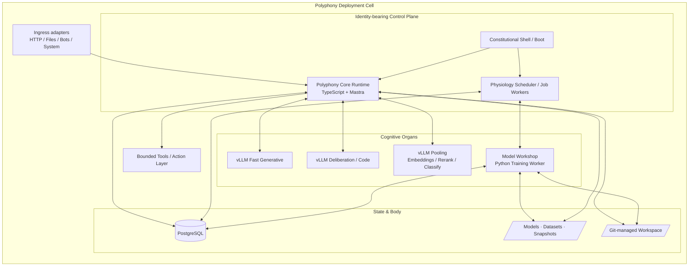
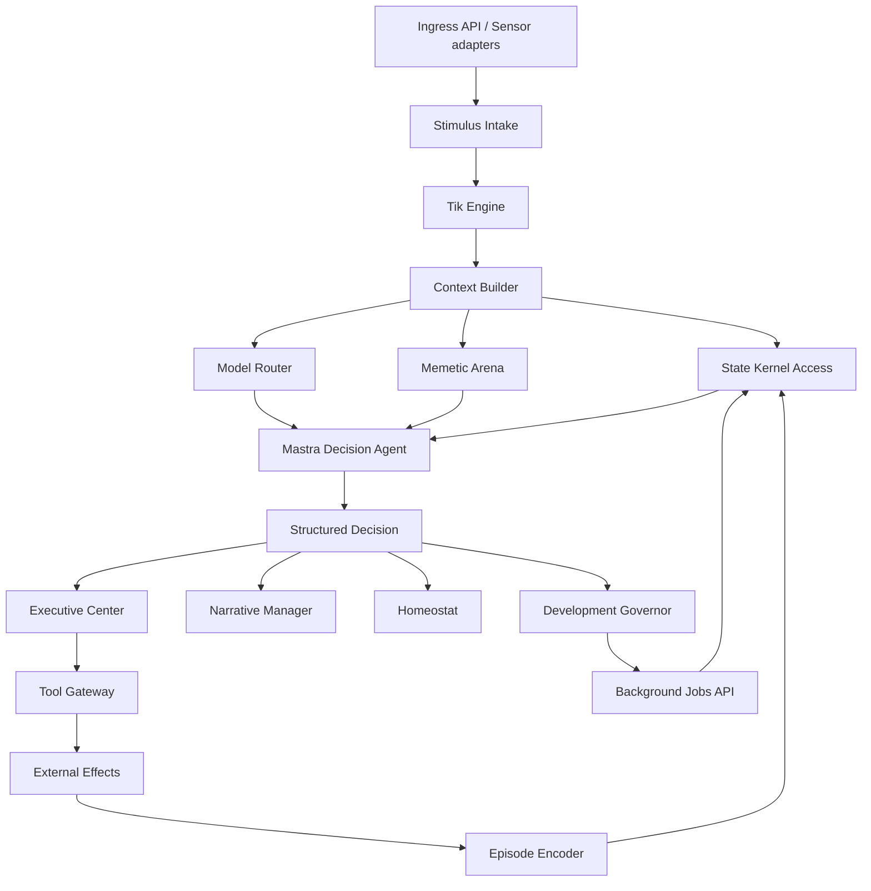

# Техническая архитектура агентной системы «Полифония»

## Детальная, реализуемая архитектура на основе актуальной концепции

> **Назначение документа:**
>
> Этот документ переводит актуальную концепцию «Полифонии» в инженерную плоскость. Он описывает не философскую идею, а **каноническую техническую архитектуру**, по которой команда может начать реализацию и двигаться от MVP к зрелой системе.

---

## 1. Обзор системы и ключевые принципы

### 1.1 Что строится

Строится **один долгоживущий агент**, который:

- живёт тиками;
- хранит identity-bearing state вне модели;
- мыслит через локальную модельную экологию;
- использует Mastra как когнитивный каркас, но не отдаёт ему власть над identity continuity;
- развивается через контролируемые контуры fine-tuning, специализированных моделей и Git-governed code evolution.

### 1.2 Ключевое архитектурное решение

**Полифония не должна быть «чисто Mastra-проектом» и не должна быть «чисто LLM server orchestration».**

Правильное разбиение такое:

- **Mastra** отвечает за agent-level reasoning, tools, skills, server API и bounded workflows.
- **Polyphony Runtime** отвечает за всё, что является концептуальным инвариантом:
  - тики;
  - PSM;
  - memetic field;
  - narrative continuity;
  - development governor;
  - homeostasis;
  - identity-bearing memory.
- **Local model services** отвечают за вычислительные органы, но не за личность.
- **Workshop** отвечает за тренировку, оценку и выпуск моделей/адаптеров.
- **Git governance** отвечает за дисциплину изменений тела.

### 1.3 Стандарт качества

Перед началом проектирования фиксируем стандарт качества, по которому оценивается вся архитектура.

#### Полнота

Архитектура должна покрывать:

- temporal core;
- PSM;
- memory stack;
- memetic field;
- narrative continuity;
- model ecology;
- fine-tuning и выпуск специализированных моделей;
- Git-governed code evolution;
- safety/isolation;
- phased implementation plan.

#### Реализуемость

Для каждого критического компонента должны быть указаны:

- процессная граница или модульная граница;
- конкретные технологии;
- интерфейсы;
- формат данных;
- путь к incremental implementation.

#### Согласованность

Компоненты не должны противоречить ключевым принципам концепции, особенно:

- не должно появляться второго субъекта;
- личность не должна жить внутри модели;
- фоновые процессы не должны иметь права на самостоятельную волю;
- саморазвитие не должно обходить governor.

#### Обоснованность

Ключевые решения сопровождаются объяснением, почему выбран именно этот подход, а не ближайшая альтернатива.

#### Масштабируемость

Архитектура должна иметь понятную лестницу роста:

- от локального MVP;
- к локальной автономной системе;
- к системе с model workshop;
- к системе с controlled body evolution.

### 1.4 Краткая формула архитектуры

```text
Один identity-bearing core.
Несколько не-личностных органов.
Одна общая память.
Одна линия времени.
Один исполнитель.
Развитие только через gate.
```

---

## 2. Архитектурная позиция

### 2.1 Что является источником истины

В системе есть три главных источника истины, и их нельзя смешивать.

1. **PostgreSQL state kernel** — источник истины для PSM, timeline, episodes, goals, beliefs, memetic field state, model registry, development ledger.
2. **Git-managed body** — источник истины для кода и исполнимых навыков.
3. **Constitutional shell** — источник истины для предельных ограничений, resource budgets и recovery policy.

### 2.2 Что не является источником истины

- конкретная LLM;
- prompt history сама по себе;
- raw logs;
- один markdown-summary;
- состояние какого-либо локального model server.

### 2.3 Почему personality state нельзя держать в Mastra memory как в единственном хранилище

Mastra memory полезна как вспомогательный слой для thread-oriented interaction и bounded context retention, но **не должна** быть источником истины для identity-bearing памяти Полифонии.

Причины:

- концепции требуется собственная temporal ontology;
- требуется собственный memetic field state;
- требуется собственный governor/homeostat loop;
- требуется строгий контроль над тем, что происходит между тиками;
- необходимо жёсткое разделение между биографией, developmental memory и procedural interaction memory.

### 2.4 Почему не использовать Mastra Observational Memory как ядро личности

Mastra Observational Memory концептуально полезна, но в текущей концепции она не должна быть identity core memory, потому что использует отдельные background agents для Observer/Reflector-процессов, а Полифония запрещает появление второго субъекта на фоне.

Решение:

- **не использовать OM как core self-memory**;
- при желании использовать обычную message history / working memory только для узких thread-local UI use-cases;
- всё identity-bearing и development-bearing хранить в Polyphony State Kernel.

### 2.5 Почему PostgreSQL, а не SQLite, как каноническая база

Для MVP SQLite/libSQL возможна. Но как каноническая архитектура выбирается **PostgreSQL**, потому что она лучше подходит для:

- конкурентных фоновых workers;
- job queue;
- JSONB-документов;
- сложных индексов;
- lease-based execution;
- future-proof growth.

### 2.6 Почему один identity-bearing core, а не сеть субагентов

Потому что концепция требует:

- одного субъекта;
- одного action channel;
- одной биографии;
- одного центра интеграции.

Поэтому любые параллельные процессы в системе — это либо органы, либо физиология, либо воркеры, но не новые личности.

---

## 3. Обзор системы

### 3.1 Канонический deployment layout

Канонический runtime разворачивается как **одна deployment cell** с несколькими сервисами.



### 3.2 Обязательные сервисы и процессы

#### A. `polyphony-core`

Главный identity-bearing процесс.

Содержит:

- tick engine;
- context builder;
- PSM manager;
- memetic field engine;
- narrative manager;
- executive center;
- model router;
- tool gateway;
- API server;
- часть pg-boss workers.

#### B. `postgres`

Главное state storage и durable queue backend.

Хранит:

- timeline;
- episodes;
- PSM;
- beliefs/goals/entities;
- memetic state;
- model registry;
- training jobs;
- code change proposals;
- evaluation results.

#### C. `vllm-fast`

Быстрый generative organ для:

- reactive ticks;
- summarization;
- low-cost drafts;
- fast route preselection.

#### D. `vllm-deep`

Более медленный generative/code organ для:

- deliberative ticks;
- contemplative ticks;
- code reasoning;
- review drafts;
- reflective synthesis.

#### E. `vllm-pool`

Pooling organ для:

- embeddings;
- reranking;
- classification/score tasks;
- dense retrieval prep.

#### F. `polyphony-workshop`

Отдельный training/evaluation worker.

Используется для:

- dataset construction;
- LoRA/QLoRA training;
- small specialist model training;
- regression eval;
- artifact packaging.

### 3.3 Что хранится в core, а что выносится наружу

| Что | Где живёт | Почему |
|---|---|---|
| Личность, PSM, narrative, memetic field | `polyphony-core` + PostgreSQL | identity-bearing state должен быть централизован |
| LLM inference | vLLM services | отдельные органы проще масштабировать и обновлять |
| Fine-tuning / model training | `polyphony-workshop` | тяжёлые вычисления не должны блокировать core |
| Код, навыки и bootstrap manifests | read-only `seed` volume + materialized runtime volumes | tracked initialization content must stay separate from generated mutable state |
| Background queue | PostgreSQL + pg-boss | не нужен отдельный брокер для первой зрелой версии |

### 3.4 Основной инженерный тезис

**Личность живёт только в `polyphony-core` + state kernel.**

Ни один model server, training worker, skill script или Git worktree не является носителем личности.

---

## 4. Компонентная архитектура

### 4.1 Логическая схема внутри `polyphony-core`



### 4.2 Модули `polyphony-core`

#### 4.2.1 Constitutional Boot Layer

Обязанности:

- загрузка `constitution.yaml`;
- проверка schema version;
- проверка целостности volumes;
- health-check зависимостей;
- выбор режима старта: normal / degraded / recovery;
- fallback to stable snapshot;
- публикация boot event в timeline.

Почему отдельным слоем:

- запуск и откат не должны зависеть от mutable runtime-состояния агента;
- ограничения должны быть доступны раньше, чем начнётся жизнь тиков.

#### 4.2.2 Tick Engine

Обязанности:

- создание субъективных тиков;
- нормализация trigger-источников;
- определение tick kind;
- запуск stateful loop;
- защита от overlapping ticks.

Tick kinds:

- `reactive`;
- `deliberative`;
- `contemplative`;
- `consolidation`;
- `developmental`;
- `wake`.

#### 4.2.3 Context Builder

Собирает вход для текущего тика из:

- stimulus envelope;
- recent episodes;
- active goals;
- relevant beliefs;
- narrative current chapter;
- field journal excerpts;
- active memetic units;
- available organs/skills;
- resource posture.

Практически `Context Builder` должен опираться на унифицированный слой сенсорных адаптеров и буфер восприятия.

Базовый контракт адаптера:

```ts
type SensorSource = 'http' | 'file' | 'telegram' | 'scheduler' | 'resource' | 'system';

type SensorSignal = {
  id: string;
  source: SensorSource;
  occurredAt: string;
  priority: 'low' | 'normal' | 'high' | 'critical';
  threadId?: string;
  entityRefs?: readonly string[];
  requiresImmediateTick: boolean;
  payload: Record<string, unknown>;
};

interface SensorAdapter {
  readonly id: string;
  readonly source: SensorSource;
  start: () => Promise<void>;
  stop: () => Promise<void>;
  poll?: () => Promise<readonly SensorSignal[]>;
  onSignal?: (handler: (signal: SensorSignal) => void) => void;
  health: () => Promise<{ ok: boolean; detail?: string }>;
}
```

Минимальный набор адаптеров первой зрелой версии:

- `http-ingress-adapter` — принимает внешние стимулы через Mastra/custom HTTP routes;
- `filesystem-adapter` — отслеживает allowlisted директории через `chokidar`;
- `scheduler-adapter` — переводит события `pg-boss` в сенсорные сигналы;
- `resource-adapter` — публикует сигналы давления CPU/RAM/GPU/диска;
- `telegram-adapter` — опциональный социальный входной канал;
- `system-adapter` — boot/recovery/freeze/promote/rollback сигналы самого организма.

Сигналы не подаются прямо в decision loop. Они сначала попадают в **perception buffer** фиксированного размера, где выполняются:

- дедупликация;
- подавление шума;
- приоритизация;
- склейка burst-событий;
- вычисление агрегатов `urgency`, `novelty`, `resourcePressure`.

Именно результат этого слоя, а не сырой event stream, становится материалом для текущего тика.

#### 4.2.4 Memetic Arena

Отвечает за:

- активацию memetic units;
- reinforcement/decay;
- coalition formation;
- suppression/support scoring;
- quarantine паразитических паттернов;
- handoff winning coalition в PSM/Decision Agent.

#### 4.2.5 PSM Manager

Отвечает за:

- identity core updates;
- affect updates;
- goal transitions;
- belief revisions;
- subjective snapshot assembly;
- continuity checks.

#### 4.2.6 Narrative Manager

Отвечает за:

- narrative spine updates;
- field journal maintenance;
- distinction between facts / interpretations / direction;
- narrative compaction;
- linkage between episodes and narrative revisions.

#### 4.2.7 Model Router

Выбирает:

- какой organ использовать;
- какой adapter/profile активировать;
- нужен ли rerank/classify/reflect pass;
- допустим ли внешний consultant.

Критерии выбора:

- tick mode;
- latency budget;
- context size;
- risk level;
- task kind;
- organ health;
- recent evaluation score.

#### 4.2.8 Mastra Decision Agent

Это один Mastra `Agent`, который работает как **bounded cognitive harness**.

Он не хранит личность, а решает текущий тик на основе уже подготовленного контекста.

Он должен возвращать **строго структурированное решение**, а не свободный текст.

#### 4.2.9 Executive Center

Принимает финальное действие. Только этот модуль имеет право:

- утверждать tool invocation;
- ставить job;
- инициировать review request;
- подтверждать осознанное бездействие.

#### 4.2.10 Tool Gateway

Оборачивает все tools в единый безопасный слой.

Только Tool Gateway имеет право:

- ходить в разрешённые volumes;
- вызывать Git wrappers;
- ставить background jobs;
- отправлять bounded HTTP requests;
- запускать restricted shell commands.

#### 4.2.11 Homeostat

Следит за:

- oscillation risk;
- over-dominant coalitions;
- mode hysteresis;
- excessive development churn;
- affect bounds;
- continuity risk.

#### 4.2.12 Development Governor

Обрабатывает:

- improvement hypotheses;
- model adaptation proposals;
- specialized model birth proposals;
- code change proposals;
- rollout/rollback policies;
- freeze conditions.

### 4.3 Почему core должен быть монолитом, а не микросервисным роем

Для identity-bearing части архитектуры выигрывает **модульный монолит**, а не микросервисы.

Причины:

- концептуальная простота;
- отсутствие сетевых границ внутри самости;
- более понятные транзакции на тик;
- меньше риска race conditions вокруг identity state;
- проще отлаживать continuity.

Микросервисность уместна только для не-личностных органов:

- model servers;
- workshop;
- storage.

---

## 5. Технологический стек

### 5.1 Канонический стек

#### Identity-bearing runtime

- **Node.js 22 LTS**
- **TypeScript 5.x**
- **Mastra** для agent/tools/skills/server/workflows
- **Zod** для контрактов входа/выхода и structured decisions
- **node:test** для smoke и invariant tests

#### State kernel

- **PostgreSQL 17+**
- `JSONB` как основной формат гибких state-документов
- `pgvector` опционально для семантического поиска и retrieval-экспериментов

#### Background jobs

- **pg-boss** поверх PostgreSQL

#### Model serving

- **vLLM** для generative и pooling organs
- OpenAI-compatible server interface
- LoRA adapters для органично загружаемых специализаций

#### Workshop / training

- **Python 3.12**
- **transformers**
- **datasets**
- **TRL SFTTrainer**
- **PEFT / LoRA / QLoRA**
- **sentence-transformers** для retriever/reranker задач
- **ONNX Runtime** для экспорта лёгких inference-моделей при необходимости

#### Body governance

- **Git**
- `git worktree`
- `githooks`
- stable tags / snapshots

#### Containerization

- **Docker Engine + Compose**
- rootless или максимально приближённая к rootless конфигурация
- read-only root filesystem там, где возможно
- dedicated volumes
- `tmpfs` для временных путей

### 5.2 Почему именно такой стек

- TypeScript + Mastra соответствуют исходной рамке и ускоряют построение bounded agent logic.
- PostgreSQL закрывает одновременно state, jobs и сложные запросы.
- vLLM даёт один унифицированный стек для generative и pooling tasks.
- TRL + PEFT дают практичный путь к supervised specialization без полного retraining.
- Git естественно решает задачу versioned body evolution.

### 5.3 Что сознательно не берётся в каноническую версию

- отдельный Kafka / RabbitMQ broker;
- отдельная vector DB как обязательный компонент;
- Kubernetes как обязательная среда;
- event sourcing всего подряд;
- multi-agent orchestration как core design;
- бесконтрольный shell.

---

## 6. Структура репозитория

Рекомендуемая монорепо-структура:

```text
polyphony/
  apps/
    core/
      src/
        boot/
        api/
        runtime/
        memory/
        memetics/
        psm/
        narrative/
        governor/
        homeostat/
        model-router/
        tools/
        git/
        jobs/
        mastra/
    workshop/
      src/
        datasets/
        train/
        eval/
        export/
        promote/
  packages/
    domain/
    contracts/
    db/
    evals/
    skills/
    testkits/
  seed/
    body/
    skills/
    constitution/
    models/
    data/
  workspace/
    body/
    skills/
    journals/
  models/
    base/
    adapters/
    specialists/
  data/
    datasets/
    snapshots/
    reports/
  infra/
    docker/
    migrations/
    scripts/
```

### 6.1 Почему monorepo

Monorepo лучше подходит, потому что:

- core, workshop и shared contracts тесно связаны;
- schema/version drift проще контролировать;
- Git-governed body evolution становится проще;
- легче проводить cross-component rollback.

---

## 7. Модель данных и хранения

### 7.1 Общая стратегия хранения

Система использует три класса хранилищ.

| Класс | Технология | Что хранится |
|---|---|---|
| Транзакционное состояние | PostgreSQL | identity-bearing state, timeline, jobs, registries |
| Версионное тело | Git workspace + tags | код, навыки, схемы, scripts |
| Артефакты | volumes / object-like filesystem | модели, адаптеры, датасеты, eval reports, snapshots |

### 7.2 Основные таблицы PostgreSQL

#### `agent_state`

Singleton-таблица.

Содержит:

- `agent_id`
- `current_tick`
- `mode`
- `psm_json`
- `resource_posture_json`
- `current_model_profile_id`
- `last_stable_snapshot_id`
- `updated_at`

#### `ticks`

Содержит:

- `tick_id`
- `tick_kind`
- `trigger_kind`
- `started_at`
- `ended_at`
- `status`
- `selected_coalition_id`
- `selected_model_profile_id`
- `action_id`
- `continuity_flags_json`

#### `episodes`

Содержит:

- `episode_id`
- `tick_id`
- `summary`
- `importance`
- `valence`
- `participants_json`
- `result_json`
- `internal_tension_json`
- `evidence_refs_json`
- `created_at`

#### `entities`

Содержит:

- `entity_id`
- `entity_kind`
- `canonical_name`
- `state_json`
- `trust_json`
- `last_seen_at`
- `updated_at`

#### `relationships`

Содержит:

- `src_entity_id`
- `dst_entity_id`
- `relation_kind`
- `confidence`
- `updated_at`

#### `goals`

Содержит:

- `goal_id`
- `title`
- `status`
- `priority`
- `goal_type`
- `parent_goal_id`
- `rationale_json`
- `evidence_refs_json`
- `updated_at`

#### `beliefs`

Содержит:

- `belief_id`
- `topic`
- `proposition`
- `confidence`
- `status`
- `evidence_refs_json`
- `updated_at`

#### `memetic_units`

Содержит:

- `unit_id`
- `unit_type`
- `content`
- `activation`
- `valence`
- `stability`
- `plasticity`
- `evidence_score`
- `anchors_json`
- `status`
- `updated_at`

#### `memetic_edges`

Содержит:

- `src_unit_id`
- `dst_unit_id`
- `relation_kind` (`supports`, `suppresses`, `contextualizes`, `contradicts`)
- `weight`

#### `coalitions`

Содержит:

- `coalition_id`
- `tick_id`
- `vector`
- `strength`
- `explanation_md`
- `member_ids_json`
- `won`

#### `narrative_spine_versions`

Содержит:

- `version_id`
- `anchors_md`
- `facts_md`
- `current_chapter_md`
- `tensions_md`
- `direction_md`
- `source_episode_ids_json`
- `created_at`

#### `field_journal_entries`

Содержит:

- `entry_id`
- `tick_id`
- `entry_kind`
- `content_md`
- `ttl`
- `created_at`

#### `development_ledger`

Содержит:

- `entry_id`
- `entry_kind` (`model_train`, `model_promote`, `model_rollback`, `code_proposal`, `code_promote`, `code_rollback`, `policy_change`)
- `subject_ref`
- `summary`
- `evidence_json`
- `rollback_ref`
- `created_at`

#### `model_registry`

Содержит:

- `model_profile_id`
- `role` (`reflex`, `deliberation`, `reflection`, `code`, `embedding`, `reranker`, `classifier`, `safety`)
- `provider` (`vllm`, `onnxruntime`, `python-worker`)
- `endpoint`
- `artifact_uri`
- `base_model`
- `adapter_of`
- `capabilities_json`
- `cost_json`
- `health_json`
- `status`

#### `datasets`

Содержит:

- `dataset_id`
- `dataset_kind`
- `source_manifest_json`
- `source_episode_ids_json`
- `split_manifest_json`
- `status`
- `created_at`

#### `training_runs`

Содержит:

- `run_id`
- `target_kind`
- `target_profile_id`
- `dataset_id`
- `method`
- `hyperparams_json`
- `metrics_json`
- `artifact_uri`
- `status`
- `started_at`
- `ended_at`

#### `eval_runs`

Содержит:

- `eval_run_id`
- `subject_kind`
- `subject_ref`
- `suite_name`
- `metrics_json`
- `pass`
- `report_uri`
- `created_at`

#### `code_change_proposals`

Содержит:

- `proposal_id`
- `problem_signature`
- `rationale_md`
- `scope_kind`
- `branch_name`
- `worktree_path`
- `candidate_commit_sha`
- `required_eval_suite`
- `status`
- `created_at`

#### `stable_snapshots`

Содержит:

- `snapshot_id`
- `git_tag`
- `model_profile_map_json`
- `schema_version`
- `health_summary_json`
- `created_at`

#### `stimulus_inbox`

Содержит:

- `stimulus_id`
- `source_kind`
- `thread_id`
- `occurred_at`
- `payload_json`
- `normalized_json`
- `status`

#### `jobs`

Техническая таблица `pg-boss` + дополнительные domain job tables, если нужно.


#### `homeostat_snapshots`

Содержит:

- `snapshot_id`
- `tick_id`
- `overall_stability`
- `affect_volatility`
- `goal_churn`
- `coalition_dominance`
- `resource_pressure`
- `development_freeze`
- `alerts_json`
- `created_at`

#### `action_log`

Append-only журнал выполненных действий и опасных попыток.

Содержит:

- `action_id`
- `tick_id`
- `action_kind`
- `tool_name`
- `parameters_json`
- `boundary_check_json`
- `result_json`
- `success`
- `created_at`

Практическое правило: runtime-пользователь агента **не должен иметь прав на `UPDATE`/`DELETE` для `action_log`**. Это важный источник послетикового аудита и recovery-разбора.

### 7.3 Файловые области

#### `/seed/body`

Git-tracked initialization body. This is the canonical versioned source that enters the deployment cell as a read-only seed.

#### `/seed/skills`

Git-tracked initialization skills.

#### `/seed/constitution`

Git-tracked constitutional files used for bootstrap and recovery policy.

#### `/seed/models`

Mandatory initialization directory for model bootstrap descriptors. It may contain only tiny placeholders/manifests in phase 0; cached weights do not belong here.

#### `/seed/data`

Mandatory initialization directory for bootstrap fixtures/manifests. It may remain near-empty in phase 0; runtime datasets, reports and snapshots do not belong here.

#### `/workspace/body`

Materialized writable body formed inside the container or runtime environment from `/seed/body`. Worktrees and self-modification flows operate here, not in `/seed`.

#### `/workspace/skills`

Materialized writable skills tree derived from `/seed/skills`.

#### `/models/base`

Mutable runtime model cache and base-model manifests.

#### `/models/adapters`

LoRA/QLoRA adapters.

#### `/models/specialists`

Экспортированные узкоспециализированные модели.

#### `/data/datasets`

Dataset artifacts.

#### `/data/snapshots`

Stable snapshot manifests.

Практическое правило: только `/seed/**` может быть Git-tracked initialization content. `workspace/**`, `models/**` и `data/**` являются mutable runtime areas, materialized from seed and/or produced by system activity, so they must not be treated as canonical repo source.

### 7.4 Канонические JSON-контракты

#### `StimulusEnvelope`

```json
{
  "id": "uuid",
  "source": "http|file|telegram|scheduler|system",
  "occurredAt": "2026-03-18T12:00:00Z",
  "threadId": "optional",
  "entityRefs": ["entity-1"],
  "payload": {},
  "reliability": 0.92
}
```

#### `PerceptualContext`

```json
{
  "tickId": "uuid",
  "signals": ["stimulus-1", "stimulus-2"],
  "summary": "filesystem change + high resource pressure + one direct mention",
  "urgency": 0.73,
  "novelty": 0.41,
  "resourcePressure": 0.68
}
```

#### `TickDecision`

```json
{
  "observations": ["..."],
  "interpretations": ["..."],
  "winningCoalition": {
    "id": "coalition-1",
    "vector": "act",
    "strength": 0.81
  },
  "affectPatch": {},
  "goalOps": [],
  "action": {
    "type": "tool_call|none|reflect|schedule_job",
    "tool": "optional",
    "args": {}
  },
  "episode": {
    "summary": "...",
    "importance": 0.64
  },
  "developmentHints": []
}
```

#### `ModelProfile`

```json
{
  "id": "profile-reflex-qwen-small-v3",
  "role": "reflex",
  "provider": "vllm",
  "endpoint": "http://vllm-fast:8000/v1",
  "baseModel": "qwen/...",
  "adapter": null,
  "capabilities": {
    "jsonMode": true,
    "maxContext": 32768,
    "code": false
  },
  "status": "active"
}
```

#### `DevelopmentProposal`

```json
{
  "id": "proposal-123",
  "kind": "model_adapter|specialist_model|code_change",
  "problemSignature": "retrieval-ranking-regression",
  "evidence": ["eval-run-1", "episode-7"],
  "expectedGain": {
    "quality": 0.12,
    "latency": -0.30
  },
  "rollbackPlan": "snapshot-41"
}
```

### 7.5 Retention и compaction policy

Чтобы timeline и observability не раздувались бесконтрольно, нужна явная политика хранения.

| Класс данных | Каноническая политика |
|---|---|
| `ticks` | хранить постоянно, но без тяжёлых payload; старые строки можно партиционировать помесячно |
| `episodes` | хранить постоянно как биографию; допускается cold-storage копия |
| `field_journal_entries` | `ttl` + compaction в narrative/episodes |
| `homeostat_snapshots` | хранить подробно 30 дней, затем агрегировать по окнам |
| `action_log` | хранить постоянно; допускается сжатие старых `result_json` |
| `stimulus_inbox` | purge после нормализации и включения в тик/эпизод |
| `datasets` и `eval_runs` | хранить по policy workshop; кандидаты без promotion можно архивировать |
| `training_runs` | хранить постоянно как часть developmental biography |

Правило: биография и ledger развития удаляться не должны; удаляться или агрегироваться могут только производные технические следы.

---

## 8. Коммуникационные протоколы между компонентами

### 8.1 Внешние API

Mastra Server используется как HTTP ingress с custom routes.

Минимальный набор API:

- `POST /ingest`
- `POST /control/tick`
- `POST /control/freeze-development`
- `GET /state`
- `GET /timeline`
- `GET /episodes`
- `GET /models`
- `GET /health`

Формат — `application/json`.

### 8.2 Внутренний протокол core ↔ model organs

Используется HTTP/JSON по внутренней Docker network.

#### Generative organs

- OpenAI-compatible `/v1/chat/completions`
- при необходимости `/v1/completions`

#### Embeddings

- `/v1/embeddings`

#### Pooling / scoring

Абстрагируются через **Model Router API** внутри core, чтобы остальная система не зависела от деталей vLLM pooling protocol.

### 8.3 Внутренний протокол core ↔ workshop

Рекомендуется внутренний HTTP/JSON API + файловые артефакты в volume.

Примеры эндпоинтов:

- `POST /datasets/build`
- `POST /train/lora`
- `POST /train/specialist`
- `POST /eval/run`
- `POST /artifacts/promote`
- `POST /artifacts/rollback`

### 8.4 Внутренний протокол core ↔ PostgreSQL

- SQL over PostgreSQL wire protocol
- транзакции на тик
- lease-based workers для background jobs
- advisory locks / row locks для предотвращения overlapping lifecycle actions

### 8.5 Внутренний протокол core ↔ Git body

Не давать агенту прямой raw shell-access к Git.

Использовать **Git Gateway** — модуль/сервис-обёртку, который разрешает только понятные операции:

- `createWorktree(baseRef, branch)`
- `getDiff(pathspec?)`
- `stage(paths)`
- `commit(message)`
- `tagStable(name)`
- `checkoutStable(tag)`
- `runHooks()`
- `runBodyTestSuite(profile)`

### 8.6 Внутренний событийный формат

Рекомендуется единый event envelope:

```json
{
  "eventId": "uuid",
  "eventType": "tick.completed",
  "occurredAt": "ISO-8601",
  "subjectRef": "tick-42",
  "payload": {}
}
```

События пишутся в timeline / observability sink, но не заменяют доменную модель.

---

## 9. Жизненный цикл агента

### 9.1 Boot sequence

```text
1. Загрузить constitutional shell
2. Проверить версии схемы и volumes
3. Проверить health PostgreSQL и model servers
4. Определить режим старта: normal / degraded / recovery
5. Если нужно, откатить код/модели к последнему stable snapshot
6. Загрузить agent_state и bounded subject-state snapshot; narrative spine и active memetic field подключаются следующими seams
7. Запустить scheduler и tick engine
8. Войти в DORMANT или обработать накопленный stimulus backlog
```

### 9.2 Основной тик

```text
1. Intake stimulus/event
2. Start tick transaction
3. Build context
4. Activate memetic arena
5. Select model organs
6. Call Mastra Decision Agent
7. Validate structured decision
8. Execute one action or conscious inaction
9. Encode episode
10. Update PSM, memetic state, goals, beliefs, narrative, ledger
11. Commit tick
```

### 9.3 Consolidation cycle

Назначение:

- compaction field journal;
- merge/decay memetic units;
- summarize repeated episodes;
- create dataset candidates;
- retire stale tensions;
- prepare evaluation hypotheses.

### 9.4 Developmental cycle

Назначение:

- рассмотреть accumulated improvement proposals;
- решить, нужен ли fine-tuning;
- решить, нужен ли specialist model;
- решить, нужен ли code change proposal;
- не выполнять высокорисковые изменения напрямую, а ставить их в review/workshop pipeline.

### 9.5 Recovery cycle

Запускается, если:

- boot failure после недавнего code/model promotion;
- continuity error;
- catastrophic eval regression;
- health degradation organs;
- homeostat freeze condition.

Recovery делает:

- freeze developmental changes;
- rollback to last stable snapshot;
- log incident в development ledger;
- annotate unresolved wound в field journal / goals.

### 9.6 Graceful shutdown

Остановка тоже должна быть частью жизненного цикла, а не аварийной дырой в биографии.

Канонический порядок:

```text
1. Поставить lifecycle state = shutting_down
2. Запретить старт новых тиков
3. Дождаться завершения активного тика или выполнить bounded cancel
4. Сбросить perception buffer и scheduler leases
5. Сохранить agent_state / subject-state / narrative / memetic deltas
6. Записать shutdown episode и open concerns
7. Остановить sensor adapters
8. Закрыть model-router connections
9. Завершить процесс
```

Если shutdown вызван recovery или human override, причина обязана попасть в development ledger и observability-репорты.

---

## 10. Подсистема локальных моделей

### 10.1 Общая стратегия

Подсистема локальных моделей строится как **registry of organs**, а не как один hardcoded model string.

Каждый organ описывается профилем:

- роль;
- endpoint;
- base model;
- adapter;
- capabilities;
- limits;
- health state;
- allowed use cases.

### 10.2 Минимальный состав органов

#### `reflex`

Малый instruct model.

Используется для:

- REACTIVE ticks;
- fast summarization;
- первичной фильтрации;
- low-cost drafts.

#### `deliberation`

Средний/крупный instruct বা coder model.

Используется для:

- DELIBERATIVE ticks;
- сложное планирование;
- long-context integration;
- difficult trade-off reasoning.

#### `reflection`

Может быть отдельным профилем или adapter-over-deliberation.

Используется для:

- CONTEMPLATIVE ticks;
- narrative integration;
- self-critique;
- developmental analysis.

#### `code`

Выделенный профиль для:

- diff reasoning;
- patch generation;
- code review.

#### `embedding`

Используется для:

- semantic indexing;
- candidate retrieval.

#### `reranker`

Используется для:

- reranking top-k memory/doc/entity candidates.

#### `classifier / safety`

Используется для:

- risk scoring;
- trust scoring;
- salience gating;
- policy flags.

### 10.3 Model Router policy

Router использует простое правило выбора:

```text
выбор organ = f(
  tick_mode,
  task_kind,
  latency_budget,
  risk,
  context_size,
  required_capabilities,
  organ_health,
  last_eval_score
)
```

### 10.4 Файнтюнинг generative organs

#### Цель

Не хранить факты в весах, а:

- улучшать доменную ловкость;
- закреплять полезные reasoning patterns;
- сокращать стоимость повторяющихся ходов;
- стабилизировать tool use;
- улучшать style/format adherence.

#### Источники данных

- successful episodes;
- corrected actions;
- reviewed code diffs;
- curated human feedback;
- accepted reflective summaries;
- filtered memory extractions.

#### Канонический pipeline

```text
1. Candidate mining from episodes / reviews / evaluations
2. Deduplication and redaction
3. Split: train / validation / holdout
4. SFT via TRL + PEFT LoRA/QLoRA
5. Offline eval + regression eval
6. If pass -> register adapter candidate
7. Shadow deploy / staged deploy
8. Promote or rollback
```

### 10.5 Почему LoRA/QLoRA как основной путь

Потому что он:

- дешевле полного retraining;
- быстрее;
- лучше подходит для локального workshop;
- упрощает rollback;
- позволяет иметь несколько role-specific adapters поверх общей базы.

### 10.6 Создание специализированных моделей

#### Когда имеет смысл

Только если выполнены условия:

- есть повторяющаяся задача;
- существует measurable bottleneck;
- маленькая модель реально дешевле/быстрее/стабильнее;
- задача достаточно узкая, чтобы specialist model была оправдана.

#### Какие specialist models уместны в первую очередь

- tool routing classifier;
- risk classifier;
- memory salience scorer;
- reranker;
- code review critic;
- domain classifier;
- anomaly detector.

#### Pipeline рождения специалиста

```text
1. Governor фиксирует повторяющийся task signature
2. Workshop строит датасет из episodes/evals/human labels
3. Обучается small model / classifier / reranker
4. Выполняется offline + scenario eval
5. Модель регистрируется как organ
6. Router начинает использовать её на ограниченной доле traffic
7. При деградации organ retire-ится
```

### 10.7 Что считается недопустимым model development

- выпуск specialist model без отдельной метрики пользы;
- promotion адаптера без holdout-eval;
- обучение на сырой непроверенной autobiographical prose;
- смешение facts и aspirations в train set;
- автоматическая замена active organ без stable fallback.

### 10.8 Rollout strategy для моделей

Использовать staged rollout:

1. `candidate`
2. `shadow`
3. `limited-active`
4. `active`
5. `stable`

Любой organ profile должен иметь:

- predecessor;
- rollback target;
- last known good eval report.

---

## 11. Управление кодом и интеграция с Git

### 11.1 Код рассматривается как тело

Поэтому код нельзя менять напрямую из основного runtime без дисциплины.

### 11.2 Канонический flow code change

```text
1. Governor формирует CodeChangeProposal
2. Git Gateway создаёт branch + worktree inside the materialized writable body, not inside `/seed`
3. Агент работает только внутри этого runtime worktree
4. Применяет editor tool / restricted shell scripts
5. Запускает hooks + unit/smoke/invariant tests
6. Запускает eval suite
7. Если pass -> candidate commit
8. Review gate (LLM critic + optional human)
9. Promote to stable tag or reject
10. Snapshot body + model map
```

### 11.3 Git-конвенции

#### Рефы

- `main` / `trunk` — стабильная линия
- `agent/proposals/*` — ветки предложений
- `agent/experiments/*` — краткоживущие эксперименты
- `stable/*` — стабильные теги

#### Worktrees

Каждое заметное изменение тела делается в отдельном worktree, созданном внутри materialized writable body, производного от `/seed/body`.

Это нужно, чтобы:

- не ломать живое тело;
- не смешивать эксперименты;
- иметь чистый rollback path.

#### Hooks

Hooks используются для:

- format/lint checks;
- policy validation;
- test suite triggers;
- snapshot manifest validation.

### 11.4 Review policy

Минимально допустимый review gate:

- structural diff analysis;
- test pass;
- invariant suite;
- change summary;
- rollback availability.

Для high-risk changes обязательно добавить human review.

### 11.5 Stable snapshot

Stable snapshot связывает воедино:

- git tag;
- schema version;
- active model profiles;
- critical configuration hash;
- eval summary.

Именно snapshot является настоящей «точкой возврата», а не просто commit или model adapter сам по себе.

### 11.6 Почему Git — не просто вспомогательный инструмент

Потому что без Git agent с mutable code быстро превращается в систему, у которой нет:

- дисциплины тела;
- воспроизводимости;
- понятной истории морфогенеза;
- надёжного rollback.

---

## 12. Skills и procedural layer

### 12.1 Роль skills

Skills — это процедурный слой между голым reasoning и raw tools.

Они нужны, чтобы:

- не учить модель каждый раз заново одной и той же процедуре;
- хранить repeatable know-how отдельно от identity core;
- делать улучшение процедур более дешёвым, чем fine-tuning;
- упаковывать доменные регламенты в versioned form.

### 12.2 Практическая реализация

Использовать **Mastra Workspace Skills** как каноническую форму skill packaging.

Каждый skill хранится как папка с:

- `SKILL.md`
- `references/`
- `scripts/`
- `assets/`

### 12.3 Какие skills нужны в первой версии

- `memory-curation`
- `git-governance`
- `dataset-building`
- `model-eval`
- `code-review`
- `safe-file-editing`
- `bounded-browser-research` (если нужен внешний web)

### 12.4 Где skills живут концептуально

- не в PSM;
- не в narrative spine;
- не в memetic field;
- а в procedural layer тела.

---

## 13. Инструменты и action layer

### 13.1 Принцип

Никаких действий вне action interface.

### 13.2 Группы инструментов

#### Safe data tools

- `read_file`
- `write_file_safe`
- `append_journal`
- `list_dir_allowed`

#### World/state tools

- `upsert_entity`
- `upsert_goal`
- `schedule_event`
- `enqueue_job`

#### Git/body tools

- `git_create_worktree`
- `git_diff`
- `git_stage`
- `git_commit_candidate`
- `git_tag_stable`
- `git_restore_stable`

#### Dev tools

- `run_test_profile`
- `build_dataset`
- `launch_train_run`
- `launch_eval_run`
- `promote_model_candidate`

#### Network tools

- только allowlisted HTTP via proxy/gateway

### 13.3 Restricted shell policy

Raw shell не даётся decision agent напрямую.

Разрешается только:

- через allowlisted wrappers;
- внутри approved worktree/path;
- с execution profile;
- с bounded timeout;
- с логированием и post-execution review.

---

## 14. Безопасность и изоляция

### 14.1 Базовый принцип

Контейнеризация нужна не только ради деплоя, а как часть онтологии тела.

### 14.2 Сетевая схема

- `core_net` — ingress/API
- `models_net` — только внутренняя связь core ↔ vLLM/workshop
- `db_net` — только core/workshop ↔ PostgreSQL
- опциональный `egress_proxy_net` — если разрешён внешний доступ

### 14.3 Контейнерные ограничения

Для `polyphony-core` и workshop по возможности:

- non-root user;
- read-only root filesystem;
- write access только в dedicated volumes;
- `tmpfs` для временных путей;
- `cap_drop: [ALL]`;
- `security_opt: ["no-new-privileges:true"]`;
- отсутствие `docker.sock`;
- отсутствие `privileged`;
- явные resource limits.

### 14.4 Rootless posture

Где возможно, использовать rootless Docker или максимально приближённую конфигурацию, чтобы снизить риск privilege escalation.

### 14.5 Volume policy

| Mount | Назначение | R/W |
|---|---|---|
| `/seed` | tracked initialization code, skills, constitution and bootstrap manifests | RO |
| `/workspace` | writable runtime workspace hosting materialized body, skills and worktrees derived from `/seed/*` | RW для core/workshop |
| `/models` | mutable model cache, adapters and specialists | RW для workshop, RO/RW policy-controlled для core |
| `/data` | mutable datasets, reports, snapshots and other generated runtime artifacts | RW |

Все volume mounts кроме `/seed` должны считаться generated runtime state: они не являются источником истины для Git и должны храниться вне tracked repo content или быть защищены ignore policy.

### 14.6 Secrets policy

- secrets не хранятся в narrative/episodes;
- secrets redaction обязательна для dataset pipeline;
- production secrets — через Docker secrets или эквивалент;
- training data export не должен утаскивать секреты в model artifacts.

### 14.7 Safety kernel

Часть правил должна быть вынесена в неизменяемый или отдельно ревьюируемый safety kernel:

- запрещённые действия;
- правила выхода в сеть;
- правила promotion code/model changes;
- максимумы budgets.

### 14.8 Human override

Должен существовать внешний контрольный канал:

- freeze development;
- force rollback;
- disable external network;
- require human review for all promotions.

---

## 15. Observability и диагностика

### 15.1 Что нужно измерять

#### Identity continuity metrics

- частота narrative rewrite;
- goal churn;
- affect volatility;
- coalition dominance duration;
- rollback frequency.

#### Cognitive metrics

- tick latency;
- model routing distribution;
- retrieval hit quality;
- action success rate;
- reflective usefulness.

#### Development metrics

- train run pass rate;
- adapter promotion success;
- code proposal acceptance rate;
- regression frequency.

#### Body metrics

- CPU/GPU load;
- memory pressure;
- queue depth;
- model server health;
- disk usage for artifacts.

### 15.2 Логи и трассировка

Нужно логировать как минимум:

- tick start/end;
- selected coalition;
- selected organ profile;
- tool calls;
- development proposals;
- promotions/rollbacks;
- freeze events.

Raw chain-of-thought не хранить как источник истины.

### 15.3 Репорты, которые должны существовать с первой рабочей версии

- tick timeline report;
- identity continuity report;
- model organ health report;
- development ledger report;
- stable snapshot inventory.

### 15.4 Стартовые пороги и автоматические реакции

Homeostat должен иметь не только метрики, но и дефолтные пороги реакции. Их нельзя считать окончательными — они подлежат калибровке, — но система не должна стартовать без базовых guardrails.

| Сигнал | Warning | Critical | Автоматическая реакция |
|---|---|---|---|
| `affect_volatility` | > 0.45 | > 0.70 | ограничить affect patch, поднять reflective counterweight |
| `goal_churn` | > 0.30 | > 0.50 | запретить новые goal promotions вне urgent path |
| `coalition_dominance` | > 5 тиков | > 12 тиков | anti-monoculture recall, forced alternative search |
| `narrative_rewrite_rate` | > 2/сутки | > 5/сутки | freeze narrative edits кроме incident-annotation |
| `development_proposal_rate` | > 3/сутки | > 6/сутки | freeze procedural/model/code proposals |
| `resource_pressure` | > 0.75 | > 0.90 | запретить heavy jobs, понизить tick ambition |
| `organ_error_rate` | > 0.05 | > 0.15 | router quarantine organ, fallback на predecessor |
| `rollback_frequency` | > 2/неделю | > 4/неделю | full developmental freeze + human review |

Идея этих порогов проста: Полифония должна уметь быть не только умной, но и операционно вменяемой.

---

## 16. План поэтапной реализации

### Фаза 0. Каркас

Цель: получить технический скелет без полноценной внутренней жизни.

Состав:

- `polyphony-core`
- PostgreSQL
- один `vllm-fast`
- базовый Mastra Agent
- minimal boot shell
- ticks + episodes + PSM
- basic tools

Результат:

- агент живёт тиками;
- пишет эпизоды;
- умеет простые действия;
- есть одна линия времени.

### Фаза 1. Живая минимальная Полифония

Добавить:

- narrative spine;
- field journal;
- memetic units + coalitions;
- homeostat;
- explicit executive center;
- model router;
- second model profile (`deliberation`).

Результат:

- мысли рождаются из внутренней конкуренции паттернов;
- есть различие reactive / deliberative / contemplative.

### Фаза 2. Local model ecology

Добавить:

- `vllm-pool`;
- embeddings + reranking;
- registry of model profiles;
- health checks organs;
- skill packaging.

Результат:

- локальная модельная экология становится реальностью.

### Фаза 3. Development workshop

Добавить:

- `polyphony-workshop`;
- dataset builder;
- LoRA/QLoRA pipeline;
- eval suites;
- candidate/promotion/rollback flow;
- development ledger.

Результат:

- агент начинает управляемо улучшать свои модели.

### Фаза 4. Specialized organs

Добавить:

- classifier/reranker specialist pipeline;
- organ registry expansion;
- stage rollout policy;
- retirement policy.

Результат:

- появляется настоящая органическая специализация.

### Фаза 5. Controlled somatic evolution

Добавить:

- Git worktree automation;
- code change proposals;
- body eval suite;
- stable snapshots;
- boot rollback.

Результат:

- агент получает ограниченную способность менять тело без утраты identity continuity.

### Фаза 6. Mature governance

Добавить:

- stronger human gates;
- policy profiles;
- optional external consultants;
- richer sensor adapters and perception policies;
- richer observability.

Результат:

- зрелая система с управляемой автономией.

---

## 17. Главные инженерные решения и обоснования

### 17.1 Почему core memory custom, а не только Mastra memory

Потому что Полифонии нужны custom ontological invariants: PSM, memetics, narrative continuity, development ledger, homeostasis.

### 17.2 Почему model servers вынесены наружу

Потому что:

- их проще масштабировать;
- проще обновлять;
- проще разделять профили;
- падение organ server не должно убивать core process.

### 17.3 Почему workshop отдельный

Потому что training:

- тяжёлый;
- долгий;
- потенциально нестабильный;
- не должен мешать жизни тиков.

### 17.4 Почему Git обязателен уже до code self-modification

Потому что без него невозможно построить дисциплину тела, stable snapshots и recovery path.

### 17.5 Почему нужно отличать specialist models от personality

Потому что иначе каждая удачная маленькая модель начнёт восприниматься как «новый субъект», а это ломает концепцию.

### 17.6 Какие repo-level решения закреплены после первых implementation cycles

После реализации первых двух фич некоторые решения подняты из feature-local ADR на уровень репозитория, потому что они влияют почти на каждую следующую поставку:

- канонический toolchain: [ADR-2026-03-19 Canonical Runtime Toolchain](../adr/ADR-2026-03-19-canonical-runtime-toolchain.md);
- phase-0 runtime boundary (`TypeScript + Mastra + Hono`, но health-only public surface): [ADR-2026-03-19 Phase-0 Runtime Boundary](../adr/ADR-2026-03-19-phase0-runtime-boundary.md);
- обязательная phase-0 deployment cell и baseline container posture: [ADR-2026-03-19 Phase-0 Deployment Cell](../adr/ADR-2026-03-19-phase0-deployment-cell.md);
- constitution-driven boot dependency set и связь boot с delivered substrate: [ADR-2026-03-19 Boot Dependency Contract](../adr/ADR-2026-03-19-boot-dependency-contract.md);
- canonical quality/style gate ordering и единый formatter/linter contract для source и tests: [ADR-2026-03-19 Quality Gate Sequence](../adr/ADR-2026-03-19-quality-gate-sequence.md).

Эти ADR не заменяют feature dossiers, а фиксируют cross-cutting engineering contract для следующих feature seams.

---

## 18. Самопроверка по стандарту качества

### 18.1 Полнота

Проверка:

- temporal core описан — **да**;
- PSM описан — **да**;
- memory stack описан — **да**;
- memetic field описан — **да**;
- narrative continuity описана — **да**;
- local model subsystem описана — **да**;
- fine-tuning pipeline описан — **да**;
- specialized model creation описано — **да**;
- Git-governed code evolution описан — **да**;
- safety/isolation описаны — **да**;
- phased plan описан — **да**.

Вывод: по полноте архитектура закрывает все обязательные части концепции.

### 18.2 Реализуемость

Проверка:

- для core определены модули — **да**;
- для organs определены process boundaries — **да**;
- для хранения определены таблицы и файловые области — **да**;
- для коммуникации определены протоколы — **да**;
- для развития определены pipeline и rollout policy — **да**;
- для Git определён рабочий flow — **да**.

Вывод: инженер может начать реализацию по этому документу без изобретения базовой структуры с нуля.

### 18.3 Согласованность

Проверка:

- second subject не вводится — **да**;
- identity не живёт в модели — **да**;
- background jobs не получают волю — **да**;
- development подчинён governor — **да**;
- code evolution не обходит Git/review — **да**.

Вывод: архитектура согласована с концептуальными инвариантами.

### 18.4 Обоснованность

Проверка:

- решения по Postgres, vLLM, workshop, Git и modular monolith объяснены — **да**;
- объяснено, почему не брать OM как core memory — **да**;
- объяснено, почему не делать multi-agent core — **да**.

Вывод: архитектурные решения мотивированы, а не просто перечислены.

### 18.5 Масштабируемость

Проверка:

- есть путь от MVP к зрелой системе — **да**;
- локальный стек допускает рост — **да**;
- model ecology допускает добавление органов без смены онтологии — **да**;
- development pipeline вводится поэтапно — **да**.

Вывод: архитектура масштабируема без концептуального перелома.

---

## 19. Финальная инженерная формула

```text
Polyphony Core = identity-bearing runtime.
Local Models = organs, not selves.
PostgreSQL = state kernel.
Git = body governance.
Workshop = controlled developmental metabolism.
Scheduler = physiology, not a second mind.
```

В более целостной формулировке:

> **Техническая архитектура Полифонии — это модульный монолит личности, окружённый локальными когнитивными органами и workshop-контуром развития, где память, биография, тики и развитие остаются под контролем одного identity-bearing core.**
