# Backlog Report

## System Summary

- Target system 1: area: runtime; public_http: false; services: polyphony-core; summary: One long-lived identity-bearing agent runs in ticks and owns bounded action, continuity, and workflow orchestration.
- Target system 2: area: state; public_http: false; stores: postgres, git-workspace; summary: PostgreSQL is the canonical state kernel while the body and skills live in a Git-governed workspace.
- Target system 3: area: models; public_http: false; services: vllm-fast, vllm-deep, vllm-pool; summary: Local model services act as organs behind the runtime rather than separate personalities.
- Target system 4: area: workshop; public_http: false; services: workshop; summary: Datasets, training, evaluation, and bounded promotion stay on the canonical workshop/runtime boundary.
- Target system 5: area: operations; commands: pnpm quality:fix, pnpm quality:check, pnpm smoke:cell; public_http: false; summary: Verification and deployment use the canonical pnpm toolchain, root quality gates, and containerized smoke path.
- As built 1: area: implemented-backbone; implemented_seams: CF-001, CF-002, CF-003, CF-004, CF-005, CF-006, CF-007, CF-008, CF-009, CF-010, CF-011, CF-017, CF-020, CF-021, CF-022; note: The delivered backbone already covers boot, runtime, state, perception, routing, bounded action, homeostat, operator API, model ecology, workshop, platform, and smoke harness seams.
- As built 2: area: pending-seams; note: These seams remain backlog-owned and must now progress through the backlog-engineer to dossier-engineer handoff instead of the legacy candidate table.; pending_seams: CF-012, CF-013, CF-014, CF-015, CF-016, CF-018, CF-019, CF-023, CF-024, CF-025, CF-026, CF-027
- As built 3: area: migration; legacy_inputs: feature-candidates.md, working-system-roadmap-matrix-2026-03-26.md, local-vllm-model-shortlist-2026-03-24.md; note: Legacy planning documents stay as supporting migration inputs only and are no longer the live backlog state.
- As built 4: area: delivery-state; explicit_rule: intaken=>implemented, confirmed=>planned; note: Candidate seams stay defined until the new backlog/dossier workflow advances them through explicit specification, planning, and closure.

## Backlog Metrics

- Total items: 27
- Items needing attention: 6
- Ready for next step: 3
- Items with gaps: 0
- Open todo count: 12
- Items by type: feature=27
- Items by delivery state: defined=7, implemented=19, planned=1

## Task Graph

Global graph:

```mermaid
flowchart TD
  CF-001["CF-001: Конституционный контур запуска и восстановления"]
  CF-002["CF-002: Тиковый runtime, scheduler и эпизодическая линия времени"]
  CF-003["CF-003: Ядро субъектного состояния и модель памяти"]
  CF-004["CF-004: Буфер восприятия и сенсорные адаптеры"]
  CF-005["CF-005: Нарративный и меметический контур рассуждения"]
  CF-006["CF-006: Базовый маршрутизатор моделей и профили органов"]
  CF-007["CF-007: Исполнительный центр и ограниченный слой действий"]
  CF-008["CF-008: Гомеостат и операционные guardrails"]
  CF-009["CF-009: HTTP API управления и интроспекции"]
  CF-010["CF-010: Расширенная модельная экология и здоровье реестра"]
  CF-011["CF-011: Контур workshop для датасетов, обучения, оценки и promotion"]
  CF-012["CF-012: Git-управляемая эволюция тела и стабильные снапшоты"]
  CF-013["CF-013: Слой skills и процедур"]
  CF-014["CF-014: Профиль безопасности и изоляции"]
  CF-015["CF-015: Наблюдаемость и диагностические отчёты"]
  CF-016["CF-016: Development Governor и управление изменениями"]
  CF-017["CF-017: Context Builder и structured decision harness"]
  CF-018["CF-018: Консолидация, event envelope и graceful shutdown"]
  CF-019["CF-019: Специализированные органы и политика вывода из эксплуатации"]
  CF-020["CF-020: Канонический scaffold монорепы и deployment cell"]
  CF-021["CF-021: Актуализация базовых зависимостей и выравнивание инструментального стека"]
  CF-022["CF-022: Детерминированный smoke harness и suite-scoped lifecycle deployment cell"]
  CF-023["CF-023: Реальный vLLM-serving и promotion model dependencies"]
  CF-024["CF-024: Аутентификация, авторизация и operator RBAC"]
  CF-025["CF-025: Deploy/release automation и rollback orchestration"]
  CF-026["CF-026: Support / operability contract и incident discipline"]
  CF-027["CF-027: Policy profiles, consultant admission и phase-6 governance closure"]
  CF-001 --> CF-002
  CF-020 --> CF-002
  CF-001 --> CF-003
  CF-002 --> CF-003
  CF-001 --> CF-004
  CF-002 --> CF-004
  CF-002 --> CF-005
  CF-003 --> CF-005
  CF-004 --> CF-005
  CF-002 --> CF-006
  CF-020 --> CF-006
  CF-002 --> CF-007
  CF-004 --> CF-007
  CF-006 --> CF-007
  CF-017 --> CF-007
  CF-020 --> CF-007
  CF-003 --> CF-008
  CF-005 --> CF-008
  CF-007 --> CF-008
  CF-001 --> CF-009
  CF-002 --> CF-009
  CF-003 --> CF-009
  CF-004 --> CF-009
  CF-006 --> CF-009
  CF-010 --> CF-009
  CF-006 --> CF-010
  CF-020 --> CF-010
  CF-010 --> CF-011
  CF-001 --> CF-012
  CF-007 --> CF-012
  CF-011 --> CF-012
  CF-016 --> CF-012
  CF-007 --> CF-013
  CF-020 --> CF-013
  CF-023 --> CF-013
  CF-007 --> CF-014
  CF-012 --> CF-014
  CF-015 --> CF-014
  CF-016 --> CF-014
  CF-020 --> CF-014
  CF-024 --> CF-014
  CF-002 --> CF-015
  CF-003 --> CF-015
  CF-007 --> CF-015
  CF-010 --> CF-015
  CF-016 --> CF-015
  CF-018 --> CF-015
  CF-003 --> CF-016
  CF-005 --> CF-016
  CF-008 --> CF-016
  CF-009 --> CF-016
  CF-011 --> CF-016
  CF-003 --> CF-017
  CF-004 --> CF-017
  CF-006 --> CF-017
  CF-002 --> CF-018
  CF-003 --> CF-018
  CF-005 --> CF-018
  CF-010 --> CF-019
  CF-011 --> CF-019
  CF-016 --> CF-019
  CF-023 --> CF-019
  CF-025 --> CF-019
  CF-001 --> CF-021
  CF-002 --> CF-021
  CF-003 --> CF-021
  CF-004 --> CF-021
  CF-020 --> CF-021
  CF-020 --> CF-022
  CF-021 --> CF-022
  CF-006 --> CF-023
  CF-010 --> CF-023
  CF-020 --> CF-023
  CF-009 --> CF-024
  CF-020 --> CF-024
  CF-015 --> CF-025
  CF-016 --> CF-025
  CF-018 --> CF-025
  CF-020 --> CF-025
  CF-022 --> CF-025
  CF-023 --> CF-025
  CF-009 --> CF-026
  CF-015 --> CF-026
  CF-024 --> CF-026
  CF-025 --> CF-026
  CF-004 --> CF-027
  CF-006 --> CF-027
  CF-014 --> CF-027
  CF-015 --> CF-027
  CF-016 --> CF-027
  CF-024 --> CF-027
```

## Needs Attention

### CF-014 — Профиль безопасности и изоляции

- Reason codes: source_changed, dependency_changed
- Reasons: Source changed: review ../architecture/system.md.; Dependency changed: review CF-018.
- Sources: ../architecture/system.md, ../features/F-0018-security-and-isolation-profile.md, ../polyphony_concept.md, feature-candidates.md, working-system-roadmap-matrix-2026-03-26.md

### CF-015 — Наблюдаемость и диагностические отчёты

- Reason codes: source_changed, dependency_changed
- Reasons: Source changed: review ../architecture/system.md.; Dependency changed: review CF-018.
- Sources: ../architecture/system.md, ../polyphony_concept.md, feature-candidates.md, working-system-roadmap-matrix-2026-03-26.md

### CF-019 — Специализированные органы и политика вывода из эксплуатации

- Reason codes: source_changed, dependency_changed
- Reasons: Source changed: review ../architecture/system.md.; Dependency changed: review CF-018.
- Sources: ../architecture/system.md, ../polyphony_concept.md, feature-candidates.md, working-system-roadmap-matrix-2026-03-26.md

### CF-025 — Deploy/release automation и rollback orchestration

- Reason codes: source_changed, dependency_changed
- Reasons: Source changed: review ../architecture/system.md.; Dependency changed: review CF-018.
- Sources: ../architecture/system.md, ../polyphony_concept.md, feature-candidates.md, working-system-roadmap-matrix-2026-03-26.md

### CF-026 — Support / operability contract и incident discipline

- Reason codes: source_changed, dependency_changed
- Reasons: Source changed: review ../architecture/system.md.; Dependency changed: review CF-018.
- Sources: ../architecture/system.md, ../polyphony_concept.md, feature-candidates.md, working-system-roadmap-matrix-2026-03-26.md

### CF-027 — Policy profiles, consultant admission и phase-6 governance closure

- Reason codes: source_changed, dependency_changed
- Reasons: Source changed: review ../architecture/system.md.; Dependency changed: review CF-018.
- Sources: ../architecture/system.md, ../polyphony_concept.md, feature-candidates.md, working-system-roadmap-matrix-2026-03-26.md

## Ready For Next Step

### Root: CF-023

- Ordering rule: depth -> downstream_dependency_count -> item_key
- Items: CF-023 -> CF-013

### Root: CF-024

- Ordering rule: depth -> downstream_dependency_count -> item_key
- Items: CF-024

## All Items

### CF-001 — Конституционный контур запуска и восстановления

- Type: feature
- Delivery state: implemented
- Needs attention: false
- Ready for next step: false
- Gaps: none
- Depends on: none
- Reverse dependencies: CF-002, CF-003, CF-004, CF-009, CF-012, CF-021
- Related sources: ../architecture/system.md, ../polyphony_concept.md, feature-candidates.md
- Todo: none
- Attention reasons: none

Context:
- Claims: none
- Contracts: none
- Data domains: none
- Quality attributes: none
- Policy decisions: none

Item metrics:
- Dependency count: 0
- Reverse dependency count: 6
- Gap count: 0
- Related source count: 3
- Related context element count: 0

### CF-002 — Тиковый runtime, scheduler и эпизодическая линия времени

- Type: feature
- Delivery state: implemented
- Needs attention: false
- Ready for next step: false
- Gaps: none
- Depends on: CF-001, CF-020
- Reverse dependencies: CF-003, CF-004, CF-005, CF-006, CF-007, CF-009, CF-015, CF-018, CF-021
- Related sources: ../architecture/system.md, ../polyphony_concept.md, feature-candidates.md
- Todo: none
- Attention reasons: none

Context:
- Claims: none
- Contracts: none
- Data domains: none
- Quality attributes: none
- Policy decisions: none

Item metrics:
- Dependency count: 2
- Reverse dependency count: 9
- Gap count: 0
- Related source count: 3
- Related context element count: 0

### CF-003 — Ядро субъектного состояния и модель памяти

- Type: feature
- Delivery state: implemented
- Needs attention: false
- Ready for next step: false
- Gaps: none
- Depends on: CF-001, CF-002
- Reverse dependencies: CF-005, CF-008, CF-009, CF-015, CF-016, CF-017, CF-018, CF-021
- Related sources: ../architecture/system.md, ../polyphony_concept.md, feature-candidates.md
- Todo: none
- Attention reasons: none

Context:
- Claims: none
- Contracts: none
- Data domains: none
- Quality attributes: none
- Policy decisions: none

Item metrics:
- Dependency count: 2
- Reverse dependency count: 8
- Gap count: 0
- Related source count: 3
- Related context element count: 0

### CF-004 — Буфер восприятия и сенсорные адаптеры

- Type: feature
- Delivery state: implemented
- Needs attention: false
- Ready for next step: false
- Gaps: none
- Depends on: CF-001, CF-002
- Reverse dependencies: CF-005, CF-007, CF-009, CF-017, CF-021, CF-027
- Related sources: ../architecture/system.md, ../polyphony_concept.md, feature-candidates.md
- Todo: none
- Attention reasons: none

Context:
- Claims: none
- Contracts: none
- Data domains: none
- Quality attributes: none
- Policy decisions: none

Item metrics:
- Dependency count: 2
- Reverse dependency count: 6
- Gap count: 0
- Related source count: 3
- Related context element count: 0

### CF-005 — Нарративный и меметический контур рассуждения

- Type: feature
- Delivery state: implemented
- Needs attention: false
- Ready for next step: false
- Gaps: none
- Depends on: CF-002, CF-003, CF-004
- Reverse dependencies: CF-008, CF-016, CF-018
- Related sources: ../architecture/system.md, ../polyphony_concept.md, feature-candidates.md
- Todo: none
- Attention reasons: none

Context:
- Claims: none
- Contracts: none
- Data domains: none
- Quality attributes: none
- Policy decisions: none

Item metrics:
- Dependency count: 3
- Reverse dependency count: 3
- Gap count: 0
- Related source count: 3
- Related context element count: 0

### CF-006 — Базовый маршрутизатор моделей и профили органов

- Type: feature
- Delivery state: implemented
- Needs attention: false
- Ready for next step: false
- Gaps: none
- Depends on: CF-002, CF-020
- Reverse dependencies: CF-007, CF-009, CF-010, CF-017, CF-023, CF-027
- Related sources: ../architecture/system.md, ../polyphony_concept.md, feature-candidates.md
- Todo: none
- Attention reasons: none

Context:
- Claims: none
- Contracts: none
- Data domains: none
- Quality attributes: none
- Policy decisions: none

Item metrics:
- Dependency count: 2
- Reverse dependency count: 6
- Gap count: 0
- Related source count: 3
- Related context element count: 0

### CF-007 — Исполнительный центр и ограниченный слой действий

- Type: feature
- Delivery state: implemented
- Needs attention: false
- Ready for next step: false
- Gaps: none
- Depends on: CF-002, CF-004, CF-006, CF-017, CF-020
- Reverse dependencies: CF-008, CF-012, CF-013, CF-014, CF-015
- Related sources: ../architecture/system.md, ../polyphony_concept.md, feature-candidates.md
- Todo: none
- Attention reasons: none

Context:
- Claims: none
- Contracts: none
- Data domains: none
- Quality attributes: none
- Policy decisions: none

Item metrics:
- Dependency count: 5
- Reverse dependency count: 5
- Gap count: 0
- Related source count: 3
- Related context element count: 0

### CF-008 — Гомеостат и операционные guardrails

- Type: feature
- Delivery state: implemented
- Needs attention: false
- Ready for next step: false
- Gaps: none
- Depends on: CF-003, CF-005, CF-007
- Reverse dependencies: CF-016
- Related sources: ../architecture/system.md, ../polyphony_concept.md, feature-candidates.md
- Todo: none
- Attention reasons: none

Context:
- Claims: none
- Contracts: none
- Data domains: none
- Quality attributes: none
- Policy decisions: none

Item metrics:
- Dependency count: 3
- Reverse dependency count: 1
- Gap count: 0
- Related source count: 3
- Related context element count: 0

### CF-009 — HTTP API управления и интроспекции

- Type: feature
- Delivery state: implemented
- Needs attention: false
- Ready for next step: false
- Gaps: none
- Depends on: CF-001, CF-002, CF-003, CF-004, CF-006, CF-010
- Reverse dependencies: CF-016, CF-024, CF-026
- Related sources: ../architecture/system.md, ../polyphony_concept.md, feature-candidates.md
- Todo: none
- Attention reasons: none

Context:
- Claims: none
- Contracts: none
- Data domains: none
- Quality attributes: none
- Policy decisions: none

Item metrics:
- Dependency count: 6
- Reverse dependency count: 3
- Gap count: 0
- Related source count: 3
- Related context element count: 0

### CF-010 — Расширенная модельная экология и здоровье реестра

- Type: feature
- Delivery state: implemented
- Needs attention: false
- Ready for next step: false
- Gaps: none
- Depends on: CF-006, CF-020
- Reverse dependencies: CF-009, CF-011, CF-015, CF-019, CF-023
- Related sources: ../architecture/system.md, ../polyphony_concept.md, feature-candidates.md
- Todo: none
- Attention reasons: none

Context:
- Claims: none
- Contracts: none
- Data domains: none
- Quality attributes: none
- Policy decisions: none

Item metrics:
- Dependency count: 2
- Reverse dependency count: 5
- Gap count: 0
- Related source count: 3
- Related context element count: 0

### CF-011 — Контур workshop для датасетов, обучения, оценки и promotion

- Type: feature
- Delivery state: implemented
- Needs attention: false
- Ready for next step: false
- Gaps: none
- Depends on: CF-010
- Reverse dependencies: CF-012, CF-016, CF-019
- Related sources: ../architecture/system.md, ../polyphony_concept.md, feature-candidates.md
- Todo: none
- Attention reasons: none

Context:
- Claims: none
- Contracts: none
- Data domains: none
- Quality attributes: none
- Policy decisions: none

Item metrics:
- Dependency count: 1
- Reverse dependency count: 3
- Gap count: 0
- Related source count: 3
- Related context element count: 0

### CF-012 — Git-управляемая эволюция тела и стабильные снапшоты

- Type: feature
- Delivery state: implemented
- Needs attention: false
- Ready for next step: false
- Gaps: none
- Depends on: CF-001, CF-007, CF-011, CF-016
- Reverse dependencies: CF-014
- Related sources: ../architecture/system.md, ../features/F-0017-git-managed-body-evolution-and-stable-snapshots.md, ../polyphony_concept.md, feature-candidates.md, working-system-roadmap-matrix-2026-03-26.md
- Todo: none
- Attention reasons: none

Context:
- Claims: none
- Contracts: none
- Data domains: none
- Quality attributes: none
- Policy decisions: none

Item metrics:
- Dependency count: 4
- Reverse dependency count: 1
- Gap count: 0
- Related source count: 5
- Related context element count: 0

### CF-013 — Слой skills и процедур

- Type: feature
- Delivery state: defined
- Needs attention: false
- Ready for next step: true
- Gaps: none
- Depends on: CF-007, CF-020, CF-023
- Reverse dependencies: none
- Related sources: ../architecture/system.md, ../polyphony_concept.md, feature-candidates.md, working-system-roadmap-matrix-2026-03-26.md
- Todo: none
- Attention reasons: none

Context:
- Claims: none
- Contracts: none
- Data domains: none
- Quality attributes: none
- Policy decisions: none

Item metrics:
- Dependency count: 3
- Reverse dependency count: 0
- Gap count: 0
- Related source count: 4
- Related context element count: 0

### CF-014 — Профиль безопасности и изоляции

- Type: feature
- Delivery state: implemented
- Needs attention: true
- Ready for next step: false
- Gaps: none
- Depends on: CF-020, CF-007, CF-012, CF-016, CF-024, CF-015
- Reverse dependencies: CF-027
- Related sources: ../architecture/system.md, ../features/F-0018-security-and-isolation-profile.md, ../polyphony_concept.md, feature-candidates.md, working-system-roadmap-matrix-2026-03-26.md
- Todo: Upstream task changed: CF-018. Review whether this task needs updates.; Review source change: ../architecture/system.md, ../features/F-0019-consolidation-event-envelope-graceful-shutdown.md, ../polyphony_concept.md, feature-candidates.md, working-system-roadmap-matrix-2026-03-26.md.
- Attention reasons: Source changed: review ../architecture/system.md.; Dependency changed: review CF-018.

Context:
- Claims: none
- Contracts: none
- Data domains: none
- Quality attributes: none
- Policy decisions: none

Item metrics:
- Dependency count: 6
- Reverse dependency count: 1
- Gap count: 0
- Related source count: 5
- Related context element count: 0

### CF-015 — Наблюдаемость и диагностические отчёты

- Type: feature
- Delivery state: defined
- Needs attention: true
- Ready for next step: false
- Gaps: none
- Depends on: CF-002, CF-003, CF-007, CF-010, CF-016, CF-018
- Reverse dependencies: CF-014, CF-025, CF-026, CF-027
- Related sources: ../architecture/system.md, ../polyphony_concept.md, feature-candidates.md, working-system-roadmap-matrix-2026-03-26.md
- Todo: Review source change: ../architecture/system.md, ../features/F-0019-consolidation-event-envelope-graceful-shutdown.md, ../polyphony_concept.md, feature-candidates.md, working-system-roadmap-matrix-2026-03-26.md.; Upstream task changed: CF-018. Review whether this task needs updates.
- Attention reasons: Source changed: review ../architecture/system.md.; Dependency changed: review CF-018.

Context:
- Claims: none
- Contracts: none
- Data domains: none
- Quality attributes: none
- Policy decisions: none

Item metrics:
- Dependency count: 6
- Reverse dependency count: 4
- Gap count: 0
- Related source count: 4
- Related context element count: 0

### CF-016 — Development Governor и управление изменениями

- Type: feature
- Delivery state: implemented
- Needs attention: false
- Ready for next step: false
- Gaps: none
- Depends on: CF-003, CF-005, CF-008, CF-009, CF-011
- Reverse dependencies: CF-012, CF-014, CF-015, CF-019, CF-025, CF-027
- Related sources: ../architecture/system.md, ../features/F-0016-development-governor-and-change-management.md, ../polyphony_concept.md, feature-candidates.md, working-system-roadmap-matrix-2026-03-26.md
- Todo: none
- Attention reasons: none

Context:
- Claims: none
- Contracts: none
- Data domains: none
- Quality attributes: none
- Policy decisions: none

Item metrics:
- Dependency count: 5
- Reverse dependency count: 6
- Gap count: 0
- Related source count: 5
- Related context element count: 0

### CF-017 — Context Builder и structured decision harness

- Type: feature
- Delivery state: implemented
- Needs attention: false
- Ready for next step: false
- Gaps: none
- Depends on: CF-003, CF-004, CF-006
- Reverse dependencies: CF-007
- Related sources: ../architecture/system.md, ../polyphony_concept.md, feature-candidates.md
- Todo: none
- Attention reasons: none

Context:
- Claims: none
- Contracts: none
- Data domains: none
- Quality attributes: none
- Policy decisions: none

Item metrics:
- Dependency count: 3
- Reverse dependency count: 1
- Gap count: 0
- Related source count: 3
- Related context element count: 0

### CF-018 — Консолидация, event envelope и graceful shutdown

- Type: feature
- Delivery state: implemented
- Needs attention: false
- Ready for next step: false
- Gaps: none
- Depends on: CF-002, CF-003, CF-005
- Reverse dependencies: CF-015, CF-025
- Related sources: ../architecture/system.md, ../features/F-0019-consolidation-event-envelope-graceful-shutdown.md, ../polyphony_concept.md, feature-candidates.md, working-system-roadmap-matrix-2026-03-26.md
- Todo: none
- Attention reasons: none

Context:
- Claims: none
- Contracts: none
- Data domains: none
- Quality attributes: none
- Policy decisions: none

Item metrics:
- Dependency count: 3
- Reverse dependency count: 2
- Gap count: 0
- Related source count: 5
- Related context element count: 0

### CF-019 — Специализированные органы и политика вывода из эксплуатации

- Type: feature
- Delivery state: defined
- Needs attention: true
- Ready for next step: false
- Gaps: none
- Depends on: CF-010, CF-011, CF-016, CF-023, CF-025
- Reverse dependencies: none
- Related sources: ../architecture/system.md, ../polyphony_concept.md, feature-candidates.md, working-system-roadmap-matrix-2026-03-26.md
- Todo: Review source change: ../architecture/system.md, ../features/F-0019-consolidation-event-envelope-graceful-shutdown.md, ../polyphony_concept.md, feature-candidates.md, working-system-roadmap-matrix-2026-03-26.md.; Upstream task changed: CF-018. Review whether this task needs updates.
- Attention reasons: Source changed: review ../architecture/system.md.; Dependency changed: review CF-018.

Context:
- Claims: none
- Contracts: none
- Data domains: none
- Quality attributes: none
- Policy decisions: none

Item metrics:
- Dependency count: 5
- Reverse dependency count: 0
- Gap count: 0
- Related source count: 4
- Related context element count: 0

### CF-020 — Канонический scaffold монорепы и deployment cell

- Type: feature
- Delivery state: implemented
- Needs attention: false
- Ready for next step: false
- Gaps: none
- Depends on: none
- Reverse dependencies: CF-002, CF-006, CF-007, CF-010, CF-013, CF-014, CF-021, CF-022, CF-023, CF-024, CF-025
- Related sources: ../architecture/system.md, ../polyphony_concept.md, feature-candidates.md
- Todo: none
- Attention reasons: none

Context:
- Claims: none
- Contracts: none
- Data domains: none
- Quality attributes: none
- Policy decisions: none

Item metrics:
- Dependency count: 0
- Reverse dependency count: 11
- Gap count: 0
- Related source count: 3
- Related context element count: 0

### CF-021 — Актуализация базовых зависимостей и выравнивание инструментального стека

- Type: feature
- Delivery state: implemented
- Needs attention: false
- Ready for next step: false
- Gaps: none
- Depends on: CF-001, CF-002, CF-003, CF-004, CF-020
- Reverse dependencies: CF-022
- Related sources: ../architecture/system.md, ../polyphony_concept.md, feature-candidates.md
- Todo: none
- Attention reasons: none

Context:
- Claims: none
- Contracts: none
- Data domains: none
- Quality attributes: none
- Policy decisions: none

Item metrics:
- Dependency count: 5
- Reverse dependency count: 1
- Gap count: 0
- Related source count: 3
- Related context element count: 0

### CF-022 — Детерминированный smoke harness и suite-scoped lifecycle deployment cell

- Type: feature
- Delivery state: implemented
- Needs attention: false
- Ready for next step: false
- Gaps: none
- Depends on: CF-020, CF-021
- Reverse dependencies: CF-025
- Related sources: ../architecture/system.md, ../polyphony_concept.md, feature-candidates.md
- Todo: none
- Attention reasons: none

Context:
- Claims: none
- Contracts: none
- Data domains: none
- Quality attributes: none
- Policy decisions: none

Item metrics:
- Dependency count: 2
- Reverse dependency count: 1
- Gap count: 0
- Related source count: 3
- Related context element count: 0

### CF-023 — Реальный vLLM-serving и promotion model dependencies

- Type: feature
- Delivery state: planned
- Needs attention: false
- Ready for next step: true
- Gaps: none
- Depends on: CF-020, CF-006, CF-010
- Reverse dependencies: CF-013, CF-019, CF-025
- Related sources: ../architecture/system.md, ../polyphony_concept.md, feature-candidates.md, local-vllm-model-shortlist-2026-03-24.md, working-system-roadmap-matrix-2026-03-26.md
- Todo: none
- Attention reasons: none

Context:
- Claims: none
- Contracts: none
- Data domains: none
- Quality attributes: none
- Policy decisions: none

Item metrics:
- Dependency count: 3
- Reverse dependency count: 3
- Gap count: 0
- Related source count: 5
- Related context element count: 0

### CF-024 — Аутентификация, авторизация и operator RBAC

- Type: feature
- Delivery state: defined
- Needs attention: false
- Ready for next step: true
- Gaps: none
- Depends on: CF-020, CF-009
- Reverse dependencies: CF-014, CF-026, CF-027
- Related sources: ../architecture/system.md, ../polyphony_concept.md, feature-candidates.md, working-system-roadmap-matrix-2026-03-26.md
- Todo: none
- Attention reasons: none

Context:
- Claims: none
- Contracts: none
- Data domains: none
- Quality attributes: none
- Policy decisions: none

Item metrics:
- Dependency count: 2
- Reverse dependency count: 3
- Gap count: 0
- Related source count: 4
- Related context element count: 0

### CF-025 — Deploy/release automation и rollback orchestration

- Type: feature
- Delivery state: defined
- Needs attention: true
- Ready for next step: false
- Gaps: none
- Depends on: CF-020, CF-022, CF-023, CF-015, CF-016, CF-018
- Reverse dependencies: CF-019, CF-026
- Related sources: ../architecture/system.md, ../polyphony_concept.md, feature-candidates.md, working-system-roadmap-matrix-2026-03-26.md
- Todo: Review source change: ../architecture/system.md, ../features/F-0019-consolidation-event-envelope-graceful-shutdown.md, ../polyphony_concept.md, feature-candidates.md, working-system-roadmap-matrix-2026-03-26.md.; Upstream task changed: CF-018. Review whether this task needs updates.
- Attention reasons: Source changed: review ../architecture/system.md.; Dependency changed: review CF-018.

Context:
- Claims: none
- Contracts: none
- Data domains: none
- Quality attributes: none
- Policy decisions: none

Item metrics:
- Dependency count: 6
- Reverse dependency count: 2
- Gap count: 0
- Related source count: 4
- Related context element count: 0

### CF-026 — Support / operability contract и incident discipline

- Type: feature
- Delivery state: defined
- Needs attention: true
- Ready for next step: false
- Gaps: none
- Depends on: CF-009, CF-015, CF-024, CF-025
- Reverse dependencies: none
- Related sources: ../architecture/system.md, ../polyphony_concept.md, feature-candidates.md, working-system-roadmap-matrix-2026-03-26.md
- Todo: Review source change: ../architecture/system.md, ../features/F-0019-consolidation-event-envelope-graceful-shutdown.md, ../polyphony_concept.md, feature-candidates.md, working-system-roadmap-matrix-2026-03-26.md.; Upstream task changed: CF-018. Review whether this task needs updates.
- Attention reasons: Source changed: review ../architecture/system.md.; Dependency changed: review CF-018.

Context:
- Claims: none
- Contracts: none
- Data domains: none
- Quality attributes: none
- Policy decisions: none

Item metrics:
- Dependency count: 4
- Reverse dependency count: 0
- Gap count: 0
- Related source count: 4
- Related context element count: 0

### CF-027 — Policy profiles, consultant admission и phase-6 governance closure

- Type: feature
- Delivery state: defined
- Needs attention: true
- Ready for next step: false
- Gaps: none
- Depends on: CF-004, CF-006, CF-014, CF-015, CF-016, CF-024
- Reverse dependencies: none
- Related sources: ../architecture/system.md, ../polyphony_concept.md, feature-candidates.md, working-system-roadmap-matrix-2026-03-26.md
- Todo: Review source change: ../architecture/system.md, ../features/F-0019-consolidation-event-envelope-graceful-shutdown.md, ../polyphony_concept.md, feature-candidates.md, working-system-roadmap-matrix-2026-03-26.md.; Upstream task changed: CF-018. Review whether this task needs updates.
- Attention reasons: Source changed: review ../architecture/system.md.; Dependency changed: review CF-018.

Context:
- Claims: none
- Contracts: none
- Data domains: none
- Quality attributes: none
- Policy decisions: none

Item metrics:
- Dependency count: 6
- Reverse dependency count: 0
- Gap count: 0
- Related source count: 4
- Related context element count: 0
