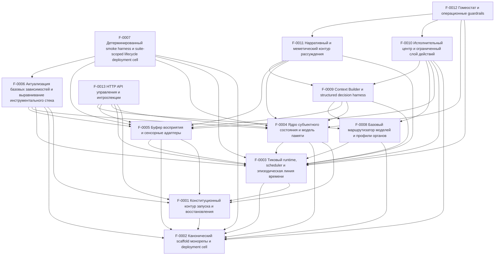

# SSOT Index

> Single-file navigation source of truth.  
> **Do not duplicate requirements here.** Link to Feature Dossiers instead.

_Last sync: 2026-03-25T21:11:25.459Z_

## Features

<!-- BEGIN GENERATED FEATURES -->
| ID | Title | Status | Coverage | Area | Depends on | Impacts | Dossier |
|---|---|---|---|---|---|---|---|
| F-0001 | Конституционный контур запуска и восстановления | done | strict | runtime | F-0002 | runtime,db,models,storage | `../features/F-0001-constitutional-boot-recovery.md` |
| F-0002 | Канонический scaffold монорепы и deployment cell | done | strict | platform | — | runtime,infra,db,models,workspace | `../features/F-0002-canonical-monorepo-deployment-cell.md` |
| F-0003 | Тиковый runtime, scheduler и эпизодическая линия времени | done | strict | runtime | F-0001, F-0002 | runtime,db,timeline,jobs | `../features/F-0003-tick-runtime-scheduler-episodic-timeline.md` |
| F-0004 | Ядро субъектного состояния и модель памяти | done | strict | memory | F-0001, F-0002, F-0003 | runtime,db,memory,state | `../features/F-0004-subject-state-kernel-and-memory-model.md` |
| F-0005 | Буфер восприятия и сенсорные адаптеры | done | strict | perception | F-0001, F-0002, F-0003 | runtime,db,ingress,perception | `../features/F-0005-perception-buffer-and-sensor-adapters.md` |
| F-0006 | Актуализация базовых зависимостей и выравнивание инструментального стека | done | strict | platform | F-0001, F-0002, F-0003, F-0004, F-0005 | runtime,infra,toolchain,dependencies | `../features/F-0006-baseline-dependency-refresh-and-toolchain-alignment.md` |
| F-0007 | Детерминированный smoke harness и suite-scoped lifecycle deployment cell | done | strict | platform | F-0002, F-0003, F-0004, F-0005, F-0006 | runtime,infra,verification,smoke | `../features/F-0007-deterministic-smoke-harness-and-suite-scoped-cell-lifecycle.md` |
| F-0008 | Базовый маршрутизатор моделей и профили органов | done | strict | models | F-0002, F-0003 | runtime,db,models,cognition | `../features/F-0008-baseline-model-router-and-organ-profiles.md` |
| F-0009 | Context Builder и structured decision harness | done | strict | cognition | F-0003, F-0004, F-0005, F-0008 | runtime,db,perception,memory,models,cognition | `../features/F-0009-context-builder-and-structured-decision-harness.md` |
| F-0010 | Исполнительный центр и ограниченный слой действий | done | strict | actions | F-0002, F-0003, F-0005, F-0008, F-0009 | runtime,db,tools,jobs,workspace,network | `../features/F-0010-executive-center-and-bounded-action-layer.md` |
| F-0011 | Нарративный и меметический контур рассуждения | done | strict | cognition | F-0003, F-0004, F-0005, F-0009 | runtime,db,memory,cognition,narrative | `../features/F-0011-narrative-and-memetic-reasoning-loop.md` |
| F-0012 | Гомеостат и операционные guardrails | done | strict | governance | F-0003, F-0004, F-0010, F-0011 | runtime,db,governance,safety,observability,jobs | `../features/F-0012-homeostat-and-operational-guardrails.md` |
| F-0013 | HTTP API управления и интроспекции | done | strict | api | F-0001, F-0003, F-0004, F-0005, F-0008 | runtime,api,state,timeline,observability,models,governance | `../features/F-0013-operator-http-api-and-introspection.md` |
<!-- END GENERATED FEATURES -->

## Dependency graph

<!-- BEGIN GENERATED DEP_GRAPH -->

<!-- END GENERATED DEP_GRAPH -->

## Red flags

<!-- BEGIN GENERATED RED_FLAGS -->
- ✅ No red flags detected.
<!-- END GENERATED RED_FLAGS -->
