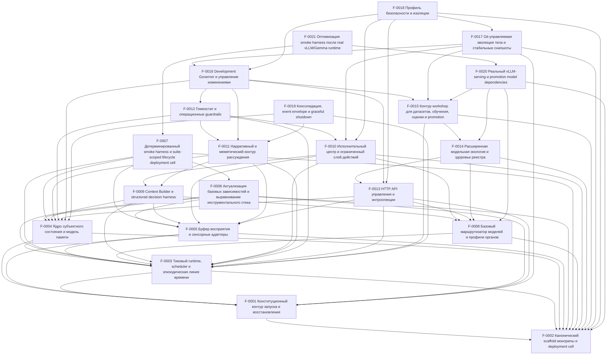

# SSOT Index

> Single-file navigation source of truth.  
> **Do not duplicate requirements here.** Link to Feature Dossiers instead.

_Last sync: 2026-04-17T18:23:00.831Z_

## Features

<!-- BEGIN GENERATED FEATURES -->
| ID | Title | Status | Coverage | Area | Depends on | Impacts | Dossier |
|---|---|---|---|---|---|---|---|
| F-0001 | Конституционный контур запуска и восстановления | done | strict | runtime | F-0002 | runtime,db,models,storage | `../features/F-0001-constitutional-boot-recovery.md` |
| F-0002 | Канонический scaffold монорепы и deployment cell | done | strict | platform | — | runtime,infra,db,models,workspace | `../features/F-0002-canonical-monorepo-deployment-cell.md` |
| F-0003 | Тиковый runtime, scheduler и эпизодическая линия времени | done | strict | runtime | F-0001, F-0002 | runtime,db,timeline,jobs | `../features/F-0003-tick-runtime-scheduler-episodic-timeline.md` |
| F-0004 | Ядро субъектного состояния и модель памяти | done | strict | memory | F-0001, F-0002, F-0003 | runtime,db,memory,state | `../features/F-0004-subject-state-kernel-and-memory-model.md` |
| F-0005 | Буфер восприятия и сенсорные адаптеры | done | strict | perception | F-0001, F-0002, F-0003 | runtime,db,ingress,perception | `../features/F-0005-perception-buffer-and-sensor-adapters.md` |
| F-0006 | Актуализация базовых зависимостей и выравнивание инструментального стека | done | strict | platform | F-0001, F-0002, F-0003, F-0004, F-0005 | runtime,infra,toolchain,dependencies | `../features/F-0006-baseline-dependency-refresh-and-toolchain-alignment.md` |
| F-0007 | Детерминированный smoke harness и suite-scoped lifecycle deployment cell | done | strict | platform | F-0002, F-0003, F-0004, F-0005, F-0006 | runtime,infra,verification,smoke | `../features/F-0007-deterministic-smoke-harness-and-suite-scoped-cell-lifecycle.md` |
| F-0008 | Базовый маршрутизатор моделей и профили органов | done | strict | models | F-0002, F-0003 | runtime,db,models,cognition | `../features/F-0008-baseline-model-router-and-organ-profiles.md` |
| F-0009 | Context Builder и structured decision harness | done | strict | cognition | F-0003, F-0004, F-0005, F-0008 | runtime,db,perception,memory,models,cognition | `../features/F-0009-context-builder-and-structured-decision-harness.md` |
| F-0010 | Исполнительный центр и ограниченный слой действий | done | strict | actions | F-0002, F-0003, F-0005, F-0008, F-0009 | runtime,db,tools,jobs,workspace,network | `../features/F-0010-executive-center-and-bounded-action-layer.md` |
| F-0011 | Нарративный и меметический контур рассуждения | done | strict | cognition | F-0003, F-0004, F-0005, F-0009 | runtime,db,memory,cognition,narrative | `../features/F-0011-narrative-and-memetic-reasoning-loop.md` |
| F-0012 | Гомеостат и операционные guardrails | done | strict | governance | F-0003, F-0004, F-0010, F-0011 | runtime,db,governance,safety,observability,jobs | `../features/F-0012-homeostat-and-operational-guardrails.md` |
| F-0013 | HTTP API управления и интроспекции | done | strict | api | F-0001, F-0003, F-0004, F-0005, F-0008 | runtime,api,state,timeline,observability,models,governance | `../features/F-0013-operator-http-api-and-introspection.md` |
| F-0014 | Расширенная модельная экология и здоровье реестра | done | strict | models | F-0002, F-0008, F-0013 | runtime,db,models,observability,api | `../features/F-0014-expanded-model-ecology-and-registry-health.md` |
| F-0015 | Контур workshop для датасетов, обучения, оценки и promotion | done | strict | workshop | F-0002, F-0003, F-0014 | runtime,db,models,workshop,artifacts,observability | `../features/F-0015-workshop-datasets-training-eval-and-promotion.md` |
| F-0016 | Development Governor и управление изменениями | done | strict | governance | F-0004, F-0011, F-0012, F-0013, F-0015 | runtime,db,governance,api,models,workspace,workshop | `../features/F-0016-development-governor-and-change-management.md` |
| F-0017 | Git-управляемая эволюция тела и стабильные снапшоты | done | strict | body | F-0001, F-0002, F-0010, F-0015, F-0016 | runtime,db,governance,workspace,tooling,recovery | `../features/F-0017-git-managed-body-evolution-and-stable-snapshots.md` |
| F-0018 | Профиль безопасности и изоляции | done | strict | safety | F-0002, F-0010, F-0013, F-0016, F-0017 | runtime,infra,governance,api,workspace,network,safety | `../features/F-0018-security-and-isolation-profile.md` |
| F-0019 | Консолидация, event envelope и graceful shutdown | done | strict | lifecycle | F-0003, F-0004, F-0011 | runtime,db,lifecycle,governance,reporting | `../features/F-0019-consolidation-event-envelope-graceful-shutdown.md` |
| F-0020 | Реальный vLLM-serving и promotion model dependencies | done | strict | models | F-0002, F-0008, F-0014, F-0015 | runtime,infra,models,artifacts,workshop | `../features/F-0020-real-vllm-serving-and-promotion-model-dependencies.md` |
| F-0021 | Оптимизация smoke harness после real vLLM/Gemma runtime | planned | deferred | platform | F-0007, F-0020 | runtime,infra,verification,smoke,db | `../features/F-0021-smoke-harness-post-f0020-runtime-optimization.md` |
<!-- END GENERATED FEATURES -->

## Dependency graph

<!-- BEGIN GENERATED DEP_GRAPH -->

<!-- END GENERATED DEP_GRAPH -->

## Red flags

<!-- BEGIN GENERATED RED_FLAGS -->
- **WARN** F-0001 — NFR section looks aspirational. Add a metric, budget/threshold, or observable signal for any normative NFR.
- **WARN** F-0001 — Planned+ dossier has dependencies, but the slicing plan does not show clear `Depends on:` visibility with owner and unblock condition. Add the dependency note where it affects delivery order.
- **WARN** F-0001 — Change log shows mature replanning, but no short reason tags were found. Prefer tags like `[clarification]`, `[scope realignment]`, `[dependency realignment]`, `[risk discovery]`, or `[contract drift]`.
- **WARN** F-0001 — Potential compound ACs detected: AC-F0001-01, AC-F0001-06, AC-F0001-06, AC-F0001-06, AC-F0001-01, AC-F0001-02, AC-F0001-03, AC-F0001-04, AC-F0001-06, AC-F0001-06, AC-F0001-06. Prefer one obligation per AC.
- **WARN** F-0001 — Vague wording in executable sections: "fast" in "dependency: "postgres" | "model-fast" | "model-deep" | "model-pool";"; "fast" in "- После `F-0002` baseline phase-0 substrate объявляет только `postgres` и `model-fast` как обязательные preflight dependencies; `model-deep` и `model-pool` остаются частью расширяемого контракта для следующих feature seams, но не считаются delivered предпосылкой текущей deployment cell.". Rewrite the statement more concretely.
- **WARN** F-0002 — NFR section looks aspirational. Add a metric, budget/threshold, or observable signal for any normative NFR.
- **WARN** F-0002 — Planning/design text suggests rollout order matters, but no rollout / activation note was found. Add a compact activation order and rollback-limits note.
- **WARN** F-0002 — Change log shows mature replanning, but no short reason tags were found. Prefer tags like `[clarification]`, `[scope realignment]`, `[dependency realignment]`, `[risk discovery]`, or `[contract drift]`.
- **WARN** F-0002 — Potential compound ACs detected: AC-F0002-02, AC-F0002-01, AC-F0002-03, AC-F0002-06, AC-F0002-01, AC-F0002-02, AC-F0002-01, AC-F0002-02, AC-F0002-04, AC-F0002-05, AC-F0002-07, AC-F0002-08, AC-F0002-07. Prefer one obligation per AC.
- **WARN** F-0002 — Vague wording in executable sections: "fast" in "- Docker Compose deployment cell для phase 0 с сервисами `core`, `postgres` и `vllm-fast`."; "fast" in "- **AC-F0002-02:** `polyphony-core` получает явный phase-0 entrypoint на `Node 22 + TypeScript + AI SDK + Hono`, который читает env/config для PostgreSQL, `vllm-fast`, read-only `seed` paths and materialized runtime `workspace/data/model` paths, materializes the writable runtime body before active handoff, держит AI SDK внутри internal reasoning boundary и предоставляет минимальную health/readiness surface, не расширяясь до operator API beyond health.". Rewrite the statement more concretely.
- **WARN** F-0003 — Planned+ dossier has dependencies, but the slicing plan does not show clear `Depends on:` visibility with owner and unblock condition. Add the dependency note where it affects delivery order.
- **WARN** F-0003 — Planning/design text suggests rollout order matters, but no rollout / activation note was found. Add a compact activation order and rollback-limits note.
- **WARN** F-0003 — Change log shows mature replanning, but no short reason tags were found. Prefer tags like `[clarification]`, `[scope realignment]`, `[dependency realignment]`, `[risk discovery]`, or `[contract drift]`.
- **WARN** F-0003 — Potential compound ACs detected: AC-F0003-08, AC-F0003-01, AC-F0003-01, AC-F0003-02, AC-F0003-06, AC-F0003-03, AC-F0003-03, AC-F0003-04, AC-F0003-05, AC-F0003-07, AC-F0003-07, AC-F0003-08, AC-F0003-08, AC-F0003-03, AC-F0003-05, AC-F0003-06, AC-F0003-07, AC-F0003-08, AC-F0003-08, AC-F0003-02, AC-F0003-08, AC-F0003-08. Prefer one obligation per AC.
- **WARN** F-0003 — Vague wording in executable sections: "fast" in "- Fast path:"; "fast" in "- smoke должен оставаться в рамках phase-0 topology `core + postgres + vllm-fast`, без отдельного `jobs` container.". Rewrite the statement more concretely.
- **WARN** F-0004 — NFR section looks aspirational. Add a metric, budget/threshold, or observable signal for any normative NFR.
- **WARN** F-0004 — Planned+ dossier has dependencies, but the slicing plan does not show clear `Depends on:` visibility with owner and unblock condition. Add the dependency note where it affects delivery order.
- **WARN** F-0004 — Planning/design text suggests rollout order matters, but no rollout / activation note was found. Add a compact activation order and rollback-limits note.
- **WARN** F-0004 — Change log shows mature replanning, but no short reason tags were found. Prefer tags like `[clarification]`, `[scope realignment]`, `[dependency realignment]`, `[risk discovery]`, or `[contract drift]`.
- **WARN** F-0004 — Potential compound ACs detected: AC-F0004-07, AC-F0004-01, AC-F0004-02, AC-F0004-04, AC-F0004-01, AC-F0004-05, AC-F0004-01, AC-F0004-03, AC-F0004-03, AC-F0004-02, AC-F0004-06, AC-F0004-07, AC-F0004-03, AC-F0004-04, AC-F0004-05, AC-F0004-07, AC-F0004-03, AC-F0004-07, AC-F0004-07, AC-F0004-07. Prefer one obligation per AC.
- **WARN** F-0004 — Vague wording in executable sections: "fast" in "- Новых сервисов deployment cell или новых обязательных env vars фича не вводит: используются уже зафиксированные `core + postgres + vllm-fast` и existing PostgreSQL connection contract из `F-0002`."; "fast" in "- Fast path:". Rewrite the statement more concretely.
- **WARN** F-0005 — Planned+ dossier has dependencies, but the slicing plan does not show clear `Depends on:` visibility with owner and unblock condition. Add the dependency note where it affects delivery order.
- **WARN** F-0005 — Planning/design text suggests rollout order matters, but no rollout / activation note was found. Add a compact activation order and rollback-limits note.
- **WARN** F-0005 — Change log shows mature replanning, but no short reason tags were found. Prefer tags like `[clarification]`, `[scope realignment]`, `[dependency realignment]`, `[risk discovery]`, or `[contract drift]`.
- **WARN** F-0005 — Potential compound ACs detected: AC-F0005-03, AC-F0005-02, AC-F0005-02, AC-F0005-02, AC-F0005-05, AC-F0005-01, AC-F0005-02, AC-F0005-04, AC-F0005-01, AC-F0005-02, AC-F0005-02, AC-F0005-06, AC-F0005-03, AC-F0005-02, AC-F0005-01, AC-F0005-01, AC-F0005-02, AC-F0005-03, AC-F0005-05, AC-F0005-06. Prefer one obligation per AC.
- **WARN** F-0005 — Vague wording in executable sections: "fast" in "- Current phase baseline for this intake: `F-0001`, `F-0002` и `F-0003` уже delivered; perception layer должна интегрироваться в уже зафиксированный `core + postgres + vllm-fast` runtime path и использовать canonical tick admission из `F-0003`, а не альтернативный event loop или message broker."; "fast" in "- Новых сервисов deployment cell фича не вводит: perception layer живёт внутри already delivered `core` container и использует existing `postgres` + `pg-boss` + `vllm-fast` topology из `F-0002`.". Rewrite the statement more concretely.
- **WARN** F-0006 — NFR section looks aspirational. Add a metric, budget/threshold, or observable signal for any normative NFR.
- **WARN** F-0006 — Planned+ dossier has dependencies, but the slicing plan does not show clear `Depends on:` visibility with owner and unblock condition. Add the dependency note where it affects delivery order.
- **WARN** F-0006 — Planning/design text suggests rollout order matters, but no rollout / activation note was found. Add a compact activation order and rollback-limits note.
- **WARN** F-0006 — Change log shows mature replanning, but no short reason tags were found. Prefer tags like `[clarification]`, `[scope realignment]`, `[dependency realignment]`, `[risk discovery]`, or `[contract drift]`.
- **WARN** F-0006 — Vague wording in executable sections: "fast" in "- Implemented verdict: local OpenAI-compatible provider wiring against `vllm-fast` and the selected-profile runtime contract is now the canonical delivered path."; "fast" in "- `chokidar 5` проходит fast checks, но ломает containerized file-watching behavior inside `pnpm smoke:cell`.". Rewrite the statement more concretely.
- **WARN** F-0007 — NFR section looks aspirational. Add a metric, budget/threshold, or observable signal for any normative NFR.
- **WARN** F-0007 — Planned+ dossier has dependencies, but the slicing plan does not show clear `Depends on:` visibility with owner and unblock condition. Add the dependency note where it affects delivery order.
- **WARN** F-0007 — Planning/design text suggests rollout order matters, but no rollout / activation note was found. Add a compact activation order and rollback-limits note.
- **WARN** F-0007 — Potential compound ACs detected: AC-F0007-04, AC-F0007-01, AC-F0007-02, AC-F0007-03, AC-F0007-05, AC-F0007-06. Prefer one obligation per AC.
- **WARN** F-0007 — Vague wording in executable sections: "fast" in "- В smoke suite должны остаться только сценарии, где containerized cell реально добавляет verification value поверх fast integration path."; "fast" in "- Lease-discipline smoke probe из `F-0003` после shaping выводится из container smoke suite и закрепляется за fast integration path, потому что его main value лежит в DB/runtime semantics, а не в long-lived container cell. `F-0007` implementation обязан удалить этот probe из `deployment-cell.smoke.ts` и сохранить coverage ownership через explicit realignment на fast integration surface, а не оставлять implementer-у выбор.". Rewrite the statement more concretely.
- **WARN** F-0008 — NFR section looks aspirational. Add a metric, budget/threshold, or observable signal for any normative NFR.
- **WARN** F-0008 — Planned+ dossier has dependencies, but the slicing plan does not show clear `Depends on:` visibility with owner and unblock condition. Add the dependency note where it affects delivery order.
- **WARN** F-0008 — Change log shows mature replanning, but no short reason tags were found. Prefer tags like `[clarification]`, `[scope realignment]`, `[dependency realignment]`, `[risk discovery]`, or `[contract drift]`.
- **WARN** F-0008 — Potential compound ACs detected: AC-F0008-01, AC-F0008-02, AC-F0008-03, AC-F0008-04, AC-F0008-04, AC-F0008-06, AC-F0008-02, AC-F0008-03, AC-F0008-04, AC-F0008-05, AC-F0008-01, AC-F0008-06. Prefer one obligation per AC.
- **WARN** F-0008 — Vague wording in executable sections: "fast" in "- feature-local: deterministic selection matrix details, continuity persistence mechanics, health-summary reuse rules and the exact fast/smoke verification map for the delivered baseline router."; "fast" in "- Missing baseline profile seed: `ensureBaselineProfiles()` завершается fail-fast ошибкой и не оставляет runtime в состоянии "роутинг как-нибудь выберет что-то сам".". Rewrite the statement more concretely.
- **WARN** F-0009 — NFR section looks aspirational. Add a metric, budget/threshold, or observable signal for any normative NFR.
- **WARN** F-0009 — Planned+ dossier has dependencies, but the slicing plan does not show clear `Depends on:` visibility with owner and unblock condition. Add the dependency note where it affects delivery order.
- **WARN** F-0009 — Change log shows mature replanning, but no short reason tags were found. Prefer tags like `[clarification]`, `[scope realignment]`, `[dependency realignment]`, `[risk discovery]`, or `[contract drift]`.
- **WARN** F-0009 — Potential compound ACs detected: AC-F0009-02, AC-F0009-03, AC-F0009-04, AC-F0009-06, AC-F0009-01, AC-F0009-01, AC-F0009-03, AC-F0009-03, AC-F0009-05, AC-F0009-05, AC-F0009-06, AC-F0009-01, AC-F0009-02, AC-F0009-05, AC-F0009-06. Prefer one obligation per AC.
- **WARN** F-0009 — Vague wording in executable sections: "fast" in "- Fast path:"; "fast" in "- Verification plan explicitly includes fast contract/integration coverage and a required deployment-cell smoke path for the eventual implementation.". Rewrite the statement more concretely.
- **WARN** F-0010 — NFR section looks aspirational. Add a metric, budget/threshold, or observable signal for any normative NFR.
- **WARN** F-0010 — Planned+ dossier has dependencies, but the slicing plan does not show clear `Depends on:` visibility with owner and unblock condition. Add the dependency note where it affects delivery order.
- **WARN** F-0010 — Change log shows mature replanning, but no short reason tags were found. Prefer tags like `[clarification]`, `[scope realignment]`, `[dependency realignment]`, `[risk discovery]`, or `[contract drift]`.
- **WARN** F-0010 — Potential compound ACs detected: AC-F0010-02, AC-F0010-03, AC-F0010-04, AC-F0010-05, AC-F0010-06, AC-F0010-01, AC-F0010-03, AC-F0010-01, AC-F0010-02, AC-F0010-02, AC-F0010-02, AC-F0010-01, AC-F0010-04, AC-F0010-04, AC-F0010-05, AC-F0010-01, AC-F0010-01, AC-F0010-03, AC-F0010-01, AC-F0010-02, AC-F0010-02, AC-F0010-02, AC-F0010-01, AC-F0010-04, AC-F0010-04, AC-F0010-05, AC-F0010-01, AC-F0010-01, AC-F0010-02, AC-F0010-03, AC-F0010-04, AC-F0010-05, AC-F0010-06. Prefer one obligation per AC.
- **WARN** F-0010 — Vague wording in executable sections: "fast" in "- `deliberative` / `contemplative` may reuse the same executive contract in fast tests or future slices, but may not silently become runtime-admissible through this dossier."; "fast" in "- Fast path:". Rewrite the statement more concretely.
- **WARN** F-0011 — NFR section looks aspirational. Add a metric, budget/threshold, or observable signal for any normative NFR.
- **WARN** F-0011 — Planned+ dossier has dependencies, but the slicing plan does not show clear `Depends on:` visibility with owner and unblock condition. Add the dependency note where it affects delivery order.
- **WARN** F-0011 — Planning/design text suggests rollout order matters, but no rollout / activation note was found. Add a compact activation order and rollback-limits note.
- **WARN** F-0011 — Change log shows mature replanning, but no short reason tags were found. Prefer tags like `[clarification]`, `[scope realignment]`, `[dependency realignment]`, `[risk discovery]`, or `[contract drift]`.
- **WARN** F-0011 — Potential compound ACs detected: AC-F0011-01, AC-F0011-02, AC-F0011-03, AC-F0011-04, AC-F0011-05, AC-F0011-06, AC-F0011-01, AC-F0011-01, AC-F0011-03, AC-F0011-03, AC-F0011-05, AC-F0011-05, AC-F0011-01, AC-F0011-03, AC-F0011-01, AC-F0011-02, AC-F0011-03, AC-F0011-05. Prefer one obligation per AC.
- **WARN** F-0011 — Vague wording in executable sections: "fast" in "- Delivered fast-path verification covers:". Rewrite the statement more concretely.
- **WARN** F-0012 — Planned+ dossier has dependencies, but the slicing plan does not show clear `Depends on:` visibility with owner and unblock condition. Add the dependency note where it affects delivery order.
- **WARN** F-0012 — Planning/design text suggests rollout order matters, but no rollout / activation note was found. Add a compact activation order and rollback-limits note.
- **WARN** F-0012 — Change log shows mature replanning, but no short reason tags were found. Prefer tags like `[clarification]`, `[scope realignment]`, `[dependency realignment]`, `[risk discovery]`, or `[contract drift]`.
- **WARN** F-0012 — Potential compound ACs detected: AC-F0012-01, AC-F0012-02, AC-F0012-03, AC-F0012-04, AC-F0012-05, AC-F0012-06, AC-F0012-07, AC-F0012-08, AC-F0012-01, AC-F0012-01, AC-F0012-02, AC-F0012-03, AC-F0012-01, AC-F0012-05, AC-F0012-04, AC-F0012-03, AC-F0012-04, AC-F0012-06, AC-F0012-08. Prefer one obligation per AC.
- **WARN** F-0013 — NFR section looks aspirational. Add a metric, budget/threshold, or observable signal for any normative NFR.
- **WARN** F-0013 — Planned+ dossier has dependencies, but the slicing plan does not show clear `Depends on:` visibility with owner and unblock condition. Add the dependency note where it affects delivery order.
- **WARN** F-0013 — Potential compound ACs detected: AC-F0013-01, AC-F0013-02, AC-F0013-03, AC-F0013-04, AC-F0013-05, AC-F0013-06, AC-F0013-07, AC-F0013-08, AC-F0013-01, AC-F0013-02, AC-F0013-04, AC-F0013-05, AC-F0013-06, AC-F0013-01, AC-F0013-08, AC-F0013-01, AC-F0013-03, AC-F0013-04, AC-F0013-05, AC-F0013-07, AC-F0013-08. Prefer one obligation per AC.
- **WARN** F-0014 — Planned+ dossier has dependencies, but the slicing plan does not show clear `Depends on:` visibility with owner and unblock condition. Add the dependency note where it affects delivery order.
- **WARN** F-0014 — Change log shows mature replanning, but no short reason tags were found. Prefer tags like `[clarification]`, `[scope realignment]`, `[dependency realignment]`, `[risk discovery]`, or `[contract drift]`.
- **WARN** F-0014 — Potential compound ACs detected: AC-F0014-01, AC-F0014-02, AC-F0014-03, AC-F0014-04, AC-F0014-05, AC-F0014-06, AC-F0014-07, AC-F0014-01, AC-F0014-03, AC-F0014-03, AC-F0014-04, AC-F0014-04, AC-F0014-03, AC-F0014-03, AC-F0014-04, AC-F0014-02, AC-F0014-03, AC-F0014-04, AC-F0014-06. Prefer one obligation per AC.
- **WARN** F-0014 — Vague wording in executable sections: "fast" in "- **AC-F0014-02:** The canonical richer-model contract covers the non-baseline shared-role vocabulary (`code`, `embedding`, `reranker`, `classifier`, `safety`) and the phase-2 optional organ families named by the backlog (`vllm-deep`, `vllm-pool`, `embedding`, `reranker`) with explicit metadata for organ kind, service identity, declared capabilities, operational status and fallback predecessor; baseline `vllm-fast` and first baseline profiles remain with the already delivered `F-0002` / `F-0008` contracts.". Rewrite the statement more concretely.
- **WARN** F-0015 — NFR section looks aspirational. Add a metric, budget/threshold, or observable signal for any normative NFR.
- **WARN** F-0015 — Planned+ dossier has dependencies, but the slicing plan does not show clear `Depends on:` visibility with owner and unblock condition. Add the dependency note where it affects delivery order.
- **WARN** F-0015 — Change log shows mature replanning, but no short reason tags were found. Prefer tags like `[clarification]`, `[scope realignment]`, `[dependency realignment]`, `[risk discovery]`, or `[contract drift]`.
- **WARN** F-0015 — Potential compound ACs detected: AC-F0015-01, AC-F0015-02, AC-F0015-03, AC-F0015-04, AC-F0015-05, AC-F0015-06, AC-F0015-07, AC-F0015-08, AC-F0015-09, AC-F0015-02, AC-F0015-02, AC-F0015-04, AC-F0015-05, AC-F0015-07, AC-F0015-02, AC-F0015-08, AC-F0015-05, AC-F0015-01, AC-F0015-02, AC-F0015-03, AC-F0015-04, AC-F0015-05, AC-F0015-06, AC-F0015-08, AC-F0015-09. Prefer one obligation per AC.
- **WARN** F-0016 — Potential compound ACs detected: AC-F0016-01, AC-F0016-02, AC-F0016-03, AC-F0016-04, AC-F0016-05, AC-F0016-06, AC-F0016-07, AC-F0016-08, AC-F0016-09, AC-F0016-10, AC-F0016-01, AC-F0016-03, AC-F0016-04, AC-F0016-07, AC-F0016-02, AC-F0016-01, AC-F0016-02, AC-F0016-06, AC-F0016-07, AC-F0016-08, AC-F0016-09, AC-F0016-10. Prefer one obligation per AC.
- **WARN** F-0017 — Potential compound ACs detected: AC-F0017-06, AC-F0017-06. Prefer one obligation per AC.
- **WARN** F-0018 — Potential compound ACs detected: AC-F0018-01, AC-F0018-02, AC-F0018-03, AC-F0018-04, AC-F0018-05, AC-F0018-06, AC-F0018-07, AC-F0018-08, AC-F0018-09, AC-F0018-10, AC-F0018-11, AC-F0018-12, AC-F0018-13, AC-F0018-03, AC-F0018-03, AC-F0018-01, AC-F0018-03, AC-F0018-08, AC-F0018-11, AC-F0018-03, AC-F0018-06, AC-F0018-01, AC-F0018-02, AC-F0018-03, AC-F0018-04, AC-F0018-05, AC-F0018-06, AC-F0018-07, AC-F0018-08, AC-F0018-09, AC-F0018-10, AC-F0018-11, AC-F0018-12, AC-F0018-13. Prefer one obligation per AC.
- **WARN** F-0020 — NFR section looks aspirational. Add a metric, budget/threshold, or observable signal for any normative NFR.
- **WARN** F-0020 — Potential compound ACs detected: AC-F0020-01, AC-F0020-02, AC-F0020-03, AC-F0020-04, AC-F0020-05, AC-F0020-06, AC-F0020-07, AC-F0020-08, AC-F0020-09, AC-F0020-10, AC-F0020-11, AC-F0020-12, AC-F0020-02, AC-F0020-04, AC-F0020-05, AC-F0020-06, AC-F0020-08, AC-F0020-03, AC-F0020-04, AC-F0020-05, AC-F0020-04, AC-F0020-04, AC-F0020-03, AC-F0020-04, AC-F0020-01, AC-F0020-02, AC-F0020-03, AC-F0020-04, AC-F0020-05, AC-F0020-08, AC-F0020-04. Prefer one obligation per AC.
- **WARN** F-0020 — Vague wording in executable sections: "fast" in "- Canonical owner for replacing the phase-0 stub-capable `vllm-fast` continuity slot with real `vLLM` inference over the canonical deployment-cell path."; "fast" in "- Explicit fast-first slice: one real `vllm-fast` organ must be live and smoke-proven before any claim about a real local-model runtime is accepted.". Rewrite the statement more concretely.
- **WARN** F-0021 — Potential compound ACs detected: AC-F0021-02, AC-F0021-07, AC-F0021-08, AC-F0021-11, AC-F0021-12, AC-F0021-12, AC-F0021-07, AC-F0021-01, AC-F0021-06, AC-F0021-09, AC-F0021-03, AC-F0021-08, AC-F0021-11, AC-F0021-12, AC-F0021-01, AC-F0021-01, AC-F0021-06, AC-F0021-03, AC-F0021-12, AC-F0021-09. Prefer one obligation per AC.
- **WARN** F-0021 — Vague wording in executable sections: "fast" in "- Telegram overlay не должен снова материализовать второй `vllm-fast` runtime или второй `Gemma` stack."; "fast" in "- **AC-F0021-04:** Telegram overlay reuses the same already-started `vllm-fast` model runtime as the base smoke family.". Rewrite the statement more concretely.
<!-- END GENERATED RED_FLAGS -->
