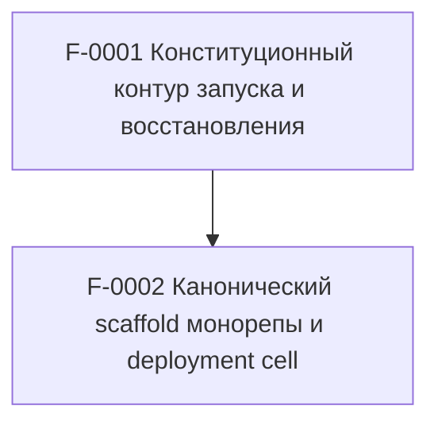

# SSOT Index

> Single-file navigation source of truth.  
> **Do not duplicate requirements here.** Link to Feature Dossiers instead.

_Last sync: 2026-03-19T01:00:40.648Z_

## Features

<!-- BEGIN GENERATED FEATURES -->
| ID | Title | Status | Area | Depends on | Impacts | Dossier |
|---|---|---|---|---|---|---|
| F-0001 | Конституционный контур запуска и восстановления | done | runtime | F-0002 | runtime,db,models,storage | `../features/F-0001-constitutional-boot-recovery.md` |
| F-0002 | Канонический scaffold монорепы и deployment cell | done | platform | — | runtime,infra,db,models,workspace | `../features/F-0002-canonical-monorepo-deployment-cell.md` |
<!-- END GENERATED FEATURES -->

## Dependency graph

<!-- BEGIN GENERATED DEP_GRAPH -->

<!-- END GENERATED DEP_GRAPH -->

## Red flags

<!-- BEGIN GENERATED RED_FLAGS -->
- ✅ No red flags detected.
<!-- END GENERATED RED_FLAGS -->
