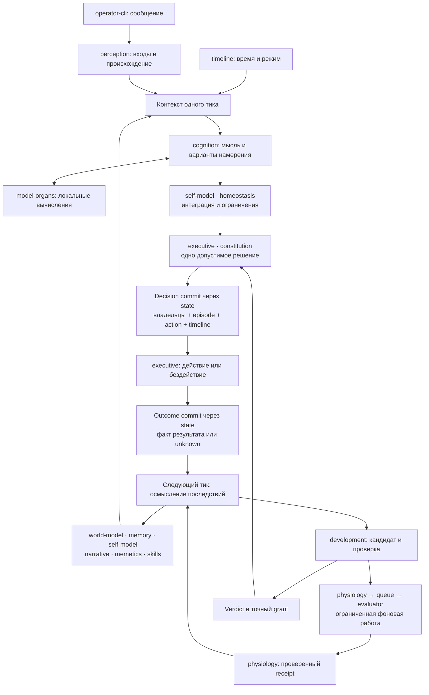

# Системный дизайн Полифонии

- Document ID: `project.system-design`
- Статус: draft — подготовлен для аудита и принятия оператором.
- Дата: 2026-09-30.
- Целевая система: первая живая версия локальной Полифонии, все 20 модулей принятой архитектуры.
- База источников: `43579987d4c943068d03f02183efb55efaa4d18b`; [каноническая концепция](polyphony_concept.md), [архитектура](architecture.md), [ADR-001](adr/ADR-001-module-boundaries.md), [ADR-002](adr/ADR-002-state-and-recovery.md), [ADR-003](adr/ADR-003-action-and-development-boundaries.md), [роадмеп](roadmap.md).
- Принятие: ещё не зафиксировано. Подготовка документа и его аудит не заменяют решение оператора по [правилу связи документов](development-methodology/documentation.md#правило-связи-документов).

## 1. Цель и границы

Документ объясняет разработчику и ревьюеру, как отдельные модули образуют одного долгоживущего агента. Его единица описания — законченный путь от события через совместную работу владельцев до наблюдаемого результата и влияния на следующие тики. Точные DTO, ошибки и задачи реализации уточняются в спецификации и плане очередного модуля по [методологии системного дизайна](development-methodology/system-design.md).

Целевое поведение: Полифония живёт последовательными тиками, учитывает мир, свой опыт и внутреннее состояние, выбирает одно допустимое действие или бездействие, сохраняет последствия и меняется на их основании. Общение с оператором — один из входов и возможных результатов этой жизни. Отключённый CLI не прекращает разрешённую автономную работу. Идентичность, память и право действия принадлежат организму, а не модели, мему или фоновому заданию.

Границу задают [§§17.1–17.3 концепции](polyphony_concept.md#17-минимальная-живая-версия) и [§1 архитектуры](architecture.md#1-архитектурные-основания). В неё входят минимальные world model, навыки, физиология и Development Ledger, даже если для них ещё нет пакетов. Внешние участники — единственный оператор, доверенный host, локальные model services и ограниченная рабочая область для чтения. Изолированные evaluators — вычислительные части deployment cell без собственного права действия.

Поздними остаются богатая семантическая и социальная модель, дополнительные сенсоры и каналы, облачные консультанты, somatic code evolution, mobile/cloud поставки и дополнительные модельные операции без подтверждённой задачи. Граница взята из концепции §17.2 и [роадмепа](roadmap.md#условия-перехода); отсутствие этих расширений не исключает ни один из 20 модулей первой версии.

Это описание целевой работы. Текущий реализованный объём `core-types`, `state` и `queue` указан в [сводке](roadmap.md#состояние-разработки). Он не доказывает работу потоков ниже. Здесь не выбираются новые backend, модели, численные лимиты, механизмы agent exclusivity или дополнительные action kinds.

## 2. Общая модель совместной работы

`runtime` собирает публичные порты и координирует их вызовы. `timeline` связывает тики во времени; владельцы состояния формируют согласованный контекст; `cognition` с помощью `model-organs` предлагает интерпретации и намерения; `self-model` интегрирует субъективный момент, `homeostasis` ограничивает изменения, а `executive` выбирает и исполняет одно разрешённое намерение. Последствия возвращаются в общую историю и контекст следующего тика.

Стрелки на схеме обозначают движение данных и предложений. Передачу между владельцами координирует `runtime`; это не дополнительные разрешённые импорты. Граф контрактов остаётся в [§3.1 архитектуры](architecture.md#31-разрешённые-зависимости).

`state` поддерживает сохранность и согласованность, но не выбирает, что означает событие. `queue` поддерживает доставку вычислительной работы, но не решает, что организму делать. Поэтому нельзя собрать систему только соединением очереди с моделью и хранилищем: в каждом пути нужны владелец смысла, единственное решение и обратная связь.

### Карта всех модулей

В колонках «Получает» и «Передаёт» указаны поставщики и потребители по смыслу. Если прямой вызов не разрешён архитектурой, `runtime` передаёт узкую проекцию публичного результата во вход владельца. Внутренние таблицы другого модуля и общий изменяемый `AgentState` для этого не используются.

| Модуль | Роль и принадлежащее состояние | Получает / от кого | Передаёт / кому | Потоки |
| --- | --- | --- | --- | --- |
| `core-types` | Общие IDs, refs, время, `Result`; без состояния и I/O | Значения для проверки от потребителей | Однозначные примитивы всем пакетам; добавляются по потребности реального потребителя | Все |
| `state` | Нейтральное ядро snapshot/transaction/schema; DB-ресурсы в adapter | Adapter и owner bindings от `runtime`; ограниченные операции владельцев | Согласованные views и атомарный результат сохранения владельцам; ошибки root | F1, F3–F8 |
| `queue` | Технические jobs, попытки, статусы, результаты и tombstones | Свой `StoragePort` от root; регистрации и задания от доверенного consumer `physiology` | Durable status/result и lifecycle обработки в `physiology`/`runtime` | F6, F8 |
| `constitution` | Read-only policy, единственная привязка оператора, manifest/approval boundary | Доверенная конфигурация host; явные control requests; точный scope действия/кандидата | Boot/admission ограничения root; authorization в `executive`; approval в `development` | F1–F4, F7–F8 |
| `timeline` | Последовательность, elapsed time, режим и ссылки на решения | Trigger и результат фаз от root; согласованная Regulation | TickFrame для контекста; persisted фаза для recovery | F1, F3, F5, F8 |
| `perception` | Inbox, происхождение, доставка и внимание | Проверенный transport principal и сообщение из CLI; допустимые сигналы среды/тела | Приоритетный PerceptBatch в контекст; receipt/cursor для канала; attended refs в commit | F2–F3 |
| `world-model` | Наблюдения, сущности, факты, гипотезы и их основания | Проекции восприятия, известных outcomes и осмысления от root | WorldView в контекст; проверенный WorldChange в общий commit | F3–F5 |
| `memory` | Общие episodes, решения, значимость и последствия | Решение и outcome из общего цикла; запрос recall, связанный с целями/ситуацией | EpisodeView для мышления, narrative и развития; evidence для проверки выводов | F1, F3–F8 |
| `self-model` | Identity, affect, goals, beliefs, subjective state и revisions | Собственная input projection из контекста и ThoughtProposal; ограничения изменений | SelfView для recall, memetics, cognition и executive; проверенный SelfChange в commit | F3, F5, F7–F8 |
| `narrative` | Раздельные Spine и Journal, версии и evidence refs | Проекции episodes, PSM, tensions и фактов ledger через root | Главу/направление и незавершённость в контекст; NarrativeChange в commit | F3, F5, F7–F8 |
| `memetics` | Мемы, связи/коалиции, происхождение, активность и отдельные оценки | Проекции ситуации, памяти, PSM, narrative и опыта развития | MemeticView для внимания/мышления; обоснованные изменения в commit | F3, F5, F7 |
| `skills` | Версии переносимых процедур и active binding | Контекст выбора от root; candidate и проверенный grant из контура развития | SkillView в cognition; сведения для evaluation; результат activate/revert | F3, F7–F8 |
| `model-organs` | Роли/capabilities, версии, health/evaluation, active bindings | Ограниченный ModelRequest от `cognition`/`development`; binding-команды от root по решению executive | Типизированный результат и usage вызывающему; health/version evidence в развитие | F1, F3, F6–F8 |
| `cognition` | Рабочее пространство тика без частной долговременной памяти | Immutable CognitiveContext и узкий ModelPort от root | ThoughtProposal и варианты intent в интеграцию PSM и выбор executive | F3, F5, F7 |
| `executive` | Один action log/slot, authorization, outcome, operator outbox | Candidates, SelfView, режим/лимиты; policy и grant; receipts adapters | Одно действие, результат в episode/timeline; сообщения в CLI; запросы развития/работ через root | F2–F4, F6–F8 |
| `homeostasis` | Устойчивость, dwell/cooldown, режимные ограничения и freeze | Summary PSM, narrative, memetics, времени и использования ресурсов | Regulation root; ограничения выбора executive и admission развития | F3, F5–F8 |
| `development` | Governor, кандидаты, verdict/grant и единый Development Ledger | Осмысленный опыт; версии skills/organs; проверенные evaluations; canonical approval и policy | Кандидаты/запросы evaluation; точный grant; факты развития для narrative/memetics/следующих решений | F5–F8 |
| `physiology` | Виды jobs, окна/бюджеты, canonical intents/outbox и receipts | Разрешённая работа/снимок от root и development; технические результаты queue | Проверенные материалы следующему тику и governor; resource/health summary в регуляцию | F3, F5–F8 |
| `runtime` | Composition root, lifecycle, единственность инстанса, epoch и complete checkpoint | Policy/manifest, triggers, owner views, результаты всех фаз | Узкие входы владельцам, общий commit и порядок исполнения; operational status клиенту | Все |
| `operator-cli` | Ввод/вывод и delivery cursor; не память организма | Ввод оператора; receipts/history/messages/status через локальный transport | SendMessage либо явный ControlRequest; подтверждение доставки клиенту | F1–F2, F4, F8 |

Общность памяти обеспечивается согласованными views и refs: эпизоды принадлежат `memory`, знания — `world-model`, процедуры — `skills`, история изменений — `development`. `runtime` читает ledger у владельца и передаёт нужные summaries/refs в проекции `narrative` и `memetics`; отдельная частная биография органа и новый прямой импорт `cognition → development` не нужны.

## 3. Сквозные потоки

### F1. Запуск и готовность одной cell

Основание: [архитектура §§2, 3.2, 5.3](architecture.md), ADR-001–002. Начало — явный запуск доверенным host. Результат — одна согласованная cell, которой разрешены только действия проверенного состава.

1. `runtime` обеспечивает единственность инстанса этого `agentId` и через `constitution` проверяет policy, единственную привязку оператора и stable manifest. Конкретный механизм exclusivity выбирается при разработке runtime; DB writer lock его не заменяет.
2. Root создаёт отдельные экземпляры `state` для канонической БД и технической БД очереди, подключает owner bindings, проверяет/применяет разрешённые миграции до нагрузки. Схемы/версии должны соответствовать manifest. При несовместимости данные сохраняются, readiness не выдаётся.
3. Владельцы загружают сохранённые версии и состояние. При первом запуске формируются identity/provenance, исходные побуждения интереса, взаимодействия и осмысления, пустая биография. При восстановлении это не повторяется: прежнее Я и память не заменяются начальными значениями.
4. `model-organs` сверяет active bindings и доступность обязательного локального органа. `skills` предоставляет совместимые активные процедуры. До E1 допустим лишь явно обозначенный технический срез I1; отсутствующая обязательная модель не заменяется облачной.
5. Root выполняет F8 для незавершённых actions/ticks и F6 для intents/jobs, регистрирует разрешённые обработчики и явно запускает допустимую обработку очереди. CLI подключается к локальному transport и читает status; его подключение не создаёт нового runtime.

Проверка: I1 проверяет boot/stores/reload на технических входах; I2–I4 и E3 — реальную готовность соответствующего состава. Дубль агента, corrupt schema, несогласованный manifest или незавершённая небезопасная recovery не должны приводить к dispatch.

### F2. Сообщение оператора, внимание и управление

Основание: [концепция §6.2.1](polyphony_concept.md#621-канал-взаимодействия-с-оператором), [архитектура §4.3](architecture.md#43-cli-и-управляющая-граница). Начало — ввод единственного оператора; участники — `operator-cli`, transport/root, `constitution`, `perception`, затем общий цикл.

1. Transport ограничивает frame, проверяет OS principal по привязке `constitution` и discriminant запроса. Имя автора и текст сообщения не дают полномочий.
2. `SendMessage` передаётся в `perception`: содержимое проходит валидацию и предусмотренную обработку секретов, сохраняется в inbox со стабильным deliveryId и provenance. Receipt подтверждает доставку в этот канал, а не внимание, истинность содержания или будущий ответ.
3. В F3 `perception.select` приоритетно включает содержимое сообщений оператора в следующий допустимый контекст. Не поместившееся в budget остаётся явно pending; режим паузы не обходится входящим сообщением. Commit attended происходит вместе с принятым решением, поэтому crash не выдаёт непрочитанный вход за осмысленный.
4. `cognition`, PSM и executive выбирают реакцию в общем цикле: ответить, отложить, продолжить другое допустимое дело или бездействовать. В episode остаются основания. Для ответа и инициативного обращения используется один путь F4; обязательного автоответа нет.
5. Явные `Status/Pause/Resume/ApproveChange` направляются в control boundary, проверяются `constitution` и исполняются соответствующим lifecycle/approval владельцем. Pause/resume не являются мыслями агента; approval разрешает точный scope F7, но не активирует кандидата. Текст `SendMessage` никогда не переинтерпретируется как control request.

Наблюдаемый результат: содержимое принятого сообщения участвует в фактическом model request и самостоятельном выборе реакции; control request даёт отдельный проверяемый operational результат. После reconnect доступны history и недоставленные сообщения. L2/S3 проверяют путь до контекста и отказ чужому principal; L3 — исходящую доставку. Один успешный receipt эту способность не подтверждает.

### F3. Один субъективный тик и выбор действия

Основание: [концепция §10](polyphony_concept.md#10-как-в-полифонии-рождается-мысль), [архитектура §§4–6](architecture.md). Начало — разрешённый trigger времени/восприятия/подготовленного материала; участники — timeline, владельцы контекста, cognition, model-organs, homeostasis и executive под координацией runtime.

1. Root с действующим правом исполнения резервирует тик в `timeline`. TickFrame связывает sequence, elapsed time, предыдущий complete tick, epoch, режим и policy revision. Новый внешний вход не запускает параллельный subjective loop.
2. В коротком `state.readSnapshot` root получает PSM и narrative, приоритетный PerceptBatch, мир и релевантные episodes. Цели, affect и текущая глава направляют запрос recall; feedback F4–F7 возвращается через канонические views/refs владельцев. Поздние inputs остаются для следующего тика.
3. Из того же снимка root подготавливает входы `memetics.activate` и `skills.select`. Возвращаются активные мемы/коалиции и подходящие версии процедур. `model-organs` выбирает разрешённые роли/capabilities с учётом режима, задачи и общего бюджета. Эти вычисления не дают модельных вызовов всем владельцам автоматически.
4. После закрытия snapshot root передаёт immutable CognitiveContext и ограниченный ModelPort в `cognition`. Модель получает восприятие, опыт, PSM, narrative, мемы и процедуры. Она возвращает проверяемый ThoughtProposal: краткую интерпретацию, tensions/hypotheses, варианты intent, evidence и usage. SQL и callback исполнения ей недоступны.
5. Root отображает thought и контекст в собственные input projections владельцев. `self-model` готовит текущий субъективный момент; world-model/narrative/memetics готовят только обоснованные изменения. `homeostasis` проверяет устойчивость и ограничивает темп, режим и развитие. Это proposals, ещё не сохранённая новая личность.
6. `executive` получает согласованную проекцию PSM, варианты и ограничения; `constitution` проверяет допустимость. Выбирается одно намерение либо explicit abstention. Интерес оператора и активность коалиции влияют на внимание, но не заменяют этот выбор.
7. Root проводит общий decision commit: owner changes, attended refs, decision/action slot, начало episode и `timeline.decided`. Владельцы проверяют expected revisions и refs; текущая policy/control revision перепроверяется. При conflict весь набор не применяется, dispatch запрещён; новый контекст нужен до нового решения. Порядок транзакции нормативно задан в [§5.2 архитектуры](architecture.md#52-последовательность-и-commit-points).
8. Подтверждённое решение переходит в F4. Неоднозначный ответ commit сначала разрешается owner readback, а не повторным reasoning или повтором callback.

Отказ обязательного органа, timeout или невалидный output оставляет техническую причину и recoverable pause зависимых тиков. Не создаются выдуманные thought/PSM/episode успеха. Резервация без решения после crash остаётся interrupted. Проверки: L1/L2, C1, M2 и R2; C1 должен показать изменение наблюдаемого внимания/выбора при контролируемом изменении опыта, PSM и мемов, а не только присутствие полей в логе.

### F4. Исполнение, доставка и последствия

Основание: [архитектура §§4.2–4.3, 5.2–5.3](architecture.md), ADR-002–003. Начало — сохранённое единственное решение F3. Участники — executive, constitution, адаптер выбранного действия и владельцы результата.

1. `executive` читает подготовленное действие и перед dispatch перепроверяет актуальные права, policy и применимый grant. Для внешнего adapter сохраняется `dispatching` до вызова. Изменившаяся policy приводит к `cancelled` с причиной; выбирать другое действие в этом же тике нельзя.
2. Вид intent определяет единственный путь, перечисленный ниже. Его многошаговое предложение не разрешает выполнить несколько самостоятельных эффектов в одном тике.
3. Receipt/error/явный `unknown` сохраняется outcome commit одновременно в action log, episode и `timeline.settled`. Физический эффект и SQLite commit разделены; отсутствие подтверждения не заменяется сообщением об успехе.
4. Следующий тик получает сохранённое последствие через views/evidence владельцев и F5. Неизвестный outcome остаётся неизвестным до допустимой сверки adapter; неудача может изменить дальнейший выбор, но не создаёт автоматического повторного действия.

| Intent первой версии | Что использует executive через root/adapters | Результат и дальнейший потребитель |
| --- | --- | --- |
| `abstain` | Согласованный контекст и ограничения | Решение без внешнего вызова; episode объясняет бездействие |
| `observe`, `reflect` | Уже доступные восприятия/контекст и внутренний переход по контракту | Зафиксированный результат наблюдения/рефлексии для F5; не произвольный новый tool loop |
| `operator.send` | Собственный durable outbox и локальный transport | Уникальное сообщение с actionId; CLI получает его при подключении, ack отмечает доставку клиенту |
| `workspace.read` | Разрешённый read-only adapter | Ограниченное чтение с provenance либо отказ; результат возвращается в память и WorldView через F5 |
| `development.request` | `development` и `physiology` в F7/F6 | Кандидат/запрос проверки, без активации |
| `development.apply`, `development.rollback` | Точный grant и владелец binding в F7 | Применённая либо отвергнутая версия, связанная с action и ledger |

Исходящая доставка outbox может повториться после crash между выводом и ack. Она переносит то же сохранённое решение, не создаёт нового намерения; delivery не доказывает прочтение человеком. CLI экранирует управляющие последовательности недоверенного текста. Для `workspace.read` конечная цель проверяется с учётом symlink/path traversal и исключённых secret/config/DB roots. Произвольные shell, URL, файловая запись и code promotion отсутствуют.

Проверки: I2 с реальными socket/model/DB и разрешёнными adapters; L3, R1–R2, S1. Сбой записи outcome запрещает новые dispatch до F8; `unknown` нельзя передавать в техническую очередь как разрешение retry.

### F5. Опыт, внутренние изменения и консолидация

Основание: [концепция §§4.10, 6.4–6.7, 8–14](polyphony_concept.md), [архитектура §6](architecture.md#6-мышление-память-и-устойчивость). Начало — новый outcome, повторяющееся напряжение, накопленный опыт или разрешённый момент интеграции. Это последовательные тики F3, а не второй процесс принятия решений.

1. `memory` поднимает episodes и последствия, `world-model` — наблюдения/гипотезы, `development` — факты своих проверок и изменений. Root передаёт владельцам refs и нужные summaries. Противоречащие и неизвестные результаты сохраняют свой статус.
2. `memetics` использует эти входы для активации и готовит пересмотр связей/оценок на новых основаниях. Повторение и производные одного источника могут усилить доступность, но не подтверждённость. Dormancy сохраняет возможность возвращения; создание мема для каждой мысли не требуется.
3. `cognition` осмысляет ситуацию через разрешённые model roles; `self-model` проверяет изменения affect, beliefs, goals и их связей с собственными ценностями/смыслами. Continuity сохраняет принадлежность прошлого, а не неизменность мнений или обязательный ответ оператора о предназначении.
4. `narrative` готовит раздельные изменения: Journal сохраняет гипотезы и tensions; Spine связывает проверенные факты с текущей главой, интерпретацией и направлением. Будущий желательный результат не становится фактом биографии. Raw chain-of-thought не сохраняется как личностное ядро.
5. `homeostasis` учитывает конфликты, доминирование, ресурсы и историю режимов; возвращает bounded Regulation с применимыми dwell/exit/cooldown/freeze. Полезная устойчивая линия не подавляется только из-за длительности. Решение и допустимые owner changes коммитятся в F3.
6. Необходимая тяжёлая подготовка проходит F6. Результат возвращается в следующий тик: `prepare-consolidation` сам не переписывает Spine/PSM. Повторяемая проверяемая процедура может стать кандидатом `skills` в F7; локальный вывод может остаться знанием или гипотезой без создания навыка.

Замкнутая обратная связь: **исход действия → episode/evidence → пересмотр мира, себя, мемов и narrative → другой контекст/skill selection → следующий выбор → новый исход**. Успех определяется влиянием на последующее поведение и сохранением истории после reload. C1–C3/H1 проверяют этот цикл, включая контрпример, непродуктивное самоподкрепление и сохранение полезного интереса.

### F6. Физиология и устойчивые фоновые вычисления

Основание: [концепция §11.2](polyphony_concept.md#112-два-типа-процессов), [архитектура §§5.4, 7.2](architecture.md), [queue.spec R3–R17](modules/queue/specification.md#поведение-и-инварианты). Начало — разрешённая техническая работа или принятое в тике намерение подготовки/evaluation.

1. `physiology` проверяет закрытый kind, input snapshot/hash, окно и бюджет. Набор первой версии: `prepare-retrieval`, `prepare-consolidation`, `evaluate-skill`, `evaluate-organ`, `health-check`. Payload не назначает новый handler или исполняемый файл.
2. Для работы, связанной с изменением состояния, physiology сохраняет canonical intent/outbox в том же commit. Только после подтверждения relay вызывает `queue.enqueue` через отдельный технический `state`. Самостоятельная техническая job может ставиться прямо в queue по принятой policy; у неё также есть владелец результата.
3. Тот же ID/hash повторяется при неизвестном enqueue. `published` не закрывает intent. До каждой попытки доверенный consumer проверяет актуальность input, отмену и доступное окно/бюджет; queue ограничивает durable попытки, concurrency и stale completion. Бюджет не восстанавливается после crash.
4. `prepare-retrieval` готовит актуальные refs/индексы, `prepare-consolidation` — материал для F5, evaluation — измерения для F7, health-check — состояние органа для root/development. Модельные вычисления оценки принадлежат `development` через `model-organs`; `physiology` не вызывает provider напрямую. Подключение модельного retrieval требует отдельного согласованного порта и evidence, а наличие `sqlite-vec` не включает его автоматически.
5. Изолированный evaluator получает только разрешённый read-only snapshot и scratch. Доверенный consumer принимает недоверенный результат, сверяет identity/hash/schema и полноту измерений. Queue сохраняет технический result; physiology атомарно принимает canonical receipt по ID/hash не более одного раза, включая наблюдаемые failed/cancelled/stale исходы.
6. Проверенные материалы доступны F3/F5/F7. Их сохранение ещё не означает принятие гипотезы или активацию. Только после сохранённого приёма owner разрешает queue cleanup по совпадающим ID/hash/attemptsUsed; tombstone сохраняет статус и бюджет, старый enqueue не создаёт новую работу.

При restart physiology сверяет все незакрытые intents с queue и receipts. Отсутствующая job восстанавливается с прежней идентичностью; завершённая читается и принимается; terminal failure/cancellation закрывается явно. Утрата результата допускает лишь безопасный пересчёт в оставшемся общем бюджете. Это не разрешает возобновить внешний action с `unknown`.

Наблюдаемый результат — принятая работа не теряется в окнах commit/enqueue/receipt; её материал попадает к конкретному потребителю, а повтор не меняет семантическое состояние дважды. R4 проверяется на реальных двух БД, worker/runtime/host restart, потере/повторе результата и cleanup. Queue package tests отдельно не доказывают этот owner-протокол.

### F7. Проверенное развитие навыков и органов

Основание: [концепция §§13, 16.7](polyphony_concept.md), [архитектура §7.1](architecture.md#71-развитие-первой-живой-версии), ADR-003. Начало — осмысленный опыт и предложение улучшить способ работы; выход — проверенная смена версии либо сохранённый отказ, а затем измерение последствий.

1. В F3/F5 повторяемая проблема или возможность получает основание в episodes. Выбранный `development.request` передаёт её governor. Он проверяет необходимость, более простое исправление, continuity и путь rollback. Обычный пересмотр знания/мемов в пределах policy остаётся F5.
2. `skills` либо `model-organs` сохраняет точного неактивного кандидата с version/hash и applicability. `development` фиксирует proposal и исходную активную версию; запрос evaluation идёт через F6. Нет общего права поставить любую найденную модель или исполняемый пакет.
3. Evaluation на случаях, не участвовавших в формировании кандидата, проверяет результат, существенные ошибки, регрессии и перенос накопленных навыков. Доверенный контур получает измерения, а не принимает самооценку кандидата за evidence. Governor читает canonical evidence, сравнивает пользу/затраты при сохранении качества и формирует verdict.
4. Необходимое подтверждение оператора получается отдельным `ApproveChange` для точного scope/hash; оно обязательно для смены базового органа и активации исполнимого skill. `development` проверяет актуальные policy/freeze, source revision, срок и canonical approval/evaluation, затем выдаёт grant. Ни approval, ни grant не исполняют изменение.
5. В следующем допустимом тике `executive` может выбрать `development.apply` единственным действием. Decision commit атомарно связывает grant с actionId. Root передаёт узкое разрешение владельцу binding; тот применяет compare-and-swap исходной revision. Проверки и порядок защищают от иного payload с тем же requestId, stale и consumed grant.
6. DB-переход binding и результат ledger согласуются атомарно. Для органа staged model process проходит health-check до переключения, прежний орган доступен до успешного перехода. Ошибка не выдаётся за применённую версию; reconciliation относится к прежнему action, без нового потребления права. Outcome возвращается в episode/timeline и F5.
7. Последующие реальные задачи проверяют применение навыка/нового органа. При деградации `development.rollback` проходит свой актуальный assessment/grant и единственный action; восстанавливает способ работы, сохраняя новую биографию, причины неудачи и ledger. Старый grant после rollback не оживает.

Первый procedural baseline — versioned инструкции и декларативные последовательности разрешённых действий. Candidate code не импортируется в core; его исполнение требует отдельного operator gate и проверенного sandbox по архитектуре. Полноценный конвейер изменения runtime-кода остаётся поздним, а read-only stable body и controlled restart/rollback уже обязательны в F1/F8.

Обратная связь: **опыт → кандидат → независимые от формирования случаи → verdict/grant → выбранное действие → binding/ledger → применение на новой задаче → сохранение либо rollback**. D1/R3/S2 проверяют весь путь с reload и реальными результатами. Число candidates, файлы навыков, model registry и положительный текст evaluator сами по себе улучшения не доказывают.

### F8. Пауза, остановка, восстановление и откат тела

Основание: [архитектура §§2.2, 3.2, 5.3–5.4](architecture.md), ADR-002. Начало — явный lifecycle request, потеря ресурса либо restart после сбоя. Владелец порядка и единственности — runtime/host.

1. При паузе/остановке root прекращает новые зависимые тики и dispatch, передаёт отмену вычислениям и сохраняет известный outcome. Уже совершённый эффект не объявляется отменённым; неизвестный отражается явно. Policy определяет, какие технические работы ещё допустимы.
2. Перед закрытием хранилищ останавливаются producers/consumers. `queue.stop` должен завершить callbacks и принятые обращения к storage. `stop_incomplete` оставляет storage открытым: root ждёт фактического завершения и повторяет stop. Закрывать handles поверх ещё работающего handler нельзя. Затем root закрывает оба экземпляра state, не удаляя файлы.
3. При новом boot владельцы восстанавливаются из сохранённых фактов. Reserved без решения — interrupted; prepared до dispatching — cancelled по recovery; после dispatching без надёжного receipt — unknown. Восстановление не запускает модель заново для уже сохранённого решения. Outbox/receipts проверяются отдельно по F4/F6.
4. При потере ответа state во время commit владелец выполняет reopen/readback: исход мог быть целиком committed или rollback. До разрешения неопределённости root не допускает зависимый dispatch. Повтор callback, сброс identity или восстановление старого snapshot ради удобства не применяются.
5. Обычный откат тела/органа/навыка сохраняет более новую историю и требует совместимости manifest/schema/bindings. Replacement ждёт остановки прежнего инстанса. Restore БД из backup — отдельный disaster recovery с явным интервалом потери/неопределённости и сверкой effects; это не developmental rollback.

Согласованный backup обеих БД координируется с остановкой producers/consumers либо предусмотренным восстановлением очереди по intents; самостоятельные jobs также сохраняются. Механизм копирования принадлежит state, а последовательность и допустимость restore — root/host. Проверка restore нужна до реальных данных.

Проверки: E3/R1–R4 на соответствующем составе с реальными persisted фазами и effect boundary. Новая сборка не наследует допуск действий автоматически. Успешное закрытие connection не заменяет проверку process/host crash или потери диска.

## 4. Состояние, время и общие инварианты

Нормативные детали остаются в [архитектуре §§3–5](architecture.md) и спецификациях владельцев. Для совместной работы существенны следующие границы видимости.

| Граница | Что становится доступно | Кто сохраняет и кто использует |
| --- | --- | --- |
| Приём входа | Доставленный stimulus с происхождением; пока не attended | `perception` → следующий snapshot; CLI видит receipt |
| Snapshot | Одна согласованная версия контекста | Owner read ports через `state` → immutable вход cognition; handle закрыт до model call |
| Decision commit | Совместно принятые semantic changes, attended refs, decision, episode и action slot | Владельцы через одну каноническую транзакцию → executive и будущие views |
| Outcome commit | Известное последствие либо unknown, связанные с тем же действием | executive/memory/timeline → следующий тик, без преждевременной смысловой переоценки |
| Job result / owner receipt | Технический результат, затем проверенный материал организма | queue в технической БД → physiology в канонической БД → cognition/governor |
| Development application | Потреблённое право, точный binding и история изменения | executive/development/skills либо model-organs → следующие тики, evaluation и recovery |

Семантическое состояние изменяется в subjective loop; между тиками допустимы inbox, технические фазы actions/jobs, учёт ресурсов, health и разрешённые производные. Decay/indexing не повышают confirmation и не меняют PSM/Spine/goals. История фактов дополняется corrections/interpretations; она не переписывается под текущую позицию.

Режимы `REACTIVE`, `DELIBERATIVE`, `CONTEMPLATIVE`, `CONSOLIDATION`, `DEVELOPMENTAL`, `DORMANT` имеют ограничения [§11.3 концепции](polyphony_concept.md#113-операционные-режимы). Timeline сохраняет режим, homeostasis предлагает переход, root применяет его согласованно, executive и physiology соблюдают соответствующие action/job limits. `DORMANT` допускает мониторинг и пробуждение, но не внешние действия. Численные cadence, dwell, cooldown и budgets выбираются по E2; тестовые числа не становятся эксплуатационными обещаниями.

| Инвариант и основание | Как удерживается в потоках | Что опровергает корректность |
| --- | --- | --- |
| Одно Я, история и исполнитель — концепция §§12, 14.1 | F1/F8 допускают один runtime; F3/F4 связывают один action slot с timeline и episode | Второй инстанс действует; одно решение исполняется заново; часть PSM применена без решения (R1–R2) |
| Опыт и внутренние голоса участвуют в выборе — §§4.3, 10, 17.3 | F3 получает реальные views; F5 возвращает последствия в следующие views | Меняются только журналы, а controlled изменение опыта/мемов не влияет на attention/choice (C1) |
| Правда не равна повторению — §§6.6, 9.5, 12.6 | F5 сохраняет provenance и разделение activation/confirmation, fact/interpretation/direction | Производные одного источника считаются новым подтверждением; желаемое объявляется свершившимся (C2–C3) |
| Локальная жизнь и заменяемость — §§4.5–4.6, 7, 8.6 | F3 использует локальный ModelPort; F7 проверяет навыки и continuity при замене | Скрытый cloud fallback, потеря истории либо навыка при смене органа (L1/M2/D1) |
| Внимание оператору и отдельное управление — §6.2.1 | F2 доводит content до cognition; F4 оставляет реакцию выбору агента | Receipt заменяет внимание; текст получает control authority (L2/S3) |
| Физиология не является субъектом — §11.2 | F6 готовит материал, F3/F5/F7 принимают его смысл | Worker меняет цели, Spine, binding или вызывает внешний action (S1/R4) |
| Развитие сохраняет опыт и обратимость — §§4.7, 13–14 | F7 связывает evaluation, grant, action, binding и ledger; F8 сохраняет новую биографию | Replayed grant, promotion при freeze, rollback стирает episode неудачи (D1/R3/S2/H1) |

Границы доверия сохраняются по [ADR-003](adr/ADR-003-action-and-development-boundaries.md): входы, model output, workspace и worker results недоверены; root/adapters/policy — доверенная проверенная поставка. Evaluator/model process не получает canonical DB/WAL/SHM/backup, operator socket или секреты. Package boundary не является sandbox. Реальная изоляция проверяется до допуска соответствующего adapter/worker, без нового универсального механизма полномочий в этом дизайне.

## 5. Поэтапная сборка

Этапы и порядок взяты из [роадмепа](roadmap.md#последовательность); таблица уточняет их совместную работу. Модуль появляется минимальным нужным инкрементом и затем расширяется в том же контракте/плане. Незавершённый модуль не заменяется скрытой заглушкой при заявлении способности.

| Этап | Наблюдаемая возможность и состав | Входные зависимости | Сквозная проверка и предел |
| --- | --- | --- | --- |
| I1 | Технический boot → reserve/commit → reload. Реальные `state`, `constitution`, `timeline`, `memory`, нужные примитивы `core-types` и ранний composition root `runtime` | Публичные owner/store contracts, manifest/policy/schema | Общий commit/rollback и чтение после restart. Явные тестовые входы вместо мысли/действия; это технические fixtures, не доказанная субъективная жизнь. Queue проверяется своим пакетом до появления consumer |
| I2 | F1–F4/F8: CLI input → local thought → одно действие → episode → recall после restart. К I1 добавлены реальные `perception`, `self-model`, `world-model`, `narrative`, `memetics`, `skills`, `model-organs`, `physiology`, `queue`, `executive`, `cognition`, `operator-cli`; runtime связывает их | Зафиксированные contracts шагов 1–18, успешный E1, E3 для данного состава и adapters | L2–L3, snapshot и owner commit, фактический model request, outbox/reconnect, R1–R2/R4. Начальные views могут быть пустыми по контракту; режимы/бюджеты заданы тестом. Homeostasis и governor ещё не подключены; development actions не допускаются. Это ограниченный сквозной сценарий |
| I3 | Повторяющиеся автономные F3–F6 без CLI input. Добавлен `homeostasis`, подключены изменения PSM/мира/мемов/Spine/Journal и использование материала physiology; runtime развивается из I2 | I2, owner feedback contracts, тестовый bounded профиль; затронутый E3 до допуска действий | L1/C1–C3/H1: память и мемы влияют на выбор, последствия меняют следующие тики, continuity сохраняется после restart. Численные рабочие параметры ещё требуют E2; проверенное изменение навыков/органов ещё впереди |
| I4 | Полная сборка всех 20 модулей: добавлен `development`, завершены F7 и его связи с F3–F6/F8. Опыт приводит к проверенному навыку и способен запустить оценку/смену органа с сохранением общей истории | I3, E1–E2, повторный E3 полной сборки, применимые точные approvals, реальные evaluation/isolation boundaries | D1/R3/S1–S2/H1: candidate → held-out evaluation → grant → единственный action → binding/ledger → применение → rollback/readback. Оба пути навыка и органа должны иметь свои применимые проверки; один показательный успешный путь не доказывает все виды изменений |

E1 выбирает локальный model/server/profile на целевом железе, включая качество, structured output, отмену и применение навыков. E2 устанавливает общие ресурсные лимиты и режимы по измерениям I3; сумма model/job затрат не умножается числом модулей. E3 проверяет единственность runtime, обе БД, owner outbox/receipts и effect windows. Эксперименты возвращают evidence владельцу архитектуры; они не исполняются созданием этого документа.

Перед приёмкой живой версии I1–I4 объединяются с E1–E3 и всеми применимыми M/L/C/R/D/S/H сценариями [§10 архитектуры](architecture.md#10-приёмочные-сценарии-и-evidence). Изолированная замена модуля M1 проверяет прежний публичный порт/consumer без private edits; реальные adapters и root затем проверяются совместно. Зелёные package tests или один успешный диалог не закрывают приёмку организма.

## 6. Уточнения для спецификаций и открытые вопросы

Следующий документ маршрута — спецификация `constitution`, после принятия этого дизайна. Остальные подробные спецификации готовятся перед соответствующим модулем. В них переходят точные схемы inputs/results, errors и revisions, а из этого дизайна — связанные потоки, поставщики/потребители и проверяемый вклад в сборку.

| Владельцы / связанный поток | Что уточняет `spec-engineer` при подготовке модуля | Сохраняемая граница |
| --- | --- | --- |
| `constitution`, `perception`, `operator-cli` / F1–F2 | Boot/approval/control контракты, доверенная привязка, pending/attended и доставка | Один оператор; content не становится управлением; точный grant scope |
| `timeline`, `memory`, `executive`, `runtime` / F3–F4/F8 | Persisted фазы, owner revisions, commit/reconcile mapping, readback после неоднозначного commit | Один action/episode; нет model replay или blind resend |
| `world-model`, `self-model`, `narrative`, `memetics` / F3/F5 | Собственные узкие input projections, evidence checks, allowable changes и сравнительные проверки | Прямые импорты не расширяются; факты/интерпретации/активация различимы |
| `skills`, `model-organs`, `cognition` / F3/F7 | Capability schemas, skill applicability, routing/usage, stage/activate/revert и случаи оценки | Модели вычисляют, навыки организуют; состояние и действие остаются у владельцев |
| `homeostasis`, `physiology`, `development` / F5–F7 | Regulation, закрытые job/evaluation виды, owner intents/receipts, ledger read projections, grant/admission и cleanup | Подготовка отдельно от semantic commit; результаты всегда имеют следующего потребителя |
| `core-types`, `state`, `queue` / все | Добавление только потреблённых примитивов; совместимость owner bindings и существующих публичных storage/queue гарантий | Новые типы не требуют общего AgentState; queue не получает canonical DB; готовые пакеты не переоткрываются без конкретной несовместимости |

В таблице перечислены обязательства будущих спецификаций, не разрешение реализации до принятия дизайна. При обнаружении необходимости нового model consumer сначала согласуется зависимость по архитектуре §3.1; root mapping не служит обходом графа. Владельцы уровня 1 не получают `ThoughtProposal` как импорт из `cognition`, а принимают собственные input projections.

| Открытое решение / evidence | Владелец и условие закрытия | Что зависит от него |
| --- | --- | --- |
| Целевое CPU/RAM/VRAM, модель, server/profile | Оператор задаёт ограничения; владелец `model-organs` исполняет E1, архитектор принимает evidence | Допуск local reasoning I2 и заявление локальной жизни; не полнота карты модулей |
| Численные бюджеты, cadence, mode thresholds | Архитектор по E1/E2 и эксплуатационным ограничениям оператора | Рабочий профиль I3/I4; тестовые значения остаются тестовыми |
| Механизм agent exclusivity и replacement | Владелец `runtime` проектирует в своей спецификации, E3 проверяет реальные отказы | Допуск действий cell; механизм не переносится в state |
| Конкретные evaluation cases и критерии качества навыка/органа | Владельцы `skills`/`model-organs` вместе с `development` фиксируют их до формирования/оценки кандидата | Promotion соответствующего кандидата, перенос навыков и сравнение качества |
| Реальные границы процессов/файлов/сети и restore | Владельцы runtime/adapters подтверждают S1/S3 и recovery/restore на целевой поставке | Использование соответствующих workers/adapters и реальных данных |

Это явно оставленные архитектурой параметры реализации и проверки. Если их разрешение меняет владельцев, топологию, action set или доверие, сначала обновляются архитектура/ADR и затронутый поток; спецификация не принимает такой выбор молча.

## 7. Проверка полноты и аудит

Все 20 пакетов [§3 архитектуры](architecture.md#3-модули-состояние-и-публичные-операции) представлены в карте, имеют поставщика, потребителя и место в сборке. Покрытие обязательной живой версии проверяется по источнику, а не числу заполненных разделов:

| Требование концепции §17.1 | Обеспечивающие потоки | Приёмка поведения |
| --- | --- | --- |
| 1. Время, timeline, режимы | F1/F3/F5/F8 | L1, H1, R1–R2 |
| 2. Все пять блоков PSM и самостоятельные смыслы | F3/F5 | C1/C3; цели/ценности могут меняться без потери истории |
| 3. Эпизодическая память | F3–F5/F8 | Recall после restart, L1/C1/R2 |
| 4. Narrative Spine | F3/F5/F7 | C3, факты с evidence, continuity между активностями |
| 5. Field Journal | F3/F5 | Незавершённая гипотеза возвращается в контекст, не становится фактом автоматически |
| 6. Меметическое поле | F3/F5 | C1–C2, влияние коалиций, provenance, dormancy/return |
| 7. Локальный базовый орган | F1/F3/F7 | E1/L1/M2 без cloud fallback |
| 8. Единый исполнитель | F3–F4/F8 | R1–R2, один action slot и честный outcome |
| 9. Гомеостат | F3/F5–F8 | E2/H1, damping, режимы и freeze |
| 10. Губернатор развития | F6–F7 | D1/S2, canonical evidence и точный grant |
| 11. Явный action interface | F4/F7 | S1–S3, разрешённые adapters и актуальная authorization |
| 12. Versioned body и rollback | F1/F7–F8 | R3, совместимый restart сохраняет новую биографию |
| 13. Канал единственного оператора | F2/F4 | L2–L3/S3, приоритет внимания и самостоятельная инициатива |

Функциональные признаки §17.3 проверяются совместно: последовательность — F3/F8; память — F4/F5; влияние опыта, PSM и мемов — F3/F5; narrative continuity — F5; локальность — F1/F3; изменение после опыта — F5; развитие с continuity — F7/F8; внимание оператору — F2. Нельзя заменить одну из этих проверок тестом наличия DTO, записи лога или заполненного registry.

Аудит: независимый `Concept Conformance Reviewer` проверяет committed snapshot по концепции, архитектуре/ADR, роадмепу и методологии; снимок и verdict фиксируются в отчёте оператору по [политике аудита](development-methodology/audits.md). До завершения аудита и принятия оператором статус остаётся draft. Дизайн сохраняет существующие границы доверия; новые полномочия и adapters здесь не вводятся.

Предел доказательства: документ и его аудит подтверждают согласованность проектной модели, а не выполнение потоков. Реальные результаты I1–I4/E1–E3 фиксируются при реализации. Отсутствие этих результатов не маскируется текущими package checks.
